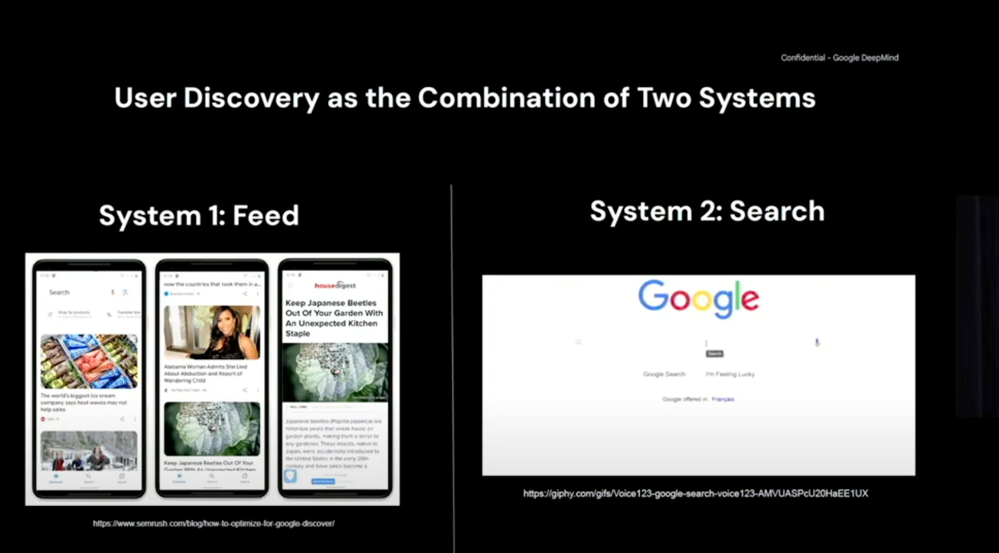

Recsys25会议个人++**最喜欢**++的Talk，没有之一。趁着记忆还在做简要整理，其他Talk和论文后续整理。
The Future of Personalized Universal Assistant . By Ed Chi , VP of Research at Google DeepMind

# 过去

多数互联网公司都是由Feed和Search这两个系统驱动的，Google Search、YouTube、Google Play、TikTok...实现这两个系统的基本想法就是做ranking。
在场的各位的各种工作，也只是在做排序罢了（笑）。英伟达炫酷的GPU，也是为了更好的sorting。

在这方面的工作包括Multi-objectives、Large Item Catalogs、Predicting Missing Features、User Sequence Model：

归根结底总结所有的工作，最主要的就以下三个方面：

1. Indexing
	
2. Vector Space Model
	
3. Deep Learning
	

# 现在

Transduction是什么意思？从工程的角度解释，就是将一种能量波转换为另一种。为什么Transformer叫“Transformer”这个名字？Transformer实际上就是Transduction，做序列转录。
Google从Deep Learning开始到现在Sequential Transduction的开创性工作：

对于Google翻译来说，常用的语言有40种，如果用Deep Learning传统的Prediction的方法，需要40\*39个model。
把所有的任务压缩到一个模型里面，是一个突破性的想法。放在一起之后我们发现，它可以做summarization、Q&A等一系列事情。

Reasoning的能力：不要只做输入输出，还要insert and explanation。

2014年的paper是革命性的，从Deep Learning开始，新一代的技术是sequential transduction，对于智能来说我们还需要CoT、Instruction Fine-tuning等等，这才形成了开始推理的完整方案。

我们能像教育孩子一样教LLM吗？

其实后训练和CoT只是开始。
 

总结：Reasoning的三个关键方面

1. Sequence Transduction
	
2. Chain of Thought
	
3. Instruction Fine-tuning
	

# 未来

用以下方式思考agentic 未来：人类由两种能力组成：一是很快的模式识别的能力；二是与推理能力密切相关，缓慢、有条理、理性的。未来，merge这两种能力为一体的系统是有发展前景的。

推荐和搜索（被动、主动，另一方面来说是ranking+reasoning），这是我们探索信息的两种截然不同的方式。但personalized assistant的未来是两者兼而有之。
（此处call back回开头，驱动企业的两种系统）

 

后面针对LLM和LEM（Large Embedding Model）有一些讨论，有时间再整理...

 

为什么觉得这个pre好呢，因为有一条主线一以贯之：ranking+reasoning。有很多高屋建瓴的观点，演讲由浅入深，过程不乏幽默，现场非常精彩。（本人文字记录不足体现万分之一，希望有官方录像...)
 

> 几个内容相似的之前的pre可作参考：
> 
> - https://youtu.be/cZ6IW562FuM?si=ydU-06Z38ZggEWn4
> 	
> - https://youtu.be/b78mvG40yis?si=3UQxSsskaIyE48OQ
>