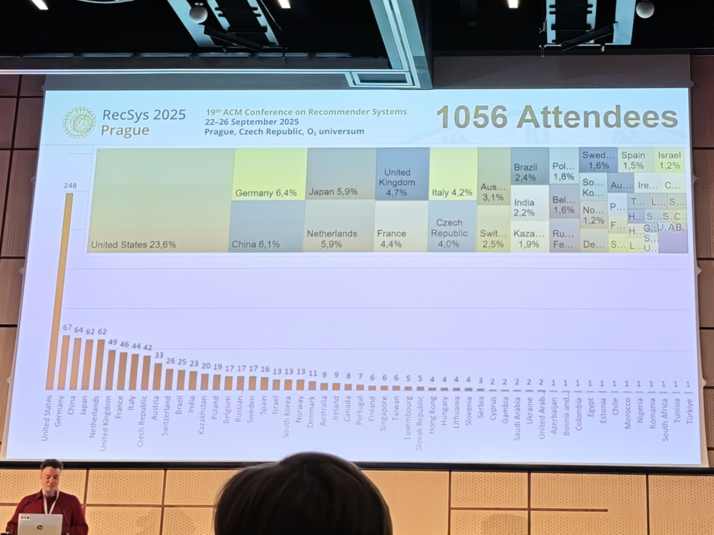
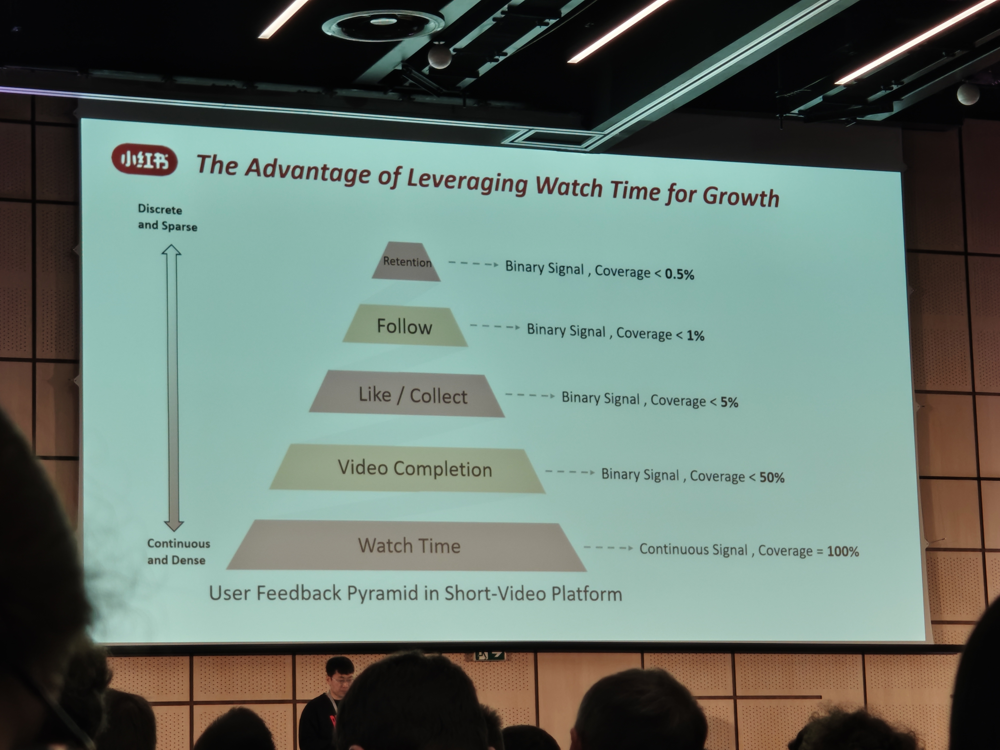
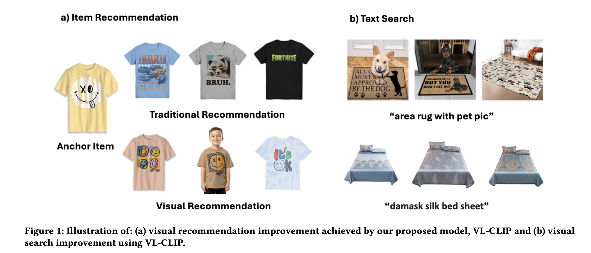
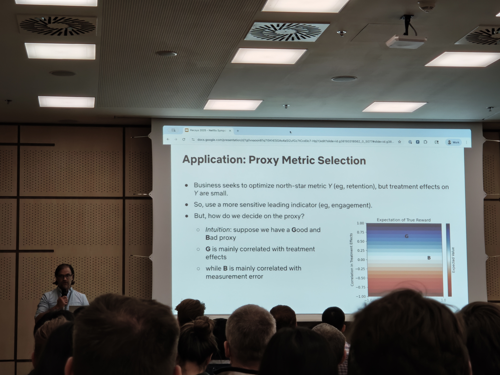

> 官方录像：https://www.youtube.com/playlist?list=PLaZufLfJumb\_-DzL9TYZwDS3sN4oznEia（包括paper session的论文和3个keynotes，可能有workshop和Tutorial）
> 总共有9个session，本文在**best papaer（获奖和提名）** 外总结几个个人感兴趣的paper，论文全集见官方：https://dl.acm.org/doi/proceedings/10.1145/3705328
> 本文档中论文目前先做罗列，阅读细节尚在持续整理ing

论文的相关细节可以看YouTube的oral视频及论文原文，个人参会最大的收获是和各方交流，以及赞助商的研讨会（虽然会打广告，无伤大雅），获得一些新视角和宏观抽象，颇有裨益。
最喜欢的两个赞助商研讨会是Google的[未来个人助理](#GoogleTalk)和AppLovin的[行业推荐系统的过去、现在和未来](#AppLovinTalk)。前者做了单独的文档记录，后者在本文记录了一些关键讨论。
有的人在做分而和之，把各场景小模型迭代变为统一大基座模型，比如Netflix的[基础模型+多任务学习](#NetflixTalk)；有人在做效率化自动化AutoML，如华为的 [Agentic AutoRecsys](#HuaweiTalk)。

# 参会情况

## 概览

|参会者众多，来自不同的地区，美国第一|
|-|-|
 

|提交率和接收率，和2024年差不多，但是Industry的贡献率（submitted）很高，与short paper的水平持平。|
|-|-|

|多数作者（隶属的机构）来自美国和中国，多数reviewer来自美国（26%）、中国（19%）、意大利（19%）。|
|-|-|

|不同领域话题的提交率：比较均衡|
|-|-|

|不同领域的接收率|
|-|-|

## 行业情况

|提交量增加了+104%，54篇论文被接受，其中15篇spotlight oral，剩余为poster|
|-|-|

 

 | 论文中讨论主要的话题：<ol><li>LLM</li><li>冷启动&数据稀疏</li><li>多目标优化（收入、多样性...）</li><li>用户反馈和负信号（如何利用 更明确的反馈和隐式反馈来改进推荐相关性）</li><li>规模化</li><li>embedding技术</li></ol>|
|-|-|	

|领域方面，包括视频流媒体、电商、音乐、广告....|
|-|-|	

|不同地区的提交，总共有35个地区，多数来自美国和中国|
|-|-|	

|不同公司的提交，除大公司外，小公司也多有贡献（图中的长尾现象）|
|-|-|	

|和学术不同的是，工业论文基本上一篇的作者数量会很多（一个东西真正投入生产需要很多人），甚至有一篇3页的论文有19个作者|
|-|-|	

## 主题**Session**

1. Beyond the Headlines and Harmonies: The Focus on Music and News on Recommendation Generation and Evaluation
	

关注音乐和新闻的推荐生成与评估

2. Models that Reflect Us: The Focus on Users’ Interests and Preferences on the Recommendation Process
	
	  推荐过程中关注用户的兴趣和偏好
	
3. Representation Meets Recommendation & Search
	
	  表征与推荐&搜索
	
4. Reflections on User Preferences leveraging LLMs
	

利用 LLM 反思用户偏好

5. Navigating User Journeys at Scale: Sequencing, Personalization, and Data-Driven
	

排序、个性化和数据驱动

6. Recommender Systems in the Wild: Domains and Society
	

领域与社会

7. Recommender Systems Without Borders: Cross-domain Methods and New Recommendation Frameworks
	

跨领域方法与新型推荐框架

8. Multimodal Moments: Leveraging Vision, Sound, and/or Text for Recommendation
	

多模态、利用视觉、声音和/或文本进行推荐

9. Signals We Trust: Offline, Online, and Real World Evaluation of Recommender Systems
	

推荐系统的离线、在线和真实世界评估

## Award

**Best Full Paper**

🏅 **[You Don’t Bring Me Flowers: Mitigating Unwanted Recommendations Through Conformal Risk Control](#Flowers)** *by Giovanni De Toni, Erasmo Purificato, Emilia Gomez, Andrea Passerini, Bruno Lepri, Cristian Consonni*
Nominees:

- [A Non-Parametric Choice Model That Learns How Users Choose Between Recommended Options](#Non-Parametric) *by Thorsten Krause, Harrie Oosterhuis*
	
- [IP2: Entity-Guided Interest Probing for Personalized News Recommendation](#IP2) *by Youlin Wu,Yuanyuan Sun, Xiaokun Zhang, Haoxi Zhan, Bo Xu, Liang Yang, Hongfei Lin*
	
- [Multi-Granularity Distribution Modeling for Video Watch Time Prediction via Exponential-Gaussian Mixture Network](#Multi-Granularity) *by Xu Zhao, Ruibo* *Ma**, Jiaqi Chen, Weiqi Zhao, Ping Yang, Yao Hu*
	
- [Off-Policy Evaluation and Learning for Matching Markets](#Off-Policy) *by Yudai Hayashi, Shuhei, Yuta*
	

**Best Short Paper**

**🏅** **[Beyond Top-1: Addressing Inconsistencies in Evaluating Counterfactual Explanations for Recommender Systems](#BeyondTop-1)** *by Amir Reza Mohammadi, Andreas Peintner, Michael Müller, Eva Zangerle*
Nominees:

- [Biases in LLM-Generated Musical Taste Profiles for Recommendation](#BiasesInLLM-Generated) *by Bruno Sguerra, Elena Epure, Harin Lee, Manuel Moussallam*
	
- [Emotion Vector-Based Fine-Tuning of Large Language Models for Age-Aware Teenage Book Recommendations](#EmotionVector-Based) *by Kate Hill, Yiu-Kai Ng, Joey Sherrill*
	

# Sessions

## Paper Session 1: Beyond the Headlines and Harmonies: The Focus on Music and News on Recommendation Generation and Evaluation

### \[Nominee\]Deezer'Biases in LLM-Generated Musical Taste Profiles for Recommendation

> https://dl.acm.org/doi/pdf/10.1145/3705328.3748030
> WIP

*by Bruno Sguerra, Elena V. Epure, Harin Lee, Manuel Moussallam*
One particularly promising use case of Large Language Models (LLMs) for recommendation is the automatic generation of Natural Language (NL) user taste profiles from consumption data. These profiles offer interpretable and editable alternatives to opaque collaborative filtering representations, enabling greater transparency and user control. However, it remains unclear whether users consider these profiles to be an accurate representation of their taste, which is crucial for trust and usability. Moreover, because LLMs inherit societal and data-driven biases, profile quality may systematically vary across user and item characteristics. In this paper, we study this issue in the context of music streaming, where personalization is challenged by a large and culturally diverse catalog. We conduct a user study in which participants rate NL profiles generated from their own listening histories. We analyze whether identification with the profiles is biased by user attributes (e.g., mainstreamness, taste diversity) and item features (e.g., genre, country of origin). We also compare these patterns to those observed when using the profiles in a downstream recommendation task. Our findings highlight both the potential and limitations of scrutable, LLM-based profiling in personalized systems.
LLM 生成的音乐品味档案在推荐中的偏差
大型语言模型在推荐领域一个极具前景的应用方向，是从用户消费数据自动生成自然语言形式的兴趣画像。相比协同过滤算法生成的不透明表征，这类画像不仅具备可解释性，还可支持人工编辑，从而增强系统透明度与用户控制权。然而，这些画像能否被用户认可为对其兴趣的准确呈现仍待验证——这恰恰是建立信任与提升可用性的关键所在。更值得注意的是，由于大语言模型存在社会性与数据驱动的偏见，画像质量可能因用户特征和物品属性的系统性差异而产生偏差。本文以音乐流媒体场景为研究对象，该场景因海量跨文化曲库使得个性化推荐面临独特挑战。我们开展用户研究，邀请参与者对基于其真实听歌记录生成的兴趣画像进行评分，系统分析用户对画像的认同度是否受其属性（如主流程度、兴趣多样性）和曲目特征（如音乐流派、来源国家）的影响，并将这些模式与下游推荐任务中使用画像时的表现进行对比。研究结果既揭示了基于大语言模型的可审查画像在个性化系统中的潜力，也明确了其局限性。

### UZH'Informfully Recommenders – Reproducibility Framework for Diversity-aware Intra-session Recommendations

> https://dl.acm.org/doi/pdf/10.1145/3705328.3748148
> 设计了比较通用的一个框架，包含推荐全流程（前中后处理、评估），可以看看

*by Lucien Heitz, Runze Li, Oana Inel, Abraham Bernstein*

Norm-aware recommender systems have gained increased attention, especially for diversity optimization. The recommender systems community has well-established experimentation pipelines that support reproducible evaluations by facilitating models’ benchmarking and comparisons against state-of-the-art methods. However, to the best of our knowledge, there is currently no reproducibility framework to support thorough norm-driven experimentation at the pre-processing, in-processing, post-processing, and evaluation stages of the recommender pipeline. To address this gap, we present Informfully Recommenders, a first step towards a normative reproducibility framework that focuses on diversity-aware design built on Cornac. Our extension provides an end-to-end solution for implementing and experimenting with normative and general-purpose diverse recommender systems that cover 1) dataset pre-processing, 2) diversity-optimized models, 3) dedicated intra-session item re-ranking, and 4) an extensive set of diversity metrics. We demonstrate the capabilities of our extension through an extensive offline experiment in the news domain.
知情推荐者——多样性感知会话内建议的可重复性框架
常态感知推荐系统日益受到关注，尤其是在多样性优化方面。推荐系统社区拥有完善的实验流程，通过促进模型的基准测试和与最新方法的比较，支持可复现的评估。然而，据我们所知，目前尚无可复现性框架能够支持在推荐流程的预处理、处理中、后处理和评估阶段进行全面的常态驱动实验。为了弥补这一缺陷，我们提出了 Informfully Recommenders，这是迈向基于 Cornac 构建的、专注于多样性感知设计的常态复现性框架的第一步。我们的扩展提供了一个端到端的解决方案，用于实现和实验规范且通用的多样性推荐系统，涵盖 1) 数据集预处理、2) 多样性优化模型、3) 专用会话内项目重排序以及 4) 广泛的多样性指标集。我们通过在新闻领域进行的大量离线实验来展示我们扩展的功能。

Informfully Recommenders 对现有 Cornac 流程进行了扩展，实现了一个具有多样性感知的四阶段 RS 流程，其中包含八个可自定义的步骤。它包含一个保存状态管理器，用于保存和加载每个阶段的结果。信息通过特定文件（例如，项目池、候选列表和推荐列表）在各个阶段之间传递。

 

### \[Nominee\]大连理工'IP2: Entity-Guided Interest Probing for Personalized News Recommendation

> https://dl.acm.org/doi/pdf/10.1145/3705328.3748091

*by Youlin Wu, Yuanyuan Sun, Xiaokun Zhang, Haoxi Zhan, Bo Xu, Liang Yang, Hongfei Lin*

News recommender systems aim to provide personalized news reading experiences for users based on their reading history. Behavioral science studies suggest that screen-based news reading contains three successive steps: scanning, title reading, and then clicking. Adhering to these steps, we find that intra-news entity interest dominates the scanning stage, while the inter-news entity interest guides title reading and influences click decisions. Unfortunately, current methods overlook the unique utility of entities in news recommendation. To this end, we propose a novel method called IP2 to probe entity-guided reading interest at both intra- and inter-news levels. At the intra-news level, a Transformer-based entity encoder is devised to aggregate mentioned entities in the news title into one signature entity. Then, a signature entity-title contrastive pre-training is adopted to initialize entities with proper meanings using the news story context, which in the meantime facilitates us to probe for intra-news entity interest. As for the inter-news level, a dual tower user encoder is presented to capture inter-news reading interest from both the title meaning and entity sides. In addition to highlighting the contribution of inter-news entity guidance, a cross-tower attention link is adopted to calibrate title reading interest using inter-news entity interest, thus further aligning with real-world behavior. Extensive experiments on two real-world datasets demonstrate that our IP2 achieves state-of-the-art performance in news recommendation.
IP2：基于实体引导的兴趣探测，实现个性化新闻推荐
新闻推荐系统旨在根据用户的阅读历史为他们提供个性化的新闻阅读体验。行为科学研究表明，基于屏幕的新闻阅读包含三个连续的步骤：浏览、阅读标题和点击。遵循这些步骤，我们发现新闻内实体兴趣主导浏览阶段，而新闻间实体兴趣引导阅读标题并影响点击决策。然而，现有方法忽视了实体在新闻推荐中的独特作用。为此，我们提出了一种名为 IP2 的新方法，用于在新闻内和新闻间层面探索实体引导的阅读兴趣。在新闻内层面，我们设计了一个基于 Transformer 的实体编码器，将新闻标题中提到的实体聚合为一个签名实体。然后，我们采用签名实体-标题对比预训练，利用新闻内容上下文初始化具有适当含义的实体，同时这有助于我们探索新闻内实体兴趣。在新闻间层面，我们提出了一个双塔用户编码器，从标题含义和实体两个方面捕捉新闻间阅读兴趣。除了突出新闻实体间引导的贡献外，我们还采用了跨塔注意力机制，利用新闻实体间兴趣来校准标题阅读兴趣，从而进一步贴合现实世界的行为。在两个真实数据集上进行的大量实验表明，我们的 IP2 在新闻推荐领域达到了最佳性能。

## Paper Session 2: Models that Reflect Us: The Focus on Users’ Interests and Preferences on the Recommendation Process

### \[Nominee\]RU'A Non-Parametric Choice Model That Learns How Users Choose Between Recommended Options

> https://dl.acm.org/doi/pdf/10.1145/3705328.3748090
> WIP

*by Thorsten Krause, Harrie Oosterhuis*
Choice models predict which items users choose from presented options. In recommendation settings, they can infer user preferences while countering exposure bias. In contrast with traditional univariate recommendation models, choice models consider which competitors appeared with the chosen item. This ability allows them to distinguish whether a user chose an item due to preference, i.e., they liked it; or competition, i.e., it was the best available option. Each choice model assumes specific user behavior, e.g., the multinomial logit model. However, it is currently unclear how accurately these assumptions capture actual user behavior, how wrong assumptions impact inference, and whether better models exist. In this work, we propose the learned choice model for recommendation (LCM4Rec), a non-parametric method for estimating the choice model. By applying kernel density estimation, LCM4Rec infers the most likely error distribution that describes the effect of inter-item cannibalization and thereby characterizes the users’ choice model. Thus, it simultaneously infers what users prefer and how they make choices. Our experimental results indicate that our method (i) can accurately recover the choice model underlying a dataset; (ii) provides robust user preference inference, in contrast with existing choice models that are only effective when their assumptions match user behavior; and (iii) is more resistant against exposure bias than existing choice models. Thereby, we show that learning choice models, instead of assuming them, can produce more robust predictions. We believe this work provides an important step towards better understanding users’ choice behavior.
学习用户如何在推荐选项之间进行选择的非参数选择模型
选择模型可以预测用户从呈现的选项中选择哪些商品。在推荐设置中，它们可以推断用户偏好，同时避免曝光偏差。与传统的单变量推荐模型相比，选择模型会考虑所选商品中出现的竞争对手。这种能力使它们能够区分用户选择商品是出于偏好（例如，他们喜欢它）还是竞争（例如，它是最佳选择）。每个选择模型都假设特定的用户行为，例如多项逻辑回归模型。然而，目前尚不清楚这些假设如何准确地捕捉实际用户行为，错误的假设如何影响推断，以及是否存在更好的模型。在本文中，我们提出了一种用于推荐的学习型选择模型（LCM4Rec），这是一种用于估计选择模型的非参数方法。通过应用核密度估计，LCM4Rec 可以推断出描述商品间蚕食效应的最可能误差分布，从而表征用户的选择模型。因此，它可以同时推断用户的偏好以及他们如何做出选择。我们的实验结果表明，我们的方法 (i) 能够准确地恢复数据集背后的选择模型；(ii) 提供稳健的用户偏好推断，而现有的选择模型仅在其假设与用户行为匹配时才有效；(iii) 比现有的选择模型更能抵御曝光偏差。由此，我们证明了学习选择模型（而非假设选择模型）可以产生更稳健的预测。我们相信这项工作为更好地理解用户的选择行为迈出了重要一步。

### \[Nominee\]Off-Policy Evaluation and Learning for Matching Markets

> https://dl.acm.org/doi/pdf/10.1145/3705328.3748047
> 离线评估策略

*by Yudai Hayashi, Shuhei Goda, Yuta Saito*
Matching users based on mutual preferences is a fundamental aspect of services driven by reciprocal recommendations, such as job search and dating applications. Although A/B tests remain the gold standard for evaluating new policies in recommender systems for matching markets, it is costly and impractical for frequent policy updates. Off-Policy Evaluation (OPE) thus plays a crucial role by enabling the evaluation of recommendation policies using only offline logged data naturally collected on the platform. However, unlike conventional recommendation settings, the large scale and bidirectional nature of user interactions in matching platforms introduce variance issues and exacerbate reward sparsity, making standard OPE methods unreliable. To address these challenges and facilitate effective offline evaluation, we propose novel OPE estimators, DiPS and DPR, specifically designed for matching markets. Our methods combine elements of the Direct Method (DM), Inverse Propensity Score (IPS), and Doubly Robust (DR) estimators while incorporating intermediate labels, such as initial engagement signals, to achieve better bias-variance control in matching markets. Theoretically, we derive the bias and variance of the proposed estimators and demonstrate their advantages over conventional methods. Furthermore, we show that these estimators can be seamlessly extended to offline policy learning methods for improving recommendation policies for making more matches. We empirically evaluate our methods through experiments on both synthetic data and A/B testing logs from a real job-matching platform. The empirical results highlight the superiority of our approach over existing methods in off-policy evaluation and learning tasks for a variety of configurations.
匹配市场的离策略评估与学习
基于相互偏好的用户匹配是互惠推荐驱动服务（例如求职和约会应用）的一个基本方面。尽管 A/B 测试仍然是评估匹配市场推荐系统中新策略的黄金标准，但对于频繁的策略更新来说，它成本高昂且不切实际。因此，离线策略评估 (OPE) 发挥着至关重要的作用，它能够仅使用平台上自然收集的离线记录数据来评估推荐策略。然而，与传统的推荐设置不同，匹配平台中用户交互的大规模和双向性会引入方差问题并加剧奖励稀疏性，使得标准的 OPE 方法变得不可靠。为了应对这些挑战并促进有效的离线评估，我们提出了专为匹配市场设计的新型 OPE 估计器 DiPS 和 DPR。我们的方法结合了直接法 (DM)、逆倾向得分 (IPS) 和双稳健 (DR) 估计器的元素，同时融入了中间标签（例如初始参与信号），以在匹配市场中实现更好的偏差-方差控制。从理论上讲，我们推导出所提估计器的偏差和方差，并展示了它们相对于传统方法的优势。此外，我们还表明这些估计器可以无缝扩展到离线策略学习方法，以改进推荐策略，从而实现更多匹配。我们通过对合成数据和来自真实职位匹配平台的 A/B 测试日志进行实验，对我们的方法进行了实证评估。实证结果凸显了我们的方法在各种配置的离线策略评估和学习任务中优于现有方法的优势。

### 字节'LONGER: Scaling Up Long Sequence Modeling in Industrial Recommenders

> https://dl.acm.org/doi/pdf/10.1145/3705328.3748065

*by Zheng Chai, Qin Ren, Xijun Xiao, Huizhi Yang, Bo Han, Sijun Zhang, Di Chen, Hui Lu, Wenlin Zhao, Lele Yu, Xionghang Xie, Shiru Ren, Xiang Sun, Yaocheng Tan, Peng Xu, Yuchao Zheng, Di Wu*

Modeling ultra-long user behavior sequences is critical for capturing both long- and short-term preferences in industrial recommender systems. Existing solutions typically rely on two-stage or indirect modeling paradigms, incurring upstream-downstream inconsistency and computational inefficiency. In this paper, we present LONGER, a Long-sequence Optimized traNsformer for GPU-Efficient Recommenders. LONGER incorporates (i) a global token mechanism for stabilizing attention over long contexts, (ii) a token merge module with lightweight InnerTransformers and hybrid attention strategy to reduce quadratic complexity, and (iii) a series of engineering optimizations, including training with mixed-precision and activation recomputation, KV cache serving, and the fully synchronous model training and serving framework for unified GPU-based dense and sparse parameter updates. LONGER consistently outperforms strong baselines in both offline metrics and online A/B testing in both advertising and e-commerce services at ByteDance, validating its consistent effectiveness and industrial-level scaling laws. Currently, LONGER has been validated and fully deployed across dozens of real-world influential scenarios at ByteDance, serving billions of users.
LONGER：在工业推荐系统中扩展长序列建模
在工业级推荐系统中，对超长用户行为序列进行建模对于捕捉长期和短期偏好至关重要。现有解决方案通常依赖于两阶段或间接建模范式，这会导致上下游不一致和计算效率低下。本文提出了 LONGER，一个针对 GPU 高效推荐系统的长序列优化转换器。LONGER 集成了 (i) 全局 token 机制，用于稳定长上下文中的注意力机制；(ii) 带有轻量级 InnerTransformers 和混合注意力策略的 token 合并模块，以降低二次复杂度；以及 (iii) 一系列工程优化，包括混合精度训练和激活重计算、键值缓存服务以及用于统一 GPU 密集和稀疏参数更新的完全同步模型训练和服务框架。LONGER 在字节跳动的广告和电商服务中，无论是离线指标还是在线 A/B 测试，其表现均持续优于强大的基准模型，验证了其一致的有效性和工业级的可扩展性。目前，LONGER 已在字节跳动数十个具有现实影响力的场景中得到验证并全面部署，服务于数十亿用户。

 

 

### 人大高瓴&联想'Paragon: Parameter Generation for Controllable Multi-Task Recommendation

*by Chenglei Shen, Jiahao Zhao, Xiao Zhang, Weijie Yu, Ming He, Jianping Fan*

> https://dl.acm.org/doi/pdf/10.1145/3705328.3748069
> 可以根据新的任务需求定制和调整推荐模型参数，而无需重新训练。后面细看。

Commercial recommender systems face the challenge that task requirements from platforms or users often change dynamically (e.g., varying preferences for accuracy or diversity). Ideally, the model should be re-trained after resetting a new objective function, adapting to these changes in task requirements. However, in practice, the high computational costs associated with retraining make this process impractical for models already deployed to online environments. This raises a new challenging problem: how to efficiently adapt the learned model to different task requirements by controlling the model parameters after deployment, without the need for retraining. To address this issue, we propose a novel controllable learning approach via parameter generation for controllable multi-task recommendation (Paragon), which allows the customization and adaptation of recommendation model parameters to new task requirements without retraining. Specifically, we first obtain the optimized model parameters through adapter tunning based on the feasible task requirements. Then, we utilize the generative model as a parameter generator, employing classifier-free guidance in conditional training to learn the distribution of optimized model parameters under various task requirements. Finally, the parameter generator is applied to effectively generate model parameters in a test-time adaptation manner given task requirements. Moreover, Paragon seamlessly integrates with various existing recommendation models to enhance their controllability. Extensive experiments on two public datasets and one commercial dataset demonstrate that Paragon can efficiently generate model parameters instead of retraining, reducing computational time by at least 94.6%. The code is released at https://anonymous.4open.science/r/Paragon-C726.
Paragon：可控多任务推荐的参数生成
商业推荐系统面临的挑战是，平台或用户的任务需求经常动态变化（例如，对准确性或多样性的偏好各不相同）。理想情况下，模型应该在重新设置新的目标函数后进行重新训练，以适应任务需求的变化。然而，在实践中，重新训练的高昂计算成本使得这一过程对于已经部署到在线环境的模型来说并不切实际。这带来了一个新的挑战性问题：如何在部署后通过控制模型参数，高效地使学习到的模型适应不同的任务需求，而无需重新训练。为了解决这个问题，我们提出了一种基于参数生成的可控学习方法，用于可控多任务推荐（Paragon），该方法允许根据新的任务需求定制和调整推荐模型参数，而无需重新训练。具体而言，我们首先根据可行的任务需求，通过适配器调优获得优化的模型参数。然后，我们将生成模型用作参数生成器，在条件训练中使用无分类器指导来学习在不同任务需求下优化模型参数的分布。最后，利用参数生成器，根据任务需求，以测试时自适应的方式高效生成模型参数。此外，Paragon 可以与现有的各种推荐模型无缝集成，增强其可控性。 在两个公开数据集和一个商业数据集上进行的大量实验表明，Paragon 可以高效地生成模型参数，无需重新训练，从而将计算时间缩短至少 94.6%。代码发布于 https://anonymous.4open.science/r/Paragon-C726。

### Apple'SEMORec: A Scalarized Efficient Multi-Objective Recommendation Framework

> https://dl.acm.org/doi/pdf/10.1145/3705328.3748140

*by Sofia Maria Nikolakaki, Siyong Ma, Srivas Chennu, Humeyra Topcu Altintas*

Recommendation systems in multi-stakeholder environments often require optimizing for multiple objectives simultaneously to meet supplier and consumer demands. Serving recommendations in these settings relies on efficiently combining the objectives to address each stakeholder’s expectations, often through a scalarization function with pre-determined and fixed weights. In practice, selecting these weights becomes a consequent problem. Recent work has developed algorithms that adapt these weights based on application-specific needs by using RL to train a model \[6\]. While this solves for automatic weight computation, such approaches are not efficient for frequent weight adaptation. They also do not allow for human intervention oftentimes determined by business needs. To bridge this gap, we propose a novel multi-objective recommendation framework that is efficient for a small number of objectives. It also enables business decision makers to easily tune the optimization by assigning different importance to multiple objectives. We demonstrate the efficacy and efficiency of our framework through improvements in online business metrics.
一个标量化的高效多目标推荐框架
在多利益相关者环境中，推荐系统通常需要同时优化多个目标，以满足供应商和消费者的需求。在这些环境中，提供推荐服务依赖于有效地组合目标以满足每个利益相关者的期望，这通常是通过一个具有预定固定权重的标量化函数来实现的。在实践中，选择这些权重成为一个随之而来的问题。最近的研究开发了一种算法，通过使用强化学习训练模型，可以根据特定应用的需求调整这些权重 。虽然这解决了权重的自动计算问题，但此类方法对于频繁的权重调整效率不高。它们也不允许通常由业务需求决定的人为干预。为了弥补这一差距，我们提出了一个新颖的多目标推荐框架，该框架对于少量目标而言非常高效。它还使业务决策者能够通过为多个目标分配不同的重要性来轻松调整优化。我们通过在线业务指标的改进证明了该框架的有效性和效率。

## Paper Session 3: Representation Meets Recommendation & Search

### Pinterest'Decoupled Entity Representation Learning for Pinterest Ads Ranking

> https://dl.acm.org/doi/pdf/10.1145/3705328.3748098
> 预训练上游模型，异步更新embedding给众多下游模型用

 

*by Jie Liu, Yinrui Li, Jiankai Sun, Kungang Li, Han Sun, Sihan Wang, Huasen Wu, Siyuan Gao, Paulo Soares, Nan Li, Zhifang Liu, Haoyang Li, Siping Ji, Ling Leng, Prathibha Deshikachar*
In this paper, we introduce a novel framework following an upstream-downstream paradigm to construct user and item (Pin) embeddings from diverse data sources, which are essential for Pinterest to deliver personalized Pins and ads effectively. Our upstream models are trained on extensive data sources featuring varied signals, utilizing complex architectures to capture intricate relationships between users and Pins on Pinterest. To ensure scalability of the upstream models, entity embeddings are learned, and regularly refreshed, rather than real-time computation, allowing for asynchronous interaction between the upstream and downstream models. These embeddings are then integrated as input features in numerous downstream tasks, including ad retrieval and ranking models for CTR and CVR predictions. We demonstrate that our framework achieves notable performance improvements in both offline and online settings across various downstream tasks. This framework has been deployed in Pinterest’s production ad ranking systems, resulting in significant gains in online metrics.
Pinterest 广告排名的解耦实体表示学习
在本文中，我们引入了一个遵循上下游范式的全新框架，用于从各种数据源构建用户和商品 (Pin) 的嵌入，这对于 Pinterest 有效地提供个性化 Pin 图和广告至关重要。我们的上游模型在包含各种信号的广泛数据源上进行训练，利用复杂的架构来捕捉 Pinterest 上用户和 Pin 图之间错综复杂的关系。为了确保上游模型的可扩展性，实体嵌入是学习的，并定期更新，而不是实时计算，从而允许上游和下游模型之间进行异步交互。然后，这些嵌入被集成为众多下游任务的输入特征，包括用于 CTR 和 CVR 预测的广告检索和排名模型。我们证明，我们的框架在各种下游任务的离线和在线设置中都实现了显著的性能提升。该框架已部署在 Pinterest 的生产广告排名系统中，并显著提高了在线指标。

### Meta' Enhancing Embedding Representation Stability in Recommendation Systems with Semantic ID

> https://dl.acm.org/doi/pdf/10.1145/3705328.3748123
> [\[论文阅读\]25'Meta'Enhancing Embedding Representation Stability in Recommendation Systems with Semantic ID](https://bytedance.larkoffice.com/wiki/PHeYwK4tritJz1kufl3c2uS5nJd)

*by Carolina Zheng, Minhui Huang, Dmitrii Pedchenko, Kaushik Rangadurai, Siyu Wang, Fan Xia, Gaby Nahum, Jie Lei, Yang Yang, Tao Liu, Zutian Luo, Xiaohan Wei, Dinesh Ramasamy, Jiyan Yang, Yiping Han, Lin Yang, Hangjun Xu, Rong Jin, Shuang Yang*
The exponential growth of online content has posed significant challenges to ID-based models in industrial recommendation systems, ranging from extremely high cardinality and dynamically growing ID space, to highly-skewed engagement distributions, to prediction instability as a result of natural id life cycles. This paper examines these challenges and introduces Semantic ID prefix-ngram, a novel token parameterization technique that significantly improves the performance of the original Semantic ID. Semantic ID prefix-ngram creates semantically meaningful collisions by hierarchically clustering items based on their content embeddings, as opposed to random assignments. Through extensive experimentation, we demonstrate that Semantic ID prefix-ngram not only addresses embedding instability but also significantly improves tail id modeling, and mitigates representation shifts. We report our experience of integrating Semantic ID into Meta’s production Ads Ranking system, leading to notable performance gains.
使用语义 ID 增强推荐系统中嵌入表示的稳定性
在线内容的指数级增长给工业推荐系统中基于 ID 的模型带来了巨大的挑战，从极高的基数和动态增长的 ID 空间，到高度倾斜的参与度分布，再到由于自然 ID 生命周期导致的预测不稳定性。本文研究了这些挑战，并介绍了语义 ID 前缀 ngram，这是一种新颖的标记参数化技术，可显著提高原始语义 ID 的性能。语义 ID 前缀 ngram 通过基于项目内容嵌入（而不是随机分配）对其进行分层聚类来创建语义上有意义的碰撞。通过大量实验，我们证明语义 ID 前缀 ngram 不仅解决了嵌入不稳定性问题，而且还显著改进了尾部 ID 建模，并减轻了表示偏移。我们报告了将语义 ID 集成到 Meta 的生产广告排名系统中的经验，从而带来了显著的性能提升。

### 快手&人大高瓴'GenSAR: Unifying Balanced Search and Recommendation with Generative Retrieval

> https://dl.acm.org/doi/pdf/10.1145/3705328.3748071
> 提出了 GenSAR，一种通过生成式检索来统一平衡 S&R（search&recommend） 的方法。设计了联合 S&R 标识符和训练任务来应对上述挑战，缓解 S&R 之间的权衡，并进一步改进这两个任务。

*by Teng Shi, Jun Xu, Xiao Zhang, Xiaoxue Zang, Kai Zheng, Yang Song, Enyun Yu*

Many commercial platforms provide both search and recommendation (S&R) services to meet different user needs. This creates an opportunity for joint modeling of S&R. Although many joint S&R studies have demonstrated the advantages of integrating S&R, they have also identified a trade-off between the two tasks. That is, when recommendation performance improves, search performance may decline, or vice versa. This trade-off stems from the different information requirements: search prioritizes the semantic relevance between the queries and the items, while recommendation heavily relies on the collaborative relationship between users and items. To balance semantic and collaborative information and mitigate this trade-off, two main challenges arise: (1) How to incorporate both semantic and collaborative information in item representations. (2) How to train the model to understand the different information requirements of S&R. The recent rise of generative retrieval based on Large Language Models (LLMs) for S&R offers a potential solution. Generative retrieval represents each item as an identifier, allowing us to assign multiple identifiers to each item to capture both semantic and collaborative information. Additionally, generative retrieval formulates both S&R as sequence-to-sequence tasks, enabling us to unify different tasks through varied prompts, thereby helping the model better understand the requirements of each task. Based on this, we propose GenSAR, a method that unifies balanced S&R through generative retrieval. We design joint S&R identifiers and training tasks to address the above challenges, mitigate the trade-off between S&R, and further improve both tasks. Experimental results on a public dataset and a commercial dataset validate the effectiveness of GenSAR.
GenSAR：通过生成检索统一平衡搜索和推荐
许多商业平台同时提供搜索和推荐 (S&R) 服务，以满足不同的用户需求。这为 S&R 的联合建模创造了机会。尽管许多 S&R 联合研究已经证明了整合 S&R 的优势，但它们也发现了两项任务之间的权衡。也就是说，当推荐性能提升时，搜索性能可能会下降，反之亦然。这种权衡源于不同的信息需求：搜索优先考虑查询和项目之间的语义相关性，而推荐则严重依赖于用户和项目之间的协作关系。为了平衡语义和协作信息并缓解这种权衡，出现了两个主要挑战：(1) 如何在项目表示中融合语义和协作信息。(2) 如何训练模型以理解 S&R 的不同信息需求。近年来，基于大型语言模型 (LLM) 的 S&R 生成检索技术兴起，为 S&R 提供了一种潜在的解决方案。生成检索将每个项目表示为一个标识符，使我们能够为每个项目分配多个标识符，以捕获语义和协作信息。此外，生成式检索将 S&R 转化为序列到序列的任务，使我们能够通过不同的提示来统一不同的任务，从而帮助模型更好地理解每个任务的需求。基于此，我们提出了 GenSAR，一种通过生成式检索来统一平衡 S&R 的方法。我们设计了联合 S&R 标识符和训练任务来应对上述挑战，缓解 S&R 之间的权衡，并进一步改进这两个任务。在公共数据集和商业数据集上的实验结果验证了 GenSAR 的有效性。
 

### Netflix'Orthogonal Low Rank Embedding Stabilization

> https://dl.acm.org/doi/pdf/10.1145/3705328.3748141

*by Kevin Zielnicki, Ko-Jen Hsiao*
The instability of embedding spaces across model retraining cycles presents significant challenges to downstream applications using user or item embeddings derived from recommendation systems as input features. This paper introduces a novel orthogonal low-rank transformation methodology designed to stabilize the user/item embedding space, ensuring consistent embedding dimensions across retraining sessions. Our approach leverages a combination of efficient low-rank singular value decomposition and orthogonal Procrustes transformation to map embeddings into a standardized space. This transformation is computationally efficient, lossless, and lightweight, preserving the dot product and inference quality while reducing operational burdens. Unlike existing methods that modify training objectives or embedding structures, our approach maintains the integrity of the primary model application and can be seamlessly integrated with other stabilization techniques.
正交低秩嵌入稳定
嵌入空间在模型再训练周期中的不稳定性，给使用来自推荐系统的用户或项目嵌入作为输入特征的下游应用带来了重大挑战。本文介绍了一种新颖的正交低秩变换方法，旨在稳定用户/项目嵌入空间，确保在再训练过程中嵌入维度的一致性。我们的方法结合高效的低秩奇异值分解和正交普鲁克变换，将嵌入映射到标准化空间。这种变换计算高效、无损且轻量级，在保持点积和推理质量的同时，减轻了运算负担。与修改训练目标或嵌入结构的现有方法不同，我们的方法保持了主要模型应用程序的完整性，并且可以与其他稳定技术无缝集成。

### LinkedIn'Scaling Retrieval for Web-Scale Recommenders: Lessons from Inverted Indexes to Embedding Search

> https://dl.acm.org/doi/pdf/10.1145/3705328.3748116

*by Yuchin Juan, Jianqiang Shen, Shaobo Zhang, Qianqi Shen, Caleb Johnson, Luke Simon, Liangjie Hong, Wenjing Zhang*
Web-scale search and recommendation systems depend on efficient retrieval to manage massive datasets and user traffic. This paper chronicles our evolutionary path in building the retrieval layer at LinkedIn, progressing from a CPU-based inverted index system to a GPU-accelerated embedding-based retrieval system. Initially anchored by traditional term-based retrieval, we enhanced relevance and productivity through learning-to-retrieve approaches by generating mappings among inferred attributes. As these early efforts encountered limitations in inferring and matching attributes at scale, we transitioned to embedding-based retrieval for greater flexibility and performance, but found that existing infrastructure couldn’t support large-scale production needs. This led us to develop a GPU-based retrieval system designed for high performance, flexible modeling, and multi-objective business optimization. We present the infrastructure innovations, optimizations, and key lessons learned throughout this transition, offering practical insights for building scalable, flexible retrieval systems.
扩展检索以用于 Web 规模推荐：从倒排索引到嵌入搜索的经验教训
网络规模的搜索和推荐系统依赖于高效的检索来管理海量数据集和用户流量。本文记录了我们在 LinkedIn 构建检索层的演进路径，从基于 CPU 的倒排索引系统发展到 GPU 加速的基于嵌入的检索系统。最初，我们以传统的基于术语的检索为基础，通过学习检索方法生成推断属性之间的映射，从而提高了相关性和生产力。由于这些早期努力在大规模推断和匹配属性方面遇到限制，我们过渡到基于嵌入的检索，以获得更高的灵活性和性能，但发现现有基础设施无法支持大规模生产需求。这促使我们开发了一个基于 GPU 的检索系统，旨在实现高性能、灵活的建模和多目标业务优化。我们将介绍在此过渡过程中获得的基础设施创新、优化和关键经验教训，为构建可扩展、灵活的检索系统提供实用见解。

### Recombee'The Future is Sparse: Embedding Compression for Scalable Retrieval in Recommender Systems

> https://dl.acm.org/doi/pdf/10.1145/3705328.3748147
> 轻量级、可学习的嵌入压缩技术，将密集嵌入投影到高维、稀疏激活的空间中。为检索任务而设计，在保持检索性能的同时降低了内存需求，从而能够在严格的资源约束下实现可扩展的部署

*by Petr Kasalický, Martin Spišák, Vojtěch Vančura, Daniel Bohuněk, Rodrigo Alves, Pavel Kordík*

Industry-scale recommender systems face a core challenge: representing entities with high cardinality, such as users or items, using dense embeddings that must be accessible during both training and inference. However, as embedding sizes grow, memory constraints make storage and access increasingly difficult. We describe a lightweight, learnable embedding compression technique that projects dense embeddings into a high-dimensional, sparsely activated space. Designed for retrieval tasks, our method reduces memory requirements while preserving retrieval performance, enabling scalable deployment under strict resource constraints. Our results demonstrate that leveraging sparsity is a promising approach for improving the efficiency of large-scale recommenders. We release our code at https://github.com/recombee/CompresSAE.
行业规模的推荐系统面临一个核心挑战：使用在训练和推理过程中都必须可访问的密集嵌入来表示高基数实体（例如用户或项目）。然而，随着嵌入规模的增长，内存限制使得存储和访问变得越来越困难。我们描述了一种轻量级、可学习的嵌入压缩技术，该技术将密集嵌入投影到高维、稀疏激活的空间中。我们的方法专为检索任务而设计，在保持检索性能的同时降低了内存需求，从而能够在严格的资源约束下实现可扩展的部署。我们的结果表明，利用稀疏性是提高大规模推荐系统效率的一种有前景的方法。我们的代码发布于 https://github.com/recombee/CompresSAE。

 

## Paper Session 4: Reflections on User Preferences leveraging LLMs

### 人大高瓴&联想'MoRE: A Mixture of Reflectors Framework for Large Language Model-Based Sequential Recommendation

> https://dl.acm.org/doi/pdf/10.1145/3705328.3748055

*by Weicong Qin, Yi Xu, Weijie Yu, Chenglei Shen, Xiao Zhang, Ming He, Jianping Fan, Jun Xu*

Large language models (LLMs) have emerged as a cutting-edge approach in sequential recommendation, leveraging historical interactions to model dynamic user preferences. Current methods mainly focus on learning processed recommendation data in the form of sequence-to-sequence text. While effective, they exhibit three key limitations: 1) failing to decouple intra-user explicit features (e.g., product titles) from implicit behavioral patterns (e.g., brand loyalty) within interaction histories; 2) underutilizing cross-user collaborative filtering (CF) signals; and 3) relying on inefficient reflection update strategies. To address this, We propose MoRE (Mixture of REflectors), which introduces three perspective-aware offline reflection processes to address these gaps. This decomposition directly resolves Challenges 1 (explicit/implicit ambiguity) and 2 (CF underutilization). Furthermore, MoRE’s meta-reflector employs a self-improving strategy and a dynamic selection mechanism (Challenge 3) to adapt to evolving user preferences. First, two intra-user reflectors decouple explicit and implicit patterns from a user’s interaction sequence, mimicking traditional recommender systems’ ability to distinguish surface-level and latent preferences. A third cross-user reflector captures CF signals by analyzing user similarity patterns from multiple users’ interactions. To optimize reflection quality, MoRE’s meta-reflector employs a offline self-improving strategy that evaluates reflection impacts through comparisons of presence/absence and iterative refinement of old/new versions, with a online contextual bandit mechanism dynamically selecting the optimal perspective for recommendation for each user. Experiments on three benchmarks show MoRE outperforms both traditional recommenders and LLM-based methods with minimal computational overhead, validating its effectiveness in bridging LLMs’ semantic understanding with multidimensional recommendation principles. Code: https://github.com/E-qin/MoRE-Rec.
MoRE：基于大型语言模型的序列推荐混合反射器框架
大型语言模型 (LLM) 已成为序列推荐领域的前沿方法，利用历史交互来建模动态用户偏好。当前的方法主要侧重于学习以序列到序列文本形式呈现的处理过的推荐数据。虽然这些方法有效，但它们存在三个关键局限性：1）未能将用户内部的显式特征（例如产品标题）与交互历史中的隐式行为模式（例如品牌忠诚度）分离；2）未充分利用跨用户协同过滤 (CF) 信号；3）依赖于低效的反射更新策略。为了解决这个问题，我们提出了 MoRE（混合反射器），它引入了三个基于视角感知的离线反射过程来弥补这些缺陷。这种分解直接解决了挑战 1（显式/隐式歧义）和挑战 2（CF 利用不足）。此外，MoRE 的元反射器采用自我改进策略和动态选择机制（挑战 3）来适应不断变化的用户偏好。首先，两个用户内反射器将显式和隐式模式从用户交互序列中分离出来，模仿传统推荐系统区分表层偏好和潜在偏好的能力。第三个跨用户反射器通过分析来自多个用户交互的用户相似性模式来捕获 CF 信号。为了优化反射质量，MoRE 的元反射器采用离线自我改进策略，通过比较存在/不存在以及新旧版本的迭代改进来评估反射效果，并利用在线上下文强盗机制动态地为每个用户选择最佳的推荐视角。 三个基准测试的实验表明，MoRE 的表现优于传统推荐系统和基于 LLM 的方法，且计算开销极小，验证了其在连接 LLM 语义理解和多维推荐原则方面的有效性。代码：https://github.com/E-qin/MoRE-Rec。

 

 

### eBay'Personalized Interest Graphs for Theme-Driven User Behavior

> https://dl.acm.org/doi/pdf/10.1145/3705328.3748133

*by Oded Zinman, Nazmul Chowdhury, Leandro Fiaschetti, Yuri M. Brovman, Guy Feigenblat, Yotam Eshel*

Many eBay users turn to our platform to pursue theme-centric interests that span diverse product categories—for example, a Star Wars fan might search for related video games, toys, memorabilia, and artwork. Existing recommendation systems, typically optimized for short-term engagement, often fail to surface cross-category items aligned with these deeper interests. We present an end-to-end recommendation framework built around a user-interest graph generated by LLM chain. The graph captures user preferences at multiple levels of granularity, enabling a balance between relevance-driven and serendipity-driven recommendations. The system has been deployed at scale, serving millions of users across billions of items. An online A/B test on the eBay homepage showed a significant improvement in engagement with previously unseen categories, alongside gains in purchases and buyer count.
主题驱动用户行为的个性化兴趣图
许多 eBay 用户选择我们的平台是为了探索涵盖不同产品类别的主题兴趣——例如，星球大战粉丝可能会搜索相关的电子游戏、玩具、纪念品和艺术品。现有的推荐系统通常针对短期互动进行优化，往往无法展现符合这些深层兴趣的跨品类商品。我们提出了一个端到端的推荐框架，该框架基于 LLM 链生成的用户兴趣图谱构建。该图谱以多个粒度级别捕获用户偏好，从而在相关性驱动和偶然性驱动的推荐之间取得平衡。该系统已大规模部署，服务于数百万用户，涵盖数十亿种商品。eBay 主页上的在线 A/B 测试显示，用户对之前未曾见过的品类的参与度显著提升，同时购买量和买家数量也有所增加。

 

 

### Zero-shot Cross-domain Knowledge Distillation: A Case study on YouTube Music

*by Srivaths Ranganathan, Chieh* *Lo**, Bernardo Cunha, Nikhil Khani, Li Wei, Aniruddh Nath, Shawn Andrews, Gergo Varady, Yanwei Song, Jochen Klingenhoefer, Tim Steele*
Knowledge Distillation (KD) has been widely used to improve the quality of latency sensitive models serving live traffic. However, applying KD in production recommender systems with low traffic is challenging: the limited amount of data restricts the teacher model size, and the cost of training a large dedicated teacher may not be justified. Cross-domain KD offers a cost-effective alternative by leveraging a teacher from a data-rich source domain, but introduces unique technical difficulties, as the features, user interfaces, and prediction tasks can significantly differ. We present a case study of using zero-shot cross-domain KD for multi-task ranking models, transferring knowledge from a (100x) large-scale video recommendation platform (YouTube) to a music recommendation application with significantly lower traffic. We share offline and live experiment results and present findings evaluating different KD techniques in this setting across two ranking models on the music app. Our results demonstrate that zero-shot cross-domain KD is a practical and effective approach to improve the performance of ranking models on low traffic surfaces.

## Paper Session 5: Navigating User Journeys at Scale: Sequencing, Personalization, and Data-Driven

### Walmart'GRACE: Generative Recommendation via Journey-Aware Sparse Attention on Chain-of-Thought Tokenization

> https://dl.acm.org/doi/pdf/10.1145/3705328.3748056
> 多行为序列推荐的新型生成式框架，基于Journey-Aware 稀疏注意力的CoT分词生成式推荐

*by Luyi Ma, Wanjia Zhang, Kai Zhao, Abhishek Kulkarni, Lalitesh Morishetti, Anjana Ganesh, Ashish Ranjan, Aashika Padmanabhan, Jianpeng Xu, Jason H.D. Cho, Praveen Kumar Kanumala, Kaushiki Nag, Sumit Dutta, Kamiya Motwani, Malay Patel, Evren Korpeoglu, Sushant Kumar, Kannan Achan*

Generative models have recently demonstrated strong potential in multi-behavior recommendation systems, leveraging the expressive power of transformers and tokenization to generate personalized item sequences. However, their adoption is hindered by (1) the lack of explicit information for token reasoning, (2) high computational costs due to quadratic attention complexity and dense sequence representations after tokenization, and (3) limited multi-scale modeling over user history. In this work, we propose GRACE (Generative Recommendation via journey-aware sparse Attention on Chain-of-thought tokEnization), a novel generative framework for multi-behavior sequential recommendation. GRACE introduces a hybrid Chain-of-Thought (CoT) tokenization method that encodes user-item interactions with explicit attributes from product knowledge graphs (e.g., category, brand, price) over semantic tokenization, enabling interpretable and behavior-aligned generation. To address the inefficiency of standard attention, we design a Journey-Aware Sparse Attention (JSA) mechanism, which selectively attends to compressed, intra-, inter-, and current-context segments in the tokenized sequence. Experiments on two real-world datasets show that GRACE significantly outperforms state-of-the-art baselines, achieving up to +106.9% HR@10 and +106.7% NDCG@10 improvement over the state-of-the-art baseline on the Home domain, and +22.1% HR@10 on the Electronics domain. GRACE also reduces attention computation by up to 48% with long sequences.
GRACE：通过对旅程感知稀疏注意力机制进行思路链标记化生成推荐
生成式模型近年来在多行为推荐系统中展现出巨大潜力，利用 Transformer 和分词的强大表达能力生成个性化商品序列。然而，其应用受到以下因素的阻碍：(1) 缺乏用于分词推理的显式信息；(2) 分词后注意力机制的二次方复杂度和密集序列表征导致计算成本高昂；以及 (3) 基于用户历史的多尺度建模能力有限。本文提出了一种基于旅程感知稀疏注意力的思想链式分词生成式推荐 (GRACE)，这是一种用于多行为序列推荐的新型生成式框架。GRACE 引入了一种混合思想链式 (CoT) 分词方法，该方法利用来自产品知识图谱的显式属性（例如，类别、品牌、价格）对用户-商品交互进行编码，而非基于语义分词，从而实现可解释且与行为一致的生成。为了解决标准注意力机制的低效问题，我们设计了一种旅程感知稀疏注意力 (JSA) 机制，该机制选择性地关注标记化序列中的压缩片段、内部片段、外部片段和当前上下文片段。在两个真实数据集上的实验表明，GRACE 的表现显著优于最先进的基线方法，在家庭领域实现了高达 +106.9% 的 HR@10 和 +106.7% 的 NDCG@10 改进，在电子产品领域实现了高达 +22.1% 的 HR@10 改进。GRACE 还能将长序列的注意力计算量减少高达 48%。

 

 

### Sony'Not Just What, But When: Integrating Irregular Intervals to LLM for Sequential Recommendation

> https://dl.acm.org/doi/pdf/10.1145/3705328.3748013
> 将间隔信息集成到 LLM 中，并结合间隔注入注意力机制，共同考虑商品和间隔的信息。

*by Wei-Wei Du, Takuma Udagawa, Kei Tateno*

Time intervals between purchasing items are a crucial factor in sequential recommendation tasks, whereas existing approaches focus on item sequences and often overlook by assuming the intervals between items are static. However, dynamic intervals serve as a dimension that describes user profiling on not only the history within a user but also different users with the same item history. In this work, we propose IntervalLLM, a novel framework that integrates interval information into LLM and incorporates the novel interval-infused attention to jointly consider information of items and intervals. Furthermore, unlike prior studies that address the cold-start scenario only from the perspectives of users and items, we introduce a new viewpoint: the interval perspective to serve as an additional metric for evaluating recommendation methods on the warm and cold scenarios. Extensive experiments on 3 benchmarks with both traditional- and LLM-based baselines demonstrate that our IntervalLLM achieves not only 4.4% improvements in average but also the best-performing warm and cold scenarios across all users, items, and the proposed interval perspectives. In addition, we observe that the cold scenario from the interval perspective experiences the most significant performance drop among all recommendation methods. This finding underscores the necessity of further research on interval-based cold challenges and our integration of interval information in the realm of sequential recommendation tasks. Our code is available here: https://github.com/sony/ds-research-code/tree/master/recsys25-IntervalLLM.
不仅关注什么，还关注何时：将不规则间隔集成到 LLM 中以实现顺序推荐
在序列推荐任务中，购买商品的时间间隔是一个关键因素。而现有方法侧重于商品序列，常常忽略了商品间隔的静态假设。然而，动态间隔可以作为描述用户画像的维度，它不仅能反映单个用户的历史，还能反映拥有相同商品历史的不同用户。本文提出了 IntervalLLM，这是一个新颖的框架，它将间隔信息集成到 LLM 中，并结合新颖的间隔注入注意力机制，共同考虑商品和间隔的信息。此外，与以往仅从用户和商品角度处理冷启动场景的研究不同，我们引入了一个全新的视角：间隔视角，作为评估冷暖场景推荐方法的额外指标。基于传统和 LLM 基线，在 3 个基准测试集上进行了大量的实验，结果表明，我们的 IntervalLLM 不仅在平均值上提升了 4.4%，而且在所有用户、商品和所提出的间隔视角下，在冷暖场景中均取得了最佳表现。此外，我们观察到，从区间视角来看，冷门场景在所有推荐方法中性能下降最为显著。这一发现强调了进一步研究基于区间的冷门挑战以及将区间信息融入序列推荐任务领域的必要性。我们的代码可在此处获取：https://github.com/sony/ds-research-code/tree/master/recsys25-IntervalLLM。

 

 

 

### Pinterest'PinFM: Foundation Model for User Activity Sequences at a Billion-scale Visual Discovery Platform

> https://dl.acm.org/doi/pdf/10.1145/3705328.3748050

*by Xiangyi Chen, Kousik Rajesh, Matthew Lawhon, Zelun Wang, Hanyu Li, Haomiao Li, Saurabh Vishwas Joshi, Pong Eksombatchai, Jaewon Yang, Yi-Ping Hsu, Jiajing Xu, Charles Rosenberg*

User activity sequences have emerged as one of the most important signals in recommender systems. We present a foundational model, PinFM, for understanding user activity sequences across multiple applications at a billion-scale visual discovery platform. We pretrain a transformer model with 20B+ parameters using extensive user activity data, then fine-tune it for specific applications, efficiently coupling it with existing models. While this pretraining-and-fine-tuning approach has been popular in other domains, such as Vision and NLP, its application in industrial recommender systems presents numerous challenges. The foundational model must be scalable enough to score millions of items every second while meeting tight cost and latency constraints imposed by these systems,. Additionally, it should capture the interactions between user activities and other features and handle new items that were not present during the pretraining stage. We developed innovative techniques to address these challenges. Our infrastructure and algorithmic optimizations, such as the Deduplicated Cross-Attention Transformer (DCAT), improved our throughput by 600% on Pinterest internal data. We demonstrate that PinFM can learn interactions between user sequences and candidate items by altering input sequences, leading to a 20% increase in engagement with new items. PinFM is now deployed to help improve the experience of more than a half billion users across various applications.
PinFM：十亿级视觉发现平台用户活动序列基础模型
用户活动序列已成为推荐系统中最重要的信号之一。我们提出了一个基础模型 PinFM，用于理解十亿级视觉发现平台上跨多个应用程序的用户活动序列。我们使用大量的用户活动数据预训练了一个拥有超过 200 亿个参数的 Transformer 模型，然后针对特定应用对其进行微调，并将其与现有模型高效地耦合。虽然这种预训练-微调方法在视觉和自然语言处理等其他领域已经非常流行，但它在工业推荐系统中的应用仍面临诸多挑战。基础模型必须具备足够的可扩展性，能够每秒对数百万个项目进行评分，同时满足这些系统严格的成本和延迟限制。此外，它还应该捕捉用户活动与其他特征之间的交互，并处理预训练阶段未出现的新项目。我们开发了创新技术来应对这些挑战。我们的基础设施和算法优化，例如去重交叉注意力 Transformer (DCAT)，将 Pinterest 内部数据的吞吐量提高了 600%。我们证明，PinFM 可以通过改变输入序列来学习用户序列和候选商品之间的交互，从而将新商品的参与度提升 20%。PinFM 现已部署，旨在帮助提升各类应用中超过 5 亿用户的体验。

 

### Allegro'Suggest, Complement, Inspire: Story of Two-Tower Recommendations at Allegro.com

> https://dl.acm.org/doi/pdf/10.1145/3705328.3748135
> 双塔模型调整为服务于三种不同的推荐任务：相似性搜索、互补产品推荐和启发性内容发现

*by Aleksandra Maria Osowska-Kurczab, Klaudia Nazarko, Mateusz Marzec, Lidia Wojciechowska, Eliška Kremeňová*

Building large-scale e-commerce recommendation systems requires addressing three key technical challenges: (1) designing a universal recommendation architecture across dozens of placements, (2) decreasing excessive maintenance costs, and (3) managing a highly dynamic product catalogue. This paper presents a unified content-based recommendation system deployed at Allegro.com, the largest e-commerce platform of European origin. The system is built on a prevalent Two Tower retrieval framework, representing products using textual and structured attributes, which enables efficient retrieval via Approximate Nearest Neighbour search. We demonstrate how the same model architecture can be adapted to serve three distinct recommendation tasks: similarity search, complementary product suggestions, and inspirational content discovery, by modifying only a handful of components in either the model or the serving logic. Extensive A/B testing over two years confirms significant gains in engagement and profit-based metrics across desktop and mobile app channels. Our results show that a flexible, scalable architecture can serve diverse user intents with minimal maintenance overhead.
建议、补充、启发：Allegro.com 上的双塔推荐故事
构建大规模电商推荐系统需要解决三大关键技术挑战：(1) 设计一个适用于数十个展示位置的通用推荐架构；(2) 降低过高的维护成本；以及 (3) 管理高度动态的产品目录。本文介绍了部署在欧洲最大的电商平台 Allegro.com 上的统一内容推荐系统。该系统基于流行的“双塔”检索框架构建，使用文本和结构化属性表示产品，并通过近似最近邻搜索实现高效检索。我们演示了如何通过仅修改模型或服务逻辑中的少数组件，将相同的模型架构调整为服务于三种不同的推荐任务：相似性搜索、互补产品推荐和启发性内容发现。经过两年的广泛 A/B 测试，该系统在桌面和移动应用渠道的参与度和利润指标方面均显著提升。我们的结果表明，灵活、可扩展的架构能够以最小的维护开销服务于多样化的用户意图。

 

## Paper Session 6: Recommender Systems in the Wild: Domains and Society

### \[Best Full Paper\]JRC'You Don’t Bring Me Flowers: Mitigating Unwanted Recommendations Through Conformal Risk Control

> https://dl.acm.org/doi/pdf/10.1145/3705328.3748054
> 限制个性化推荐中的不良内容

*by Giovanni De Toni, Erasmo Purificato, Emilia Gomez, Andrea Passerini, Bruno Lepri, Cristian Consonni*
Recommenders are significantly shaping online information consumption. While effective at personalizing content, these systems increasingly face criticism for propagating irrelevant, unwanted, and even harmful recommendations. Such content degrades user satisfaction and contributes to significant societal issues, including misinformation, radicalization, and erosion of user trust. Although platforms offer mechanisms to mitigate exposure to undesired content, these mechanisms are often insufficiently effective and slow to adapt to users’ feedback. This paper introduces an intuitive, model-agnostic, and distribution-free method that uses conformal risk control to provably bound unwanted content in personalized recommendations by leveraging simple binary feedback on items. We also address a limitation of traditional conformal risk control approaches, i.e., the fact that the recommender can provide a smaller set of recommended items, by leveraging implicit feedback on consumed items to expand the recommendation set while ensuring robust risk mitigation. Our experimental evaluation on data coming from a popular online video-sharing platform demonstrates that our approach ensures an effective and controllable reduction of unwanted recommendations with minimal effort. The source code is available here: https://github.com/geektoni/mitigating-harm-recsys.
通过共形风险控制减轻不必要的建议
推荐系统正在显著影响在线信息消费。虽然这些系统在个性化内容方面卓有成效，但它们也因传播不相关、不受欢迎甚至有害的推荐而日益受到批评。此类内容降低了用户满意度，并引发了严重的社会问题，包括虚假信息、极端主义和用户信任度的侵蚀。尽管平台提供了一些机制来减少不良内容的曝光，但这些机制往往不够有效，并且难以快速响应用户的反馈。本文介绍了一种直观、模型无关且不受分布约束的方法，该方法利用共形风险控制，通过对商品进行简单的二元反馈，可证明地限制个性化推荐中的不良内容。我们还解决了传统共形风险控制方法的一个局限性，即推荐系统只能提供较少的推荐商品集，而是利用已消费商品的隐式反馈来扩展推荐集，同时确保稳健的风险缓解。我们对来自一个热门在线视频共享平台的数据进行的实验评估表明，我们的方法能够以最小的努力有效且可控地减少不受欢迎的推荐。源代码可在此处获取：https://github.com/geektoni/mitigating-harm-recsys。

### \[Nominee\]Emotion Vector-Based Fine-Tuning of Large Language Models for Age-Aware Teenage Book Recommendations

> WIP

*by Kate Hill, Yiu-Kai Ng, Joey Sherrill*
Reading is a vital skill for teenagers as described by the National Institute of Child Health and Human Development, "Reading is the single most important skill necessary for a happy, productive, and successful life." Yet, teens and their parents often struggle to find engaging books amid an overwhelming number of options. Moreover, existing book recommender systems rely heavily on user data such as profiles, reviews, or browsing behavior—information often restricted for minors due to privacy laws. To address this, we propose a privacy- conscious, teenage book recommender system that analyzes the emotional content of books using the NRC Emotion Intensity Lexicon (NRC-EIL). By extracting emotion vectors from book descriptions, we capture each book's emotional tone and intensity. Our system then uses patterns in emotional preferences across age groups to recommend books that align with teen readers' developmental and emotional needs. While LLMs can make content-based book recommendations for teenagers as well, they still face challenges like training bias, limited sensitivity to age-specific nuances, and lack of transparency. By integrating our emotion vector approach, we fine-tune LLMs to better detect age relevant emotional cues, enhancing their ability to suggest meaningful and appropriate content for teen audiences. Experimental results confirm that fine-tuning LLMs with our emotional vector approach significantly enhances their performance in generating accurate and age-appropriate book recommendations for teenagers.
正如美国国家儿童健康与人类发展研究所 (National Institute of Child Health and Human Development) 所述，阅读是青少年的一项重要技能，“阅读是幸福、充实和成功人生的必备技能。” 然而，青少年及其父母往往难以在琳琅满目的书籍中找到引人入胜的读物。此外，现有的图书推荐系统严重依赖用户数据，例如个人资料、评论或浏览行为——而这些信息通常由于隐私法而限制未成年人访问。为了解决这个问题，我们提出了一个注重隐私的青少年图书推荐系统，该系统使用 NRC 情感强度词典 (NRC-EIL) 分析书籍的情感内容。通过从书籍描述中提取情感向量，我们捕捉了每本书的情感基调和强度。然后，我们的系统会利用不同年龄段的情感偏好模式，推荐符合青少年读者发展和情感需求的书籍。虽然 LLM 也可以为青少年提供基于内容的图书推荐，但它们仍然面临着诸如训练偏差、对特定年龄细微差别的敏感度有限以及缺乏透明度等挑战。通过整合我们的情感向量方法，我们对 LLM 进行微调，使其能够更好地检测与年龄相关的情感线索，从而增强其向青少年受众推荐有意义且合适的内容的能力。实验结果证实，使用我们的情感向量方法对 LLM 进行微调，显著提高了其为青少年生成准确且适龄的图书推荐的能力。

### Google'Cross-Batch Aggregation for Streaming Learning from Label Proportions in Industrial-Scale Recommendation Systems

> https://dl.acm.org/doi/pdf/10.1145/3705328.3748115
> 提出跨批次聚合 (XBA) 损失，让标签比例学习 (LLP) 能够适应流式传输环境。

*by Jonathan Valverde, Tiansheng Yao, Xiang Li, Yuan Gao, Yin Zhang, Andrew Evdokimov,* *Adam* *Kraft, Samuel Ieong, Jerry Zhang, Ed H. Chi, Derek Zhiyuan Cheng, Ruoxi Wang*
Recent controls over user data have diluted user signals essential to train industrial recommendation systems, replacing traditional event-level labels with aggregated item-level labels. Fitting these noisy aggregates into the event-level paradigm used by industrial recommendation systems causes models to be biased and miscalibrated, hurting critical business metrics. Learning from Label Proportions (LLP), a framework where instance-level prediction models are trained from aggregated signals, offers a principled solution to this problem — as long as all samples from an aggregate are present within the same training batch. Unfortunately, industry-scale recommender systems impose infrastructure constraints that fail this critical assumption because (1) they are trained in a sequential streaming framework that spreads aggregates across batches, (2) aggregates often exceed the size of a single batch, and (3) label noise makes it difficult to identify the time boundaries that correspond to the aggregated label. To address these issues, we propose a novel technique called Cross-Batch Aggregate (XBA) Loss to adapt LLP to the streaming setting. We design the loss to have a gradient that mimics the true aggregated loss gradient, approximating the distribution of the aggregate by using cumulative statistics across each aggregate. This enables (1) optimizing for model calibration and (2) learning a conversion model from the aggregate signals. We have deployed this technique to a Google Ads system impacted by conversion signal loss due to privacy constraints, delivering significant improvements on model calibration (48.8% reduction in online bias), advertiser value, and business metrics. Our key contribution is the extension of LLP to the streaming setting, providing a practical solution that bridges the gap between LLP research and industrial applications. 工业规模推荐系统中标签比例流学习的跨批次聚合 近期对用户数据的管控稀释了训练工业推荐系统所必需的用户信号，传统的事件级标签被聚合的商品级标签所取代。将这些噪声聚合数据拟合到工业推荐系统使用的事件级范式中，会导致模型出现偏差和校准错误，从而损害关键的业务指标。标签比例学习 (LLP) 框架提供了一个原则性的解决方案，该框架利用聚合信号训练实例级预测模型——只要聚合数据中的所有样本都存在于同一个训练批次中。然而，工业级推荐系统存在一些基础设施限制，无法满足这一关键假设，原因包括：(1) 它们在顺序流式框架中训练，该框架将聚合数据分散到各个批次；(2) 聚合数据通常超过单个批次的大小；(3) 标签噪声使得识别与聚合标签对应的时间边界变得困难。为了解决这些问题，我们提出了一种名为跨批次聚合 (XBA) 损失的新技术，使 LLP 能够适应流式传输环境。我们设计的损失函数梯度能够模拟真实的聚合损失梯度，并利用每个聚合的累积统计数据来近似聚合的分布。这能够实现以下目标：(1) 优化模型校准；(2) 从聚合信号中学习转化模型。我们已将这项技术部署到因隐私限制而受到转化信号损失影响的 Google Ads 系统中，显著提升了模型校准效果（在线偏差降低了 48.8%）、广告主价值以及业务指标。 我们的主要贡献是将 LLP 扩展到流媒体设置，提供了一个实用的解决方案，弥合了 LLP 研究与工业应用之间的差距

## Paper Session 7: Recommender Systems Without Borders: Cross-domain Methods and New Recommendation Frameworks

### CUHK&Wechat'Hierarchical Graph Information Bottleneck for Multi-Behavior Recommendation

> https://dl.acm.org/doi/pdf/10.1145/3705328.3748073

*by Hengyu Zhang, Chunxu Shen, Xiangguo Sun, Jie Tan, Yanchao Tan, Yu Rong, Hong Cheng, Lingling Yi*

In real-world recommendation scenarios, users typically engage with platforms through multiple types of behavioral interactions. Multi-behavior recommendation algorithms aim to leverage various auxiliary user behaviors to enhance prediction for target behaviors of primary interest (e.g., buy), thereby overcoming performance limitations caused by data sparsity in target behavior records. Current state-of-the-art approaches typically employ hierarchical design following either cascading (e.g., view→cart→buy) or parallel (unified→behavior→specific components) paradigms, to capture behavioral relationships. However, these methods still face two critical challenges: (1) severe distribution disparities across behaviors, and (2) negative transfer effects caused by noise in auxiliary behaviors. In this paper, we propose a novel model-agnostic Hierarchical Graph Information Bottleneck (HGIB) framework for multi-behavior recommendation to effectively address these challenges. Following information bottleneck principles, our framework optimizes the learning of compact yet sufficient representations that preserve essential information for target behavior prediction while eliminating task-irrelevant redundancies. To further mitigate interaction noise, we introduce a Graph Refinement Encoder (GRE) that dynamically prunes redundant edges through learnable edge dropout mechanisms. We conduct comprehensive experiments on three real-world public datasets, which demonstrate the superior effectiveness of our framework. Beyond these widely used datasets in the academic community, we further expand our evaluation on several real industrial scenarios and conduct an online A/B testing, showing again a significant improvement in multi-behavior recommendations. The source code of our proposed HGIB is available at https://github.com/zhy99426/HGIB.
多行为推荐的分层图信息瓶颈
在实际的推荐场景中，用户通常通过多种类型的行为交互与平台互动。多行为推荐算法旨在利用各种辅助用户行为来增强对主要目标行为（例如购买）的预测，从而克服目标行为记录数据稀疏性造成的性能限制。目前最先进的方法通常采用层级设计，遵循级联（例如浏览→购物车→购买）或并行（统一→行为→特定组件）范式来捕捉行为关系。然而，这些方法仍然面临两个关键挑战：（1）行为间严重的分布差异；（2）辅助行为中的噪声引起的负迁移效应。本文提出了一种新颖的与模型无关的层级图信息瓶颈（HGIB）框架，用于多行为推荐，以有效应对这些挑战。遵循信息瓶颈原则，我们的框架优化了紧凑而充分的表示的学习，这些表示保留了目标行为预测的必要信息，同时消除了与任务无关的冗余。为了进一步降低交互噪声，我们引入了图细化编码器 (GRE)，通过可学习的边丢弃机制动态修剪冗余边。我们在三个真实公共数据集上进行了全面的实验，证明了我们框架的卓越有效性。除了这些在学术界广泛使用的数据集之外，我们还在多个真实的工业场景中扩展了评估，并进行了在线 A/B 测试，再次证明了多行为推荐的显著提升。 我们提出的 HGIB 的源代码可在 https://github.com/zhy99426/HGIB 上找到。

## Paper Session 8: Multimodal Moments: Leveraging Vision, Sound, and/or Text for Recommendation

### 快手'Enhancing Online Video Recommendation via a Coarse-to-fine Dynamic Uplift Modeling Framework

> https://dl.acm.org/doi/pdf/10.1145/3705328.3748070
> 提出了一个由粗到细的动态提升模型（CDUM）框架。
> 粗粒度模块，利用用户的离线特征来建模用户的长期偏好
> 细粒度模块，利用在线实时上下文特征和请求级候选集来建模用户的实时兴趣
> 这两个模块协同动态地识别和定位特定用户群体

*by Chang Meng, Chenhao Zhai, Xueliang Wang, Shuchang Liu, Xiaoqiang Feng, Lantao Hu, Xiu Li, Han Li, Kun Gai*

The popularity of short video applications has brought new opportunities and challenges to video recommendation. In addition to the traditional ranking-based pipeline, industrial solutions usually introduce additional distribution management components to guarantee a diverse and content-rich user experience. However, existing solutions are either non-personalized or fail to generalize well to the ever-changing user preferences. Inspired by the success of uplift modeling in online marketing, we attempt to implement uplift modeling in the video recommendation scenario to mitigate the problems. However, we face two main challenges when migrating the technique: 1) the complex-response causal relation in distribution management problem, and 2) the modeling of long-term and real-time user preferences. To address these challenges, we correspond each treatment to a specific adjustment of the distribution over video types, then propose a Coarse-to-fine Dynamic Uplift Modeling (CDUM) framework for real-time video recommendation scenarios. Specifically, CDUM consists of two modules, a coarse-grained module that utilizes the offline features of users to model their long-term preferences, and a fine-grained module that leverages online real-time contextual features and request-level candidates to model users’ real-time interests. These two modules collaboratively and dynamically identify and target specific user groups, and then apply treatments effectively. We conduct comprehensive experiments on two offline public datasets, an industrial offline dataset, and an online A/B test, demonstrating the superiority and effectiveness of CDUM. The proposed method is fully deployed on Kuaishou platform, serving hundreds of millions of users every day. Our code and datasets are available at https://github.com/UpliftVideo/CDUM.
通过由粗到细的动态提升建模框架增强在线视频推荐
短视频应用的流行为视频推荐带来了新的机遇和挑战。除了传统的基于排名的推荐流程外，行业解决方案通常会引入额外的分发管理组件，以保证多样化且内容丰富的用户体验。然而，现有的解决方案要么缺乏个性化，要么无法很好地泛化到不断变化的用户偏好。受提升模型在在线营销中成功的启发，我们尝试在视频推荐场景中实现提升模型以缓解这些问题。然而，在迁移该技术时我们面临两个主要挑战：1）分发管理问题中复杂的响应因果关系；2）长期和实时用户偏好的建模。为了应对这些挑战，我们将每个处理对应到视频类型分布的特定调整，然后针对实时视频推荐场景提出了一个由粗到细的动态提升模型（CDUM）框架。具体来说，CDUM 由两个模块组成：一个粗粒度模块，利用用户的离线特征来建模用户的长期偏好；一个细粒度模块，利用在线实时上下文特征和请求级候选集来建模用户的实时兴趣。这两个模块协同动态地识别和定位特定用户群体，并有效地应用处理方法。我们在两个离线公共数据集、一个工业界离线数据集和一个在线 A/B 测试上进行了全面的实验，证明了 CDUM 的优越性和有效性。该方法已在快手平台上全面部署，每天服务于数亿用户。 我们的代码和数据集可在 https://github.com/UpliftVideo/CDUM 上找到。

 

### Amazon'In-context Learning for Addressing User Cold-start in Sequential Movie Recommenders

> https://dl.acm.org/doi/pdf/10.1145/3705328.3748109

*by Xurong Liang, Vu Nguyen, Vuong Le, Paul Albert, Julien Monteil*

The user cold-start problem remains a fundamental challenge for sequential recommender systems, particularly in large-scale video streaming services where a substantial portion of users have limited or no historical interaction data. In this work, we formulate an attempt at solving this issue by proposing a framework that leverages Large Language Models (LLMs) to enrich interaction histories using user metadata. Our approach generates a set of imaginary video items relevant to a given user’s demographic, represented through structured item key-value attributes. The generated items are inserted into users’ interaction sequences using early or late fusion strategies. We find that the generated user histories enable better initial user profiling for absolute cold users and enhanced preference modeling for nearly cold users. Experimental results on the public ML-1M dataset and an internal dataset from an Amazon streaming service demonstrate the effectiveness of our LLM-based augmentation method in mitigating cold-start challenges.
上下文学习解决顺序电影推荐中的用户冷启动问题
用户冷启动问题仍然是顺序推荐系统面临的一个基本挑战，尤其是在大规模视频流服务中，因为相当一部分用户的历史交互数据有限甚至没有。在本文中，我们尝试通过提出一个框架来解决此问题，该框架利用大型语言模型 (LLM) 通过用户元数据来丰富交互历史记录。我们的方法会生成一组与给定用户人口统计相关的虚构视频项目，并通过结构化的项目键值属性来表示。生成的项目会使用早期或晚期融合策略插入到用户的交互序列中。我们发现，生成的用户历史记录可以为绝对冷用户提供更好的初始用户分析，并为近乎冷用户增强偏好建模。在公共 ML-1M 数据集和来自亚马逊流媒体服务的内部数据集上的实验结果证明了我们基于 LLM 的增强方法在缓解冷启动挑战方面的有效性。

### \[Nominee\]小红书'Multi-Granularity Distribution Modeling for Video Watch Time Prediction via Exponential-Gaussian Mixture Network

> https://dl.acm.org/doi/pdf/10.1145/3705328.3748080
> 基于指数高斯混合网络的多粒度分布建模，用于视频观看时间预测。后续细看

*by Xu Zhao, Ruibo Ma, Jiaqi Chen, Weiqi Zhao, Ping Yang, Yao Hu*
Accurate watch time prediction is crucial for enhancing user engagement in streaming short-video platforms, although it is challenged by complex distribution characteristics across multi-granularity levels. Through systematic analysis of real-world industrial data, we uncover two critical challenges in watch time prediction from a distribution aspect: (1) coarse-grained skewness induced by a significant concentration of quick-skips1, (2) fine-grained diversity arising from various user-video interaction patterns. Consequently, we assume that the watch time follows the Exponential-Gaussian Mixture (EGM) distribution, where the exponential and Gaussian components respectively characterize the skewness and diversity. Accordingly, an Exponential-Gaussian Mixture Network (EGMN) is proposed for the parameterization of EGM distribution, which consists of two key modules: a hidden representation encoder and a mixture parameter generator. We conducted extensive offline experiments on public datasets and online A/B tests on the industrial short-video feeding scenario of Xiaohongshu App to validate the superiority of EGMN compared with existing state-of-the-art methods. Remarkably, comprehensive experimental results have proven that EGMN exhibits excellent distribution fitting ability across coarse-to-fine-grained levels. We open source related code on Github: https://github.com/BestActionNow/EGMN.
基于指数高斯混合网络的多粒度分布建模，用于视频观看时间预测
准确的观看时间预测对于提升流媒体短视频平台的用户参与度至关重要，尽管它面临着跨多粒度级别的复杂分布特征的挑战。通过对现实世界工业数据的系统分析，我们从分布方面发现了观看时间预测的两个关键挑战：（1）由于快速跳过 1 的显著集中而导致的粗粒度偏度，（2）由于各种用户-视频交互模式而产生的细粒度多样性。因此，我们假设观看时间遵循指数-高斯混合（EGM）分布，其中指数和高斯分量分别表征偏度和多样性。据此，提出一种指数-高斯混合网络（EGMN）用于 EGM 分布的参数化，它由两个关键模块组成：隐藏表示编码器和混合参数生成器。我们在公开数据集上进行了大量的离线实验，并在小红书 App 的短视频推送场景下进行了大量的在线 A/B 测试，以验证 EGMN 相比现有 SOTA 方法的优越性。全面的实验结果证明了 EGMN 在从粗粒度到细粒度的层面上都展现出了优异的分布拟合能力。相关代码已在 Github 上开源：https://github.com/BestActionNow/EGMN。

 

### Meta'Not All Impressions Are Created Equal: Psychology-Informed Retention Optimization for Short-Form Video Recommendation

> https://dl.acm.org/doi/pdf/10.1145/3705328.3748122
> 观点很有意思：基于峰终定律的心理学留存建模方法，该定律表明人们主要根据最激烈的时刻（“峰值”）和最后时刻（“结束”）来评估过去的体验。

*by Yuyan Wang, Jing Zhong, Yuxin Cui, Zhaohui Guo, Chuanqi Wei, Yanchen Wang, Zellux Wang*
Recommender systems that are optimized only for short-term engagement can lead to undesirable outcomes and hurt long-term consumer experience. In response, researchers and practitioners have proposed to incorporate retention signals into recommender systems. Existing retention models are built on item-level interactions where every impression is weighted equally. However, on short-form video platforms where content is presented sequentially and passively consumed, users are unlikely to engage equally with every video, and it is hard to establish any meaningful relationships between a short video watch and long-term retention behaviors. In this work, we propose a psychology-informed retention modeling approach grounded in the peak–end rule, which suggests that people evaluate past experiences largely based on the most intense moment (“peak”) and the final moment (“end”). Specifically, we train a retention model that predicts user return based on the peak and end moments of each session, which is then incorporated into a multi-stage recommender system. We implemented our approach on Facebook Reels, one of the world’s largest short-form video recommendation platforms. In a long-term A/B test against the production system, our model delivered significant improvements in Daily Active Users and total sessions, suggesting an improved long-term user experience.
并非所有印象都是平等的：基于心理学的短视频推荐留存优化
仅针对短期参与度进行优化的推荐系统可能会导致不良结果，并损害长期消费者体验。为此，研究人员和从业人员提出将留存信号纳入推荐系统。现有的留存模型建立在项目级交互的基础上，每个展示都具有同等权重。然而，在短视频平台上，内容按顺序呈现并被动消费，用户不太可能平等地参与每个视频，并且很难在短视频观看和长期留存行为之间建立任何有意义的关系。在本文中，我们提出了一种基于峰终定律的心理学留存建模方法，该定律表明人们主要根据最激烈的时刻（“峰值”）和最后时刻（“结束”）来评估过去的体验。具体而言，我们训练了一个留存模型，该模型可以根据每次会话的峰值和结束时刻来预测用户回归，然后将其纳入多阶段推荐系统。我们在全球最大的短视频推荐平台之一 Facebook Reels 上实现了该方法。在针对生产系统的长期 A/B 测试中，我们的模型在每日活跃用户和总会话数方面取得了显著的改进，这表明长期用户体验得到了改善

 

### Walmart'VL-CLIP: Enhancing Multimodal Recommendations via Visual Grounding and LLM-Augmented CLIP Embeddings

> https://dl.acm.org/doi/pdf/10.1145/3705328.3748064
> 提出了一个框架 VL-CLIP，该框架通过集成用于细粒度视觉理解的 Visual Grounding 和用于生成富文本嵌入的基于 LLM 的代理来增强 CLIP 嵌入

*by Ramin Giahi, Kehui Yao, Sriram Kollipara, Kai Zhao, Vahid Mirjalili, Jianpeng Xu, Topojoy Biswas, Evren Korpeoglu, Kannan Achan*

Multimodal learning plays a critical role in e-commerce recommendation platforms today, enabling accurate recommendations and product understanding. However, existing vision-language models, such as CLIP, face key challenges in e-commerce recommendation systems: 1) Weak object-level alignment, where global image embeddings fail to capture fine-grained product attributes, leading to suboptimal retrieval performance; 2) Ambiguous textual representations, where product descriptions often lack contextual clarity, affecting cross-modal matching; and 3) Domain mismatch, as generic vision-language models may not generalize well to e-commerce-specific data. To address these limitations, we propose a framework, VL-CLIP, that enhances CLIP embeddings by integrating Visual Grounding for fine-grained visual understanding and an LLM-based agent for generating enriched text embeddings. Visual Grounding refines image representations by localizing key products, while the LLM agent enhances textual features by disambiguating product descriptions. Our approach significantly improves retrieval accuracy, multimodal retrieval effectiveness, and recommendation quality across tens of millions of items on one of the largest e-commerce platforms in the U.S., increasing CTR by 18.6%, ATC by 15.5%, and GMV by 4.0%. Additional experimental results show that our framework outperforms vision-language models, including CLIP, FashionCLIP, and GCL, in both precision and semantic alignment, demonstrating the potential of combining object-aware visual grounding and LLM-enhanced text representation for robust multimodal recommendations.
VL-CLIP：通过视觉基础和 LLM 增强 CLIP 嵌入增强多模态推荐
多模态学习在当今的电商推荐平台中发挥着至关重要的作用，它能够实现精准的推荐和产品理解。然而，现有的视觉语言模型（例如 CLIP）在电商推荐系统中面临着诸多关键挑战：1）对象级对齐能力弱，全局图像嵌入无法捕捉细粒度的产品属性，导致检索性能欠佳；2）文本表征模糊，产品描述通常缺乏上下文清晰度，影响跨模态匹配；3）领域不匹配，通用视觉语言模型可能无法很好地泛化到电商特定数据。为了突破这些限制，我们提出了一个框架 VL-CLIP，该框架通过集成用于细粒度视觉理解的 Visual Grounding 和用于生成富文本嵌入的基于 LLM 的代理来增强 CLIP 嵌入。Visual Grounding 通过定位关键产品来细化图像表征，而 LLM 代理则通过消除产品描述的歧义来增强文本特征。我们的方法显著提升了美国最大电商平台之一的数千万商品的检索准确率、多模态检索效率和推荐质量，点击率提升了 18.6%，平均点击量提升了 15.5%，商品交易总额提升了 4.0%。其他实验结果表明，我们的框架在准确率和语义对齐方面均优于 CLIP、FashionCLIP 和 GCL 等视觉语言模型，展现了将对象感知的视觉基础与 LLM 增强的文本表示相结合，实现稳健的多模态推荐的潜力。

## Paper Session 9: Signals We Trust: Offline, Online, and Real World Evaluation of Recommender Systems

### \[Best Short Paper \]UIBK'Beyond Top-1: Addressing Inconsistencies in Evaluating Counterfactual Explanations for Recommender Systems

> https://dl.acm.org/doi/pdf/10.1145/3705328.3748028
> 提出一个评估指标，以一致性作为有效评估的关键原则，解决推荐系统反事实解释评估中的不一致问题

*by Amir Reza Mohammadi, Andreas Peintner, Michael Müller, Eva Zangerle*
Explainability in recommender systems (RS) remains a pivotal yet challenging research frontier. Among state-of-the-art techniques, counterfactual explanations stand out for their effectiveness, as they show how small changes to input data can alter recommendations, providing actionable insights that build user trust and enhance transparency. Despite their growing prominence, the evaluation of counterfactual explanations in RS is far from standardized. Specifically, existing metrics show inconsistency since they are affected by variations in the performance of the underlying recommenders. Hence, we critically examine the evaluation of counterfactual explainers through consistency as the key principle of effective evaluation. Through extensive experiments, we assess how going beyond top-1 recommendation and incorporating top-k recommendations impacts the consistency of existing evaluation metrics. Our findings reveal factors that impact the consistency of existing evaluation metrics and offer a step toward effectively mitigating the inconsistency problem in counterfactual explanation evaluation.
超越 Top-1：解决推荐系统反事实解释评估中的不一致问题
推荐系统 (RS) 中的可解释性仍然是一个关键且充满挑战的研究前沿。在众多先进技术中，反事实解释因其有效性而脱颖而出，因为它们展示了输入数据的微小变化如何改变推荐，从而提供可操作的洞察，从而建立用户信任并提升透明度。尽管反事实解释日益受到重视，但在推荐系统中，其评估远未标准化。具体而言，现有指标存在不一致性，因为它们会受到底层推荐器性能差异的影响。因此，我们以一致性作为有效评估的关键原则，批判性地审视反事实解释器的评估。通过大量的实验，我们评估了超越 top-1 推荐并结合 top-k 推荐对现有评估指标一致性的影响。我们的研究结果揭示了影响现有评估指标一致性的因素，并为有效缓解反事实解释评估中的不一致性问题提供了一步。

### OTTO'Identifying Offline Metrics that Predict Online Impact: A Pragmatic Strategy for Real-World Recommender Systems

> https://dl.acm.org/doi/pdf/10.1145/3705328.3748111
> 提出一个策略让离线指标和在线指标更一致。在离线一致性确实是一个痛点，后续细看一下。

*by Timo Wilm, Philipp Normann*
A critical challenge in recommender systems is to establish reliable relationships between offline and online metrics that predict real-world performance. Motivated by recent advances in Pareto front approximation, we introduce a pragmatic strategy for identifying offline metrics that align with online impact. A key advantage of this approach is its ability to simultaneously serve multiple test groups, each with distinct offline performance metrics, in an online experiment controlled by a single model. The method is model-agnostic for systems with a neural network backbone, enabling broad applicability across architectures and domains. We validate the strategy through a large-scale online experiment in the field of session-based recommender systems on the OTTO e-commerce platform. The online experiment identifies significant alignments between offline metrics and real-word click-through rate, post-click conversion rate and units sold. Our strategy provides industry practitioners with a valuable tool for understanding offline-to-online metric relationships and making informed, data-driven decisions.
识别预测在线影响的离线指标：现实世界推荐系统的实用策略
推荐系统面临的一个关键挑战是如何在离线和在线指标之间建立可靠的关系，从而预测实际性能。受帕累托前沿近似方法的最新进展启发，我们提出了一种实用策略，用于识别与在线影响相符的离线指标。该方法的关键优势在于，它能够在由单个模型控制的在线实验中同时服务于多个测试组，每个测试组拥有不同的离线性能指标。对于以神经网络为骨干的系统，该方法与模型无关，从而能够广泛适用于各种架构和领域。我们通过在 OTTO 电商平台上基于会话的推荐系统领域开展的大规模在线实验验证了该策略。在线实验发现，离线指标与实际点击率、点击后转化率和销量之间存在显著的一致性。我们的策略为行业从业者提供了一个宝贵的工具，帮助他们理解离线到在线指标之间的关系，并做出明智的、数据驱动的决策。

# Talk

1. LLM vs LEM(Large Embedding ) vs Foundation Model、Generative...
	
2. Agentic
	
3. How to use LLM 、 Integration
	
4. Recsys is ranking + reasoning
	

 

## Amazon- Prime Video Talk

By Caren Chen

> WIP 整理中

## AppLovin - Industrial Recommendation Systems: Past, Present, and Future

- 过去10-15 年最大的改变是什么？transformer，YouTube 2013 开始用
	
- 优化目标是什么很重要
	
- Netflix
	- deepffm dcn 都想解决高维特征的问题
		
	- 工业数据集很少 公共数据集已过时
		
	- Netflix 每天有1.5B 数据集
		
	- 学术研究不够 工业界又无人力真正研究
		
	- 真正简单优雅的结构还没有出现
		
- 未来
	- llms 世界知识
		
	- normal iteration 更高效可扩展
		
	- 现在基本上都是one shot decision， ctr 、cvr... 期待多决策
		
	- llm 和 recommendation sys 结合，而不是直接去使用
		

## Netflix - Recent Advances and Practical Experiences in Recommender Systems and Large-scale Personalization

> WIP 整理中

### From Pixels to Preferences

Discover how Netflix leverages cutting-edge content and media embeddings—including multimodal approaches spanning visual, audio, and text—to drive personalization, improve cold-start recommendations, support content understanding, and optimize ad placement.

### ++Evaluating A/B Test Decision Rules++

Learn about Netflix’s data-driven methodology for evaluating experimentation decision rules, including solutions to the “winner’s curse” and the real-world impact of proxy metrics on personalization tests.

### ++Evolution of Netflix Recommendations++

> 这个部分是我比较好奇的一个部分，把各个模型都变成统一模型，迭代上怎么控制呢？

Explore the shift to scalable, unified models through multi-task learning (Hydra Models) and foundation models, enabling Netflix to support diverse personalization needs across domains and applications with increased efficiency and innovation velocity.

## Huawei - Ads Recommendation and Generative Recommendation

> 最好的模型结构是什么？提出了一个框架自动化AutoML。

## **Google - The Future of Personalized Universal Assistant**

这个很有意思，单独总结

<a href="./GoogleTalk/[Recsys25]Google-The Future of Personalized Universal Assistant.md" title="[Recsys25]Google-The Future of Personalized Universal Assistant">[Recsys25]Google-The Future of Personalized Universal Assistant </a>

 

# KeyNotes\[WIP\]

1. 第一个keynote是从相关法律方面来看推荐系统的，没太关注
	

## \[Jure Leskovec\]Relational Foundation Models: A New Frontier for Predictive AI in Structured Data

Foundation Models have transformed how we interact with unstructured data — enabling seamless in-context learning across text, images, and code. Yet, the structured data that drives core decisions in enterprises -— transaction logs, customer journeys, events, time series -— remains locked behind brittle pipelines and handcrafted machine learning models. In this talk, I will introduce Relational Foundation Models (RFMs), a new class of pre-trained models that unlock in-context learning over relational data, just as LLMs did for language.
RFMs model multi-table, heterogeneous graph-structured data and can predict complex outcomes — such as user engagement, purchases, churn, fraud, and recommendations — without per-task supervision, feature engineering, or model training. I will describe the architecture and training objectives of RFMs, which combine table-agnostic embeddings, relational transformers, and SQL-like prompt interfaces. The result is a single general-purpose model that makes accurate, fast predictions across a broad class of tasks, often outperforming traditional supervised pipelines built over months.
We will explore how RFMs reshape the paradigm of predictive AI — from model-building as a craft to model-use as querying — and what this means for the future of recommender systems, classification, regression, and more. I will argue that RFMs are not a replacement for LLMs but their structured-data complement — together forming the foundation for the next generation of enterprise AI.

 

 

 

 

 

 

 

 

 

 

## \[Xavier Amatriain\]Recommending in the Age of AI: How We Got Here and What Comes Next

For the recommender systems community, the current AI revolution driven by Generative AI presents both an existential challenge and an unprecedented opportunity. We are on the cusp of realizing a long-held vision: recommending and even generating content for an audience of one. This keynote will provide a historical and future-looking perspective on this pivotal moment. We will begin by reflecting on the Netflix Prize era, recalling how a single competition galvanized our community and embedded machine learning into the core of mainstream products. Drawing on a career that has spanned this evolution —- from Netflix to Quora, LinkedIn, Curai Health, and now Google -— I will share key insights from that journey. We will distinguish between the foundational principles of recommendation that endure and the new rules being written by today’s powerful AI models, illustrated with modern examples from products like YouTube. I will end by discussing the profound implications of emerging technologies like auto-generated personalized media and the complex dynamics of multi-agentic recommender systems.

 

 

# Posters

> 贴一些感兴趣的poster，后面有空整理

## R⁴ec: A Reasoning, Reflection, and Refinement Framework for Recommendation Systems

*by Hao Gu, Rui Zhong, Yu Xia, Wei Yang, Chi Lu, Peng Jiang, Kun* *Gai* Topic: LLMs, Embeddings & Conversational Recommender Systems
Harnessing Large Language Models (LLMs) for recommendation systems has emerged as a prominent avenue, drawing substantial research interest. However, existing approaches primarily involve basic prompt techniques for knowledge acquisition, which resemble System-1 thinking. This makes these methods highly sensitive to errors in the reasoning path, where even a small mistake can lead to an incorrect inference. To this end, in this paper, we propose R⁴ec, a reasoning, reflection and refinement framework that evolves the recommendation system into a weak System-2 model. Specifically, we introduce two models: an actor model that engages in reasoning, and a reflection model that judges these responses and provides valuable feedback. Then the actor model will refine its response based on the feedback, ultimately leading to improved responses. We employ an iterative reflection and refinement process, enabling LLMs to facilitate slow and deliberate System-2-like thinking. Ultimately, the final refined knowledge will be incorporated into a recommendation backbone for prediction. We conduct extensive experiments on Amazon-Book and MovieLens-1M datasets to demonstrate the superiority of R⁴ec. We also deploy R⁴ec on a large scale online advertising platform, showing 2.2\\% increase of revenue. Furthermore, we investigate the scaling properties of the actor model and reflection model.

## USB-Rec: An Effective Framework for Improving Conversational Recommendation Capability of Large Language Model

*by Jianyu Wen, Jingyun Wang, Cilin Yan, Jiayin Cai, Xiaolong Jiang, Ying Zhang* Topic: LLMs, Embeddings & Conversational Recommender Systems
Recently, Large Language Models (LLMs) have been widely employed in Conversational Recommender Systems (CRSs).Unlike traditional language model approaches that focus on training, all existing LLMs-based approaches are mainly centered around how to leverage the summarization and analysis capabilities of LLMs while ignoring the issue of training.Therefore, in this work, we propose an integrated training-inference framework, User-Simulator-Based framework (USB-Rec), for improving the performance of LLMs in conversational recommendation at the model level.Firstly, we design a LLM-based Preference Optimization (PO) dataset construction strategy for RL training, which helps the LLMs understand the strategies and methods in conversational recommendation.Secondly, we propose a Self-Enhancement Strategy (SES) at the inference stage to further exploit the conversational recommendation potential obtained from RL training.Extensive experiments on various datasets demonstrate that our method consistently outperforms previous state-of-the-art methods.

## Cold Starting a New Content Type: A Case Study with Netflix Live

*by Yunan Hu, Mark Thornburg, Mario Garcia Armas, Vito Ostuni, Anne Cocos, Kriti Kohli, Christoph Kofler, Rob Saltiel*
Industrial recommender systems often face challenges when personalizing content under an ever-changing, heterogeneous item catalog. With Netflix for example, members can watch TV shows and movies on demand, play the latest games, or tune in to thrilling live events. The difficulty of recommending new items with limited historical interaction data is often referred to as “the cold start problem.” This problem becomes exacerbated when an entirely new type of content is introduced into a recommender system, requiring the cold-start of a new content type. The purpose of this work is to review an algorithmic approach we implemented at Netflix to efficiently cold-start live events. We validated this approach through a series of online experiments that resulted in increased live engagement (+20%) across Netflix’s global member base without negatively impacting core business metrics.

 

 

 

## Industry Insights from Comparing Deep Learning and GBDT Models for E-Commerce Learning-to-Rank

*by Yunus Lutz, Timo Wilm, Philipp Duwe*
In e-commerce recommender and search systems, tree-based models, such as LambdaMART, have set a strong baseline for Learning-to-Rank (LTR) tasks. Despite their effectiveness and widespread adoption in industry, the debate continues whether deep neural networks (DNNs) can outperform traditional tree-based models in this domain. To contribute to this discussion, we systematically benchmark DNNs against our production-grade LambdaMART model. We evaluate multiple DNN architectures and loss functions on a proprietary dataset from OTTO and validate our findings through an 8-week online A/B test. The results show that a simple DNN architecture outperforms a strong tree-based baseline in terms of total clicks and revenue, while achieving parity in total units sold.

 

## Location Matters: Leveraging Multi-Resolution Geo-Embeddings for Housing Search

*by Ivo Silva, Guilherme Bonaldo, Pedro Nogueira*
QuintoAndar Group is Latin America’s largest housing platform, revolutionizing property rentals and sales. Headquartered in Brazil, it simplifies the housing process by eliminating paperwork and enhancing accessibility for tenants, buyers, and landlords. With thousands of houses available for each city, users struggle to find the ideal home. In this context, location plays a pivotal role, as it significantly influences property value, access to amenities, and life quality. A great location can make even a modest home highly desirable. Therefore, incorporating location into recommendations is essential for their effectiveness. We propose a geo-aware embedding framework to address sparsity and spatial nuances in housing recommendations on digital rental platforms. Our approach integrates an hierarchical H3 \[3\] grid at multiple levels into a two-tower neural architecture. We compare our method with a traditional matrix factorization baseline and a single-resolution variant using interaction data from our platform. Embedding specific evaluation reveals richer and more balanced embedding representations, while offline ranking simulations demonstrate a substantial uplift in recommendation quality.

 

 

## Practical Multi-Task Learning for Rare Conversions in Ad Tech

*by Yuval Dishi, Ophir Friedler, Yonatan Karni, Natalia Silberstein, Yulia Stolin*
 

We present a Multi-Task Learning (MTL) approach for improving predictions for rare (e.g., <1%) conversion events in online advertising. The conversions are classified into `rare'' or` frequent'' types based on historical statistics. The model learns shared representations across all signals while specializing through separate task towers for each type. The approach was tested and fully deployed to production, demonstrating consistent improvements in both offline (0.69% AUC lift) and online KPI performance metric (2% Cost per Action reduction).

 

 

## Efficient Off-Policy Evaluation of Content Blending in Station-Based Music Experiences

*by Chelsea Weaver, Arvind Balasubramanian, Juan Borgnino, Ben London*
 

Audio streaming services, on both voice assistants and in visual apps, often field requests such as “play more like Foo Fighters.” The service then returns a sequence of tracks that is both relevant to the request and personalized to the requester. While it is natural to evaluate the policies that produce these sequences in terms of customer engagement, such metrics do not assess their performance on other key business goals. We present our work to implement a content blending strategy to increase the prevalence of specific strategically-important content in these sequences and show how it allowed us to meet the needs of our artist and record label customers while minimizing harm to playback rates. In particular, we describe our efficient extension of off-policy evaluation to evaluate how blending impacts both engagement and the number of successful new release plays. We demonstrate how we used this work to choose blend rates for new policies so as to maximize our engagement metric while preserving the new release metric baseline set by the current production policy. We also investigate the accuracy of these methods by comparing our estimates to online results.

 

## User Long-Term Multi-Interest Retrieval Model for Recommendation

*by Yue Meng, Cheng Guo, Xiaohui Hu, Honghu Deng, Yi Cao, Tong Liu, Bo Zheng*
User behavior sequence modeling, which captures user interest from rich historical interactions, is pivotal for industrial recommendation systems. Despite breakthroughs in ranking-stage models capable of leveraging ultra-long behavior sequences with length scaling up to thousands, existing retrieval models remain constrained to sequences of hundreds of behaviors due to two main challenges. One is strict latency budget imposed by real-time service over large-scale candidate pool. The other is the absence of target-aware mechanisms and cross-interaction architectures, which prevent utilizing ranking-like techniques to simplify long sequence modeling. To address these limitations, we propose a new framework named User Long-term Multi-Interest Retrieval Model(ULIM), which enables thousand-scale behavior modeling in retrieval stages. ULIM includes two novel components: 1)Category-Aware Hierarchical Dual-Interest Learning partitions long behavior sequences into multiple category-aware sub-sequences representing multi-interest and jointly optimizes long-term and short-term interests within specific interest cluster. 2)Pointer-Enhanced Cascaded Category-to-Item Retrieval introduces Pointer-Generator Interest Network(PGIN) for next-category prediction, followed by next-item retrieval upon the top-K predicted categories. Comprehensive experiments on Taobao dataset show that ULIM achieves substantial improvement over state-of-the-art methods, and brings 5.54% clicks, 11.01% orders and 4.03% GMV lift for Taobaomiaosha, a notable mini-app of Taobao.
 

 

## Stream Normalization for CTR Prediction

*by Yizhou Sang, Congcong Liu, Yuying Chen, Zhiwei Fang, Xue Jiang, Changping Peng, Zhangang Lin, Ching Law, Jingping Shao*
Deep learning models often encounter significant challenges when dealing with non-i.i.d. and non-stationary data distributions, particularly in incremental learning tasks such as click-through rate (CTR) prediction in recommender systems. Traditional normalization techniques, such as Batch Normalization and Layer Normalization, struggle to maintain stability and adaptability in the face of rapidly changing data distributions. To overcome these challenges, we introduce Stream Normalization (SN), a novel normalization method designed to dynamically adjust to shifting data distributions. SN enhances model robustness and mitigates the risk of catastrophic forgetting by continuously adapting its normalization strategy. Extensive experiments demonstrate that SN achieves state-of-the-art performance on both offline datasets and real-world online A/B tests, representing a significant advancement in incremental learning for streaming data.
 

# 接受论文汇总表
 **#**   | **Title**                                                                                                                                    | **abstract**                                                                                                                                                                                                                                                                                                                                                                                                                                                                                                                                                                                                                                                                                                                                                                                                                                                                                                                                                                                                                                                                                                                                                                                                                                                                                                                                                                                                                                                                                                                                                                                                                                                                                                                                                                                                                                                                                                                                                                                                                                          | **link**                                                     | **authors**                                                                                                                                                                                                                                                                                                                                                                                                               | **Category**    | **附件**              
---------|----------------------------------------------------------------------------------------------------------------------------------------------|-------------------------------------------------------------------------------------------------------------------------------------------------------------------------------------------------------------------------------------------------------------------------------------------------------------------------------------------------------------------------------------------------------------------------------------------------------------------------------------------------------------------------------------------------------------------------------------------------------------------------------------------------------------------------------------------------------------------------------------------------------------------------------------------------------------------------------------------------------------------------------------------------------------------------------------------------------------------------------------------------------------------------------------------------------------------------------------------------------------------------------------------------------------------------------------------------------------------------------------------------------------------------------------------------------------------------------------------------------------------------------------------------------------------------------------------------------------------------------------------------------------------------------------------------------------------------------------------------------------------------------------------------------------------------------------------------------------------------------------------------------------------------------------------------------------------------------------------------------------------------------------------------------------------------------------------------------------------------------------------------------------------------------------------------------|--------------------------------------------------------------|---------------------------------------------------------------------------------------------------------------------------------------------------------------------------------------------------------------------------------------------------------------------------------------------------------------------------------------------------------------------------------------------------------------------------|-----------------|---------------------
 **1**   | A Language Model-Based Playlist Generation Recommender System                                                                                | The title of a playlist reflects its intended mood or theme, allowing creators to easily locate their content and enabling other users to discover music that matches specific situations and needs. This study introduces a novel approach to playlist generation using language models to leverage the thematic coherence between a playlist title and its tracks. Our method involves creating semantic clusters from text embeddings, followed by fine-tuning a transformer model on these thematic clusters. Playlists are generated by evaluating cosine similarity scores between known and unknown titles and applying a voting mechanism. Performance evaluation, combining quantitative and qualitative metrics, demonstrates that using the playlist title as a seed provides useful recommendations, even in a zero-shot scenario.                                                                                                                                                                                                                                                                                                                                                                                                                                                                                                                                                                                                                                                                                                                                                                                                                                                                                                                                                                                                                                                                                                                                                                                                        |                                                              | Jonathan Valverde (Google DeepMind), Tiansheng Yao (Google DeepMind), Xiang Li (Google LLC), Yuan Gao (Google LLC), Yin Zhang (Google DeepMind), Andrew Evdokimov (Google LLC), Adam Kraft (Google DeepMind), Samuel Ieong (Google LLC), Jerry Zhang (Google LLC), Ed Chi (Google DeepMind), Derek Cheng (Google DeepMind), Ruoxi Wang (Google DeepMind)                                                                  | Full Papers     |                     
 **2**   | A Multi-Factor Collaborative Prediction for Review-based Recommendation                                                                      | In user behaviors, the higher the click-through rate, the higher the rating. Thus, existing recommendation methods implicitly model click behaviors by learning user preferences and achieving accurate predictions on rating prediction tasks. However, they ignore the help of the rating behaviors for the click-through rate prediction task (CTR). Although the rating behavior occurs after the click behavior, we can still get helpful information about clicks from ratings. In this paper, we propose a multi-factor collaborative prediction method (MFC), which mines the complex relationship between click and rating behaviors, achieving accurate prediction on CTR tasks. Specifically, we factorize the complex relationship into three simple relationships, i.e., linear, sharing, and cross-correlation relationships. Thus, MFC first extracts click factors, rating factors, and their sharing factor from user click and rating behaviors with user reviews, as review-based methods have achieved great results on rating predictions. Then, a rating factor regularization method is used to learn rating factors accurately, helping to model the true relationships between click and rating behavior. Finally, MFC combines those three factors to make predictions, while click and rating factors are used to model the linear and cross-correlation relationships, and the sharing factors correspond to the sharing relation. Experiments on five real-world datasets demonstrate that MFC outperforms the best baseline by 9.19%, 9.80%, 0.69%, and 7.95%, in terms of Accuracy, Precision, Recall, and F1-score, respectively. MFC also reduces the MAE of the rating prediction task by 1.92%.                                                                                                                                                                                                                                                                                                                    |                                                              | Jie Liu (Pinterest, Inc), Yinrui Li (Pinterest, Inc), Jiankai Sun (Pinterest, Inc), Kungang Li (Pinterest), Han Sun (Pinterest), Sihan Wang (Pinterest, Inc), Huasen Wu (Pinterest, Inc), Siyuan Gao (Pinterest, Inc), Paulo Soares (Pinterest, Inc), Nan Li (Pinterest, Inc), Zhifang Liu (Pinterest, Inc), Haoyang Li (Pinterest, Inc), Siping Ji (Pinterest), Ling Leng (Pinterest), Prathibha Deshikachar (Pinterest) | Full Papers     |                     
 **3**   | A Non-Parametric Choice Model That Learns How Users Choose Between Recommended Options                                                       | Choice models predict which items users choose from presented options. In recommendation settings, they can infer user preferences while countering exposure bias. In contrast with traditional univariate recommendation models, choice models consider which competitors appeared with the chosen item. This ability allows them to distinguish whether a user chose an item due to preference, i.e., they liked it; or competition, i.e., it was the best available option. Each choice model assumes specific user behavior, e.g., the multinomial logit model. However, it is currently unclear how accurately these assumptions capture actual user behavior, how wrong assumptions impact inference, and whether better models exist.  In this work, we propose the learned choice model for recommendation (LCM4Rec), a non-parametric method for estimating the choice model. By applying kernel density estimation, LCM4Rec infers the most likely error distribution that describes the effect of inter-item cannibalization and thereby characterizes the users’ choice model. Thus, it simultaneously infers what users prefer and how they make choices. Our experimental results indicate that our method (i) can accurately recover the choice model underlying a dataset; (ii) provides robust user preference inference, in contrast with existing choice models that are only effective when their assumptions match user behavior; and (iii) is more resistant against exposure bias than existing choice models. Thereby, we show that learning choice models, instead of assuming them, can produce more robust predictions. We believe this work provides an important step towards better understanding users’ choice behavior.                                                                                                                                                                                                                                                                                               | https://arxiv.org/pdf/2507.20035                             | Xiao Yang (Pinterest), Mehdi Ayed (Pinterest), Longyu Zhao (Pinterest), Fan Zhou (Pinterest), Yuchen Shen (Pinterest), Abe Engle (Pinterest), Jinfeng Zhuang (Pinterest), Ling Leng (Pinterest), Jiajing Xu (Pinterest), Charles Rosenberg (Pinterest), Prathibha Deshikachar (Pinterest)                                                                                                                                 | Full Papers     |                     
 **4**   | Affect-aware Cross-Domain Recommendation for Art Therapy via Music Preference Elicitation                                                    | Art Therapy (AT) is an established practice that facilitates emotional processing and recovery through creative expression. Recently, Visual Art Recommender Systems (VA RecSys) have emerged to support AT, demonstrating their potential by personalizing therapeutic artwork recommendations. Nonetheless, current VA RecSys rely on visual stimuli for user modeling, limiting their ability to capture the full spectrum of emotional responses during preference elicitation. Previous studies have shown that music stimuli elicit unique affective reflections, presenting an opportunity for cross-domain recommendation (CDR) to enhance personalization in AT. Since CDR has not yet been explored in this context, we propose a family of CDR methods for AT based on music-driven preference elicitation. A large-scale study with 200 users demonstrates the efficacy of music-driven preference elicitation, outperforming the classic visual-only elicitation approach.                                                                                                                                                                                                                                                                                                                                                                                                                                                                                                                                                                                                                                                                                                                                                                                                                                                                                                                                                                                                                                                               | https://arxiv.org/pdf/2507.21120                             | Chelsea Weaver (Amazon Music), Arvind Balasubramanian (Amazon Music), Juan Borgnino (Amazon Music), Ben London (Amazon Music)                                                                                                                                                                                                                                                                                             | Full Papers     |                     
 **5**   | An Off-Policy Learning Approach for Steering Sentence Generation towards Personalization                                                     | We study the problem of personalizing the output of a large language model (LLM) by training on logged bandit feedback (e.g., personalizing movie descriptions based on likes). While one may naively treat this as a standard off-policy contextual bandit problem, the large action space and the large parameter space make naive applications of off-policy learning (OPL) infeasible. We overcome this challenge by learning a prompt policy for a frozen LLM that has only a modest number of parameters. The proposed Direct Sentence Off-policy gradient (DSO) effectively propagates the gradient to the prompt policy space by leveraging the smoothness and overlap in the sentence space. Consequently, DSO substantially reduces variance while also suppressing bias. Empirical results on our newly established suite of benchmarks, called OfflinePrompts, demonstrate the effectiveness of the proposed approach in generating personalized descriptions for movie recommendations, particularly when the number of candidate prompts and reward noise are large.                                                                                                                                                                                                                                                                                                                                                                                                                                                                                                                                                                                                                                                                                                                                                                                                                                                                                                                                                                    |                                                              | Carolina Zheng (Columbia University), Minhui Huang (Meta), Dmitrii Pedchenko (Meta), Kaushik Rangadurai (Meta), Siyu Wang (Meta), Fan Xia (Meta), GaNahum (Meta), Jie Lei (Meta), Yang Yang (Meta), Tao Liu (Meta), Zutian Luo (Meta), Xiaohan Wei (Meta), Dinesh Ramasamy (Meta), Jiyan Yang (Meta), Yiping Han (Meta), Lin Yang (Meta), Hangjun Xu (Meta), Rong Jin (Meta), Shuang Yang (Meta)                          | Full Papers     |                     
 **6**   | Auditing Recommender Systems for User Empowerment in Very Large Online Platforms under the Digital Services Act                              | The governance of recommender systems (RSs) in very large online platforms (VLOPs) is expected to undergo a major transformation under the Digital Services Act (DSA), which imposes new obligations on transparency and user control. However, beyond legal compliance, a critical question remains: How can RSs be reimagined to genuinely empower users and foster meaningful personalization? This paper addresses this question by analyzing how three major short-video platforms—Instagram, TikTok, and YouTube—have implemented the DSA requirements for RSs. By reviewing their audit reports, systemic risk assessments and compliance strategies, we evaluate the extent to which current approaches enhance user autonomy and control over content exposure. Building on this analysis, we outline a perspective for the future of VLOPs’ RSs grounded in speculative design. We argue that meaningful personalization should integrate algorithmic choice, balancing proportionality and granularity in RS customization, and content curation, ensuring authoritativeness and diversity to mitigate systemic risks. By bridging legal analysis, platform governance, and user-centered design, this paper outlines actionable pathways for aligning technical developments with regulatory objectives. Our findings contribute to interdisciplinary research on RSs by highlighting how platforms can move beyond minimal compliance toward a model that prioritizes user empowerment and content pluralism.                                                                                                                                                                                                                                                                                                                                                                                                                                                                                                                            |                                                              | Gwendolyn Zhao (Google), Yilin Zheng (Google), Raghu Keshavan (Google), Lukasz Heldt (Google), Qian Sun (Google), Fabio Soldo (Google), Li Wei (Google), Aniruddh Nath (Google), Nikhil Khani (Google), Weilong Yang (Google), Dapo Omidiran (Google), Rein Zhang (Google), Mei Chen (gNucleus AI, Inc), Lichan Hong (Google Deepmind), Xinyang Yi (Google Deepmind)                                                      | Full Papers     |                     
 **7**   | Beyond Immediate Click: Engagement-Aware and MoE-Enhanced Transformers for Sequential Movie Recommendation                                   | Modern video streaming services heavily rely on recommender systems. Although there are many methods for content personalization and recommendation, sequential recommendation models stand out due to their ability to summarize user behavior over time.  We propose a novel sequential recommendation framework to address the following key issues: suboptimal negative sampling strategies, fixed user-history context lengths, and single-task optimization objectives, insufficient engagement-aware learning, and short-sighted prediction horizons, ultimately improving both immediate and multi-step next-title prediction for video streaming services. In this work, we propose a novel approach to capture patterns of interaction at different time scales. We also align long-term user happiness with instantaneous intent signals using multi-task learning with engagement-aware personalized loss. Finally, we extend traditional next-item prediction into a next-K forecasting task using a training strategy with soft positive label. Extensive experiments on large-scale streaming data validate the effectiveness of our approach. Our best model outperforms the baseline in NDCG@1 by up to 3.52% under realistic ranking scenarios showing the effectiveness of our engagement-aware and MoE-enhanced designs. Results also show that soft-label Multi-K training is a practical and scalable extension, and that a balanced personalized negative sampling strategy generalizes well. Our framework outperforms baselines across all ranking metrics, providing a robust solution for production-scale streaming recommendations.                                                                                                                                                                                                                                                                                                                                                                                      |                                                              | Ghazal Fazelnia (Spotify), Sanket Gupta (Spotify), Claire Keum (Spotify), Mark Koh (Spotify), Timothy Heath (Spotify), Guillermo Carrasco Hernández (Spotify), Stephen Xie (Spotify), Nandini Singh (Spotify), Ian Anderson (Spotify), Maya Hristakeva (Spotify), Petter Skiden (Spotify), Mounia Lalmas (Spotify)                                                                                                        | Full Papers     |                     
 **8**   | Breaking Knowledge Boundaries: Cognitive Distillation-enhanced Cross-Behavior Course Recommendation Model                                    | Online Course Recommendation (CR) stands as a promising educational strategy within online education platforms, with the goal of providing personalized learning experiences for learners and enhancing their learning efficiency. Existing CR methods focus on modeling learners’ learning needs from their historical course interactions by adopting general recommendation techniques, but fail to consider the shifts in course preferences caused by cognitive states. While Cognitive Diagnosis (CD) techniques are adept at tracking cognitive states’ evolution via mining learner-exercise interactions and benefit the CR task, it is non-trivial to integrate CD and CR properly due to several challenges, including accurate diagnosis, divergent task objectives, and inconsistent data magnitude. To address these challenges, we propose a Cognitive Distillation-enhanced Cross-Behavior Course Recommendation model (C3Rec), which aims to transfer the knowledge of learners’ cognitive states to enhance the CR task. Specifically, for accurate diagnosis, we introduce a dual-granularity cognitive diagnosis module to capture learner representations at both coarse and fine granularities, thereby achieving a comprehensive construction of learners’ cognitive states. For divergent task objectives, we design a cross-behavior course recommendation module to jointly profile the dynamic course preferences from two temporal interleaved learning behaviors, achieving the seamlessly semantic alignment between these two tasks. For inconsistent data magnitude, we introduce a triple-stage distillation mechanism to exploit cognitive state features as prior knowledge, enhancing the CR task by further profiling learners’ course preferences. Experimental comparisons with multiple state-of-the-art methods on two real-world educational datasets demonstrate the effectiveness of our model.                                                                                                           |                                                              | Timo Wilm (OTTO (GmbH & Co. KGaA)), Philipp Normann (TU Wien)                                                                                                                                                                                                                                                                                                                                                             | Full Papers     |                     
 **9**   | Enhancing Online Video Recommendation via a Coarse-to-fine Dynamic Uplift Modeling Framework                                                 | The popularity of short video applications has brought new opportunities and challenges to video recommendation. In addition to the traditional ranking-based pipeline, industrial solutions usually introduce additional distribution management components to guarantee a diverse and content-rich user experience. However, existing solutions are either non-personalized or fail to generalize well to the ever-changing user preferences. Inspired by the success of uplift modeling in online marketing, we attempt to implement uplift modeling in the video recommendation scenario to mitigate the problems. However, we face two main challenges when migrating the technique: 1) the complex-response causal relation in distribution management problem, and 2) the modeling of long-term and real-time user preferences. To address these challenges, we correspond each treatment to a specific adjustment of the distribution over video types, then propose a Coarse-to-fine Dynamic Uplift Modeling (CDUM) framework for real-time video recommendation scenarios. Specifically, CDUM consists of two modules, a coarse-grained module that utilizes the offline features of users to model their long-term preferences, and a fine-grained module that leverages online real-time contextual features and request-level candidates to model users’ real-time interests. These two modules collaboratively and dynamically identify and target specific user groups, and then apply treatments effectively. We conduct comprehensive experiments on two offline public datasets, an industrial offline dataset, and an online A/B test, demonstrating the superiority and effectiveness of CDUM. The proposed method is fully deployed on a large-scale short video platform, serving hundreds of millions of users every day. We plan to make source code available after the paper is accepted.                                                                                                                                   |                                                              | Mengxi Lv (Meta), Drew Hogg (Meta), Thomas Grubb (Meta), Shashank Bassi (Meta), Min Li (Meta), Cayman Simpson (Meta), Senthil Rajagopalan (Meta)                                                                                                                                                                                                                                                                          | Full Papers     |                     
 **10**  | Enhancing Sequential Recommender with Large Language Models for Joint Video and Comment Recommendation                                       | Nowadays, reading or writing comments on captivating videos has emerged as a critical part of the viewing experience on online video platforms. However, existing recommender systems primarily focus on users’ interaction behaviors with videos, neglecting comment content and interaction in user preference modeling. In this paper, we propose a novel recommendation approach called LSVCR that utilizes user interaction histories with both videos and comments to jointly perform personalized video and comment recommendation. Specifically, our approach comprises two key components: sequential recommendation (SR) model and supplemental large language model (LLM) recommender. The SR model functions as the primary recommendation backbone (retained in deployment) of our method for efficient user preference modeling. Concurrently, we employ a LLM as the supplemental recommender (discarded in deployment) to better capture underlying user preferences derived from heterogeneous interaction behaviors. In order to integrate the strengths of the SR model and the supplemental LLM recommender, we introduce a two-stage training paradigm. The first stage, personalized preference alignment, aims to align the preference representations from both components, thereby enhancing the semantics of the SR model. The second stage, recommendation-oriented fine-tuning, involves fine-tuning the alignment-enhanced SR model according to specific objectives. Extensive experiments in both video and comment recommendation tasks demonstrate the effectiveness of LSVCR. Moreover, online A/B testing on a real-world video platform verifies the practical benefits of our approach. In particular, we attain a cumulative gain of 4.13\% in comment watch time.                                                                                                                                                                                                                                              | https://arxiv.org/abs/2403.13574                             | Yuki Yada (Mercari, Inc.), Sho Akiyama (Mercari, Inc.), Ryo Watanabe (Mercari, Inc.), Yuta Ueno (Mercari, Inc.), Yusuke Shido (Mercari, Inc.), Andre Rusli (Mercari, Inc.)                                                                                                                                                                                                                                                | Full Papers     |                     
 **11**  | Enhancing Transferability and Consistency in Cross-Domain Recommendations via Supervised Disentanglement                                     | Cross-domain recommendation (CDR) aims to alleviate the data sparsity by transferring knowledge across domains. Disentangled representation learning provides an effective solution to model complex user preferences by separating intra-domain features (domain-shared and domain-specific features), thereby enhancing robustness and interpretability. However, disentanglement-based CDR methods employing generative modeling or GNNs with contrastive objectives face two key challenges: (i) pre-separation strategies decouple features before extracting collaborative signals, disrupting intra-domain interactions and introducing noise; (ii) unsupervised disentanglement objectives lack explicit task-specific guidance, resulting in limited consistency and suboptimal alignment. To address these challenges, we propose DGCDR, a GNN-enhanced encoder-decoder framework. For challenge (i), DGCDR first applies GNN to extract high-order collaborative signals, providing enriched representations as a robust foundation for disentanglement. The encoder then dynamically disentangles features into domain-shared and -specific spaces, preserving collaborative information during the separation process. To handle challenge (ii), the decoder introduces an anchor-based supervision mechanism that leverages hierarchical feature relationships to enhance intra-domain consistency and cross-domain alignment. Extensive experiments on real-world datasets demonstrate that DGCDR achieves state-of-the-art performance, with improvements of up to 11.59% across key metrics. Qualitative analyses further validate its superior disentanglement quality and transferability.                                                                                                                                                                                                                                                                                                                                         | https://arxiv.org/abs/2507.17112                             | Xurong Liang (Amazon), Vu Nguyen (Amazon), Vuong Le (Amazon), Paul Albert (Amazon), Julien Monteil (Amazon)                                                                                                                                                                                                                                                                                                               | Full Papers     |                     
 **12**  | Exploring Scaling Laws of CTR Model for Online Performance Improvement                                                                       | Click-Through Rate (CTR) models play a vital role in improving user experience and boosting business revenue in many online personalized services. However, current CTR models generally encounter bottlenecks in performance improvement. Inspired by the scaling law phenomenon of Large Language Models (LLMs), we propose a new paradigm for improving CTR predictions: first, constructing a CTR model with accuracy scalable to the model grade and data size, and then distilling the knowledge implied in this model into its lightweight model that can serve online users. To put it into practice, we construct a CTR model named SUAN (Stacked Unified Attention Network). In SUAN, we propose the unified attention block (UAB) as a behavior sequence encoder. A single UAB unifies the modeling of the sequential and non-sequential features and also measures the importance of each user behavior feature from multiple perspectives. Stacked UABs elevate the configuration to a high grade, paving the way for performance improvement. In order to benefit from the high performance of the high-grade SUAN and avoid the disadvantage of its long inference time, we modify the SUAN with sparse self-attention and parallel inference strategies to form LightSUAN, and then adopt online distillation to train the low-grade LightSUAN, taking a high-grade SUAN as a teacher. The distilled LightSUAN has superior performance but the same inference time as the LightSUAN, making it well-suited for online deployment. Experimental results show that SUAN performs exceptionally well and holds the scaling laws spanning three orders of magnitude in model grade and data size, and the distilled LightSUAN outperforms the SUAN configured with one grade higher. More importantly, the distilled LightSUAN has been integrated into an online service, increasing the CTR by 2.81\% and CPM by 1.69\% while keeping the average inference time acceptable.                                                           | https://arxiv.org/abs/2508.15326                             | Yunus Lutz (OTTO (GmbH & Co. KGaA)), Timo Wilm (OTTO (GmbH & Co. KGaA)), Philipp Duwe (OTTO (GmbH & Co. KGaA))                                                                                                                                                                                                                                                                                                            | Full Papers     |                     
 **13**  | GRACE: Generative Recommendation via Journey-Aware Sparse Attention on Chain-of-Thought Tokenization                                         | Generative models have recently demonstrated strong potential in multi-behavior recommendation systems, leveraging the expressive power of transformers and tokenization to generate personalized item sequences. However, their adoption is hindered by (1) the lack of explicit information for token reasoning, (2) high computational costs due to quadratic attention complexity and dense sequence representations after tokenziation, and (3) limited multi-scale modeling over user history. In this work, we propose GRACE (Generative Recommendation via journey-aware sparse Attention on Chain-of-thought tokEnization), a novel generative framework for multi-behavior sequential recommendation. GRACE introduces a hybrid Chain-of-Thought (CoT) tokenization method that encodes user-item interactions with explicit attributes from product knowledge graphs (e.g., category, brand, price) over semantic tokenization, enabling interpretable and behavior-aligned generation. To address the inefficiency of standard attention, we design a Journey-Aware Sparse Attention (JSA) mechanism, which selectively attends to compressed, intra-, inter-, and current-context segments in the tokenized sequence. Experiments on two real-world datasets show that GRACE significantly outperforms state-of-the-art baselines, achieving up to +106.9% HR@10 and +106.7% NDCG@10 improvement over state-of-the-art baseline on the Home domain, and +22.1% HR@10 on the Electronics domain. GRACE also reduces attention computation by up to 48% with long sequences.                                                                                                                                                                                                                                                                                                                                                                                                                                                               | https://arxiv.org/abs/2507.14758                             | Dong Wang (Google LLC), Junyi Jiao (Google LLC), Arnab Bhadury (Google), Yaping Zhang (Google), Mingyan Gao (Google), Onkar Dalal (Google)                                                                                                                                                                                                                                                                                | Full Papers     |                     
 **14**  | GenSAR: Unifying Balanced Search and Recommendation with Generative Retrieval                                                                | Many commercial platforms provide both search and recommendation (S&R) services to meet different user needs. This creates an opportunity for joint modeling of S&R. Although many joint S&R studies have demonstrated the advantages of integrating S&R, they have also identified a trade-off between the two tasks. That is, when recommendation performance improves, search performance may decline, or vice versa. This trade-off stems from the different information requirements: search prioritizes the semantic relevance between the queries and the items, while recommendation heavily relies on the collaborative relationship between users and items. To balance semantic and collaborative information and mitigate this trade-off, two main challenges arise: (1) How to incorporate both semantic and collaborative information in item representations. (2) How to train the model to understand the different information requirements of S&R. The recent rise of generative retrieval based on Large Language Models (LLMs) for S&R offers a potential solution. Generative retrieval represents each item as an identifier, allowing us to assign multiple identifiers to each item to capture both semantic and collaborative information. Additionally, generative retrieval formulates both S&R as sequence-to-sequence tasks, enabling us to unify different tasks through varied prompts, thereby helping the model better understand the requirements of each task. Based on this, we propose GenSAR, a method that unifies balanced S&R through generative retrieval. We design joint S&R identifiers and training tasks to address the above challenges, mitigate the trade-off between S&R, and further improve both tasks. Experimental results on a public dataset and a commercial dataset validate the effectiveness of GenSAR.                                                                                                                                                                                  | https://arxiv.org/abs/2504.05730                             | George Barrowclough (Expedia Group), Marian Andrecki (Expedia Group), James Shinner (Expedia Group), Daniele Donghi (Expedia Group)                                                                                                                                                                                                                                                                                       | Full Papers     |                     
 **15**  | Heterogeneous User Modeling for LLM-based Recommendation                                                                                     | Leveraging Large Language Models (LLMs) for recommendation has demonstrated notable success in various domains, showcasing their potential for open-domain recommendation. A key challenge to advancing open-domain recommendation lies in effectively modeling user preferences within users’ heterogeneous behaviors across multiple domains. Existing approaches, including ID-based and semantic-based modeling, struggle with poor generalization, an inability to compress noisy interactions effectively, and the domain seesaw phenomenon. To address these challenges, we propose a Heterogeneous User Modeling (HUM) method, which incorporates a compression enhancer and a robustness enhancer for LLM-based recommendation. The compression enhancer uses a customized prompt to compress heterogeneous behaviors into a tailored token, while a masking mechanism enhances cross-domain knowledge extraction and understanding. The robustness enhancer introduces a domain importance score to mitigate the domain seesaw phenomenon by guiding domain optimization. Extensive experiments on heterogeneous datasets validate that HUM effectively models user heterogeneity by achieving both high efficacy and robustness, leading to superior performance in open-domain recommendation.                                                                                                                                                                                                                                                                                                                                                                                                                                                                                                                                                                                                                                                                                                                                            |                                                              | Mattia Ottoborgo (TrustPilot)                                                                                                                                                                                                                                                                                                                                                                                             | Full Papers     |                     
 **16**  | Hierarchical Graph Information Bottleneck for Multi-Behavior Recommendation                                                                  | In real-world recommendation scenarios, users typically engage with platforms through multiple types of behavioral interactions. Multi-behavior recommendation algorithms aim to leverage various auxiliary user behaviors to enhance prediction for target behaviors of primary interest (e.g., buy), thereby overcoming performance limitations caused by data sparsity in target behavior records. Current state-of-the-art approaches typically employ hierarchical design following either cascading (e.g., view→cart→buy) or parallel (unified→behavior→specific components) paradigms, to capture behavioral relationships. However, these methods still face two critical challenges: (1) severe distribution disparities across behaviors, and (2) negative transfer effects caused by noise in auxiliary behaviors. In this paper, we propose a novel model-agnostic Hierarchical Graph Information Bottleneck (HGIB) framework for multi-behavior recommendation to effectively address these challenges. Following information bottleneck principles, our framework optimizes the learning of compact yet sufficient representations that preserve essential information for target behavior prediction while eliminating task-irrelevant redundancies. To further mitigate interaction noise, we introduce a Graph Refinement Encoder (GRE) that dynamically prunes redundant edges through learnable edge dropout mechanisms. We conduct comprehensive experiments on three real-world public datasets, which demonstrate the superior effectiveness of our framework. Beyond these widely used datasets in the academic community, we further expand our evaluation on several real industrial scenarios, showing again a significant improvement in multi-behavior recommendations.                                                                                                                                                                                                                                                   | https://arxiv.org/abs/2507.15395                             | Boyuan Long (Google), Yueqi Wang (Google), Hiloni Mehta (Google), Mick Zomnir (Google), Omkar Pathak (Google), Changping Meng (Google), Ruolin Jia (Google), Yajun Peng (Google), Dapeng Hong (Google), Xia Wu (Google), Mingyan Gao (Google), Onkar Dalal (Google), Ningren Han (Google)                                                                                                                                 | Full Papers     |                     
 **17**  | How Do Users Perceive Recommender Systems’ Objectives?                                                                                       | Multi-objective recommender systems (MORS) aim to optimize multiple criteria while generating recommendations, such as relevance, novelty, diversity, or exploration. These algorithms are based on the assumption that an operationalization of these criteria (i.e., translating abstract goals into measurable metrics), will reflect how users perceive them. Nevertheless, such beliefs are rarely rigorously evaluated, which can lead to a mismatch between algorithmic goals and user satisfaction. Moreover, if users are allowed to control the RS via their propensities towards such objectives, the misconceptions may further impact users’ trust and engagement. To characterize this problem, we conduct a large user study focusing on recommender systems in two domains: books and movies. Part of the study is focused on how users perceive different recommendation objectives, which we compared with well-established metrics aiming at the same objectives. We found that despite such metrics correlating to some extent with users’ perceptions, the mapping is far from perfect. Moreover, we also report on conceptual-level differences in users’ understanding of RS objectives and how this affects the results.                                                                                                                                                                                                                                                                                                                                                                                                                                                                                                                                                                                                                                                                                                                                                                                                      |                                                              | Madhura Raju (TikTok Inc), Manisha Sharma (TikTok Inc.), Hongyu Xiong (TikTok, Inc.), Bingfeng Deng (TikTok, Inc.), Meng Na (TikTok Inc)                                                                                                                                                                                                                                                                                  | Full Papers     |                     
 **18**  | IP2: Entity-Guided Interest Probing for Personalized News Recommendation                                                                     | News recommender systems aim to deliver personalized news articles for users based on their reading history. Previous behavior study suggested that screen-based news reading contains three successive steps: scanning, title reading, and then clicking. Adhere to these steps, we find that intra-news entity interest dominates the scanning stage, while inter-news entity interest guides title reading and influences click decisions. Unfortunately, current methods overlook the unique utility of entities in news recommendation. To this end, we propose a novel method IP2 to probe entity-guided reading interest at both intra- and inter-news levels. At intra-news level, a transformer-based entity encoder is devised to aggregate mentioned entities in the news title into one signature entity. Then, a signature entity-title contrastive pre-training is adopted to initialize entities with proper meanings in the news context, which in the meantime facilitates us to probe for intra-news entity interest. As for the inter-news level, a dual tower user encoder is presented to capture inter-news reading interest from both title meaning and entity sides. In addition, to highlight the contribution of inter-news entity guidance, a cross-tower attention link is adopted to calibrate title reading interest using inter-news entity interest, thus further aligning with real-world behavior. Extensive experiments on two real-world datasets demonstrate that our IP2 achieves state-of-the-art performance in news recommendation.                                                                                                                                                                                                                                                                                                                                                                                                                                                                          | https://arxiv.org/abs/2507.13622                             | Ivo Silva (QuintoAndar), Guilherme Bonaldo (QuintoAndar), Pedro Nogueira (QuintoAndar)                                                                                                                                                                                                                                                                                                                                    | Full Papers     |                     
 **19**  | Integrating Individual and Group Fairness for Recommender Systems through Social Choice                                                      | Fairness in recommender systems is a complex concept, involving multiple definitions of fairness, different parties for whom fairness is sought, and various scopes over which fairness might be measured. Researchers have derived a variety of solutions, usually highly tailored to specific choices along each of these dimensions, and typically aimed at tackling a single fairness concern. However, in practical contexts, we find a multiplicity of fairness concerns within a given recommendation application. We explore a general solution to recommender system fairness using social choice methods to integrate multiple heterogeneous fairness definitions. In this paper, we extend group-fairness results from prior research to provider-side individual fairness, demonstrating in multiple datasets that both individual and group fairness objectives can be integrated and optimized jointly. We identify both synergies and tensions among different fairness objectives with individual fairness correlated with group fairness for some groups and anti-correlated with others.                                                                                                                                                                                                                                                                                                                                                                                                                                                                                                                                                                                                                                                                                                                                                                                                                                                                                                                                            |                                                              | Sinan Zhu (Indeed.com), Sanja Simonovikj (Indeed.com), Darren Edmonds (Indeed.com), Yang Sun (Indeed.com)                                                                                                                                                                                                                                                                                                                 | Full Papers     |                     
 **20**  | LANCE: Exploration and Reflection for LLM-based Textual Attacks on News Recommender Systems                                                  | News recommender systems rely on rich textual information from news articles to generate user-specific recommendations. This reliance may expose these systems to potential vulnerabilities through textual attacks. To explore this vulnerability, we propose LANCE, a LArge language model-based News Content rEwriting framework, designed to influence news rankings and highlight the unintended promotion of manipulated news. LANCE consists of two key components: an explorer and a reflector. The explorer first generates rewritten news using diverse prompts, incorporating different writing styles, sentiments, and personas. We then collect these rewrites, evaluate their ranking impact within news ecommender systems, and apply a filtering mechanism to retain effective rewrites. Next, the reflector fine-tunes an open-source LLM using the successful rewrites, enhancing its ability to generate more effective textual attacks. Experimental results demonstrate the effectiveness of LANCE in manipulating rankings within news ecommender systems. Unlike attacks in other recomendation domains, negative and neutral rewrites consistently outperform positive ones, revealing a unique vulnerability specific to news recommendation. Once trained, LANCE successfully attacks unseen news ecommender systems, highlighting its generalization ability and exposing shared vulnerabilities across different systems. Our work underscores the urgent need for research on textual attacks and paves the way for future studies on defense strategies.                                                                                                                                                                                                                                                                                                                                                                                                                                                                |                                                              | Suman Malani (Google, Inc), Youwei Zhang (Google), Liang Liu (Google)                                                                                                                                                                                                                                                                                                                                                     | Full Papers     |                     
 **21**  | LEAF: Lightweight, Efficient, Adaptive and Flexible Embedding for Large-Scale Recommendation Models                                          | Deep Learning Recommendation Models (DLRMs) are central to modeling user behavior, enhancing user experience, and boosting revenues for internet companies. DLRMs rely heavily on embedding tables, which scale to tens of terabytes as the number of users and features grows, presenting challenges in training and storage. These models typically require substantial GPU memory, as embedding operations are not compute-intensive but occupy significant storage. While some solutions have explored CPU storage, this approach still demands terabytes of memory. We introduce LEAF, a multi-level hashing framework that compresses the large embedding tables  based on access frequency. In particular, LEAF leverages a streaming algorithm to estimate access distributions on the fly without relying on model gradients or requiring a priori knowledge of access distribution. By using multiple hash functions, LEAF minimizes collision rates of feature instances. Experiments show that LEAF outperforms state-of-the-art compression methods on Criteo Kaggle, Avazu, KDD12, and Criteo Terabyte datasets, with testing AUC improvements of 1.411\%, 1.885\%, 2.761\%, and 1.243\%, respectively.                                                                                                                                                                                                                                                                                                                                                                                                                                                                                                                                                                                                                                                                                                                                                                                                                                 |                                                              | Aditee Kumthekar (Google Inc), Li Wei (Google), Andrea Bettale (Google Inc), Mahesh Sathiamoorthy (Bespoke Labs, Ex-Google), Zrinka Puljiz (Google Inc), Aditya Mahajan (Google Inc)                                                                                                                                                                                                                                      | Full Papers     |                     
 **22**  | LLM-RecG: A Semantic Bias-Aware Framework for Zero-Shot Sequential Recommendation                                                            | Zero-shot cross-domain sequential recommendation (ZCDSR) enables predictions in unseen domains without additional training or fine-tuning, addressing the limitations of traditional models in sparse data environments. Recent advancements in large language models (LLMs) have significantly enhanced ZCDSR by facilitating cross-domain knowledge transfer through rich, pretrained representations. Despite this progress, domain semantic bias—arising from differences in vocabulary and content focus between domains—remains a persistent challenge, leading to misaligned item embeddings and reduced generalization across domains.  To address this, we propose a novel semantic bias-aware framework that enhances LLM-based ZCDSR by improving cross-domain alignment at both the item and sequential levels.  At the item level, we introduce a generalization loss that aligns the embeddings of items across domains (inter-domain compactness), while preserving the unique characteristics of each item within its own domain (intra-domain diversity). This ensures that item embeddings can be transferred effectively between domains without collapsing into overly generic or uniform representations. At the sequential level, we develop a method to transfer user behavioral patterns by clustering source domain user sequences and applying attention-based aggregation during target domain inference. We dynamically adapt user embeddings to unseen domains, enabling effective zero-shot recommendations without requiring target-domain interactions.  Extensive experiments across multiple datasets and domains demonstrate that our framework significantly enhances the performance of sequential recommendation models on the ZCDSR task. By addressing domain bias and improving the transfer of sequential patterns, our method offers a scalable and robust solution for better knowledge transfer, enabling improved zero-shot recommendations across domains.                                             | https://arxiv.org/abs/2501.19232                             | Yuyan Wang (Stanford University), Jing Zhong (Meta Platforms Inc.), Yuxin Cui (Meta Platforms Inc.), Zhaohui Guo (Meta Platforms Inc.), Chuanqi Wei (Meta Platforms Inc.), Yanchen Wang (Meta Platforms Inc.), Zellux Wang (Meta Platforms Inc.)                                                                                                                                                                          | Full Papers     |                     
 **23**  | LONGER: Scaling Up Long Sequence Modeling in Industrial Recommenders                                                                         | Modeling ultra-long user behavior sequences is critical for capturing both long- and short-term preferences in industrial recommender systems. Existing solutions typically rely on two-stage retrieval or indirect modeling paradigms, incuring upstream-downstream inconsistency and computational inefficiency. In this paper, we present LONGER, a Long-sequence Optimized traNsformer for GPU-Efficient Recommenders. LONGER incorporates (i) a global token mechanism for stabilizing attention over long contexts, (ii) a token merge module with lightweight InnerTransformers and hybrid attention strategy to reduce quadratic complexity, and (iii) a series of engineering optimizations, including training with mixed-precision and activation recomputation, KV cache serving, and the fully synchronous model training and serving framework for unified GPU-based dense and sparse parameter updates. LONGER consistently outperforms strong baselines in both offline metrics and online A/B testing in both advertising and e-commerce services at ByteDance, validating its consistent effectiveness and industrial-level scaling laws. Currently, LONGER has been fully deployed at more than 10 influential scenarios at ByteDance, serving billion users.                                                                                                                                                                                                                                                                                                                                                                                                                                                                                                                                                                                                                                                                                                                                                                      | https://arxiv.org/abs/2505.04421                             | Vivek Singh (Siemens Healthineers), Sarith Mohan (Siemens Healthineers), Chetan Srinidhi (Siemens Healthineers), Santosh Pai (Siemens Healthineers), Ullaskrishnan Poikavila (Siemens Healthineers), Codruta Ene (Siemens Healthineers), Ankur Kapoor (Siemens Healthineers), Neil Biehn (Siemens Healthineers), Dorin Comaniciu (Siemens Healthineers)                                                                   | Full Papers     |                     
 **24**  | Lasso: Large Language Model-based User Simulator for Cross-Domain Recommendation                                                             | Cross-Domain Recommendation (CDR) aims to mitigate the cold-start problem in target domains by leveraging user interactions from source domains. However, existing CDR methods offer suffer from low data efficiency, as they require a substantial number of historical interactions from overlapping users for training, which is impractical in real-world scenarios. To address this challenge, we propose Lasso, a novel framework that leverages the large language model (LLM) as a user simulator to capture cross-domain user preferences based on the remarkable internal knowledge of the LLM. Specifically, we introduce a cross-domain training paradigm to fine-tune the LLM-based simulator, enabling it to simulate user behaviors in the target domain using historical interactions from the source domain. Furthermore, to enhance the efficiency and accuracy of Lasso, we propose two effective modules: Personalized Candidate Pool (PCP) and Confidence-Guided Inference (CGI). The PCP module employs cross-domain collaborative filtering to construct a tailored set of candidate items for simulating interactions of each cold-start user in the target domain, thereby improving the inference efficiency of the LLM. The CGI module utilizes confidence scores from the LLM to reduce noise in the simulated data, ensuring more accurate estimations. During the application phase, the simulated interactions serve as additional inputs for downstream recommendation models, effectively alleviating cold-start problems for users. Extensive experiments on public benchmark datasets and real-world industrial dataset demonstrate that Lasso achieves superior accuracy while requiring fewer historical interactions from overlapping users.                                                                                                                                                                                                                                                                    |                                                              | Kevin Zielnicki (Netflix), Ko-Jen Hsiao (Netflix)                                                                                                                                                                                                                                                                                                                                                                         | Full Papers     |                     
 **25**  | Leave No One Behind: Fairness-Aware Cross-Domain Recommender Systems for Non-Overlapping Users                                               | Cross-domain recommendation (CDR) methods predominantly leverage overlapping users to transfer knowledge from a source domain to a target domain. However, through empirical studies, we uncover a critical bias inherent in these approaches: while overlapping users experience significant enhancements in recommendation quality, non-overlapping users benefit minimally and even face performance degradation. This unfairness may erode user trust, and, consequently, negatively impact business engagement and revenue. To address this issue, we propose a novel solution that generates virtual source-domain users for non-overlapping target-domain users. Our method utilizes a dual attention mechanism to discern similarities between overlapping and non-overlapping users, thereby synthesizing realistic virtual user embeddings. We further introduce a limiter component that ensures the generated virtual users align with real-data distributions while preserving each user’s unique characteristics. Notably, our method is model-agnostic and can be seamlessly integrated into any CDR model. Comprehensive experiments conducted on three public datasets with five CDR baselines demonstrate that our method effectively mitigates the CDR non-overlapping user bias, without loss of overall accuracy.                                                                                                                                                                                                                                                                                                                                                                                                                                                                                                                                                                                                                                                                                                                | https://arxiv.org/abs/2507.17749                             | Shaghayegh Agah (Comcast Technology AI), Shaun Schaeffer (Comcast Technology AI), Maria Peifer (Comcast Technology AI), Neeraj Sharma (Comcast Technology AI), Ankit Maheshwari (Comcast Technology AI), Sardar Hamidian (Comcast Technology AI)                                                                                                                                                                          | Full Papers     |                     
 **26**  | MDSBR: Multimodal Denoising for Session-based Recommendation                                                                                 | Multimodal session-based recommendation (SBR) has emerged as a promising direction for capturing user intent using visual and textual item content. However, existing methods often overlook a fundamental issue: the modality features extracted from pre-trained models (e.g., BERT, CLIP) are inherently noisy and misaligned with user-specific preferences. This noise arises from label errors, task mismatch, and over-inclusion of irrelevant content, ultimately degrading recommendation quality. In this work, we propose a diffusion-based denoising framework that explicitly refines noisy pre-trained representations without full fine-tuning. By progressively removing noise through a structured denoising process, our Multimodal Denoising Diffusion Layer enhances task-specific semantics. Furthermore, we introduce two auxiliary modules: an Interest-Guided Denoising Layer that filters modality features using session context, and a Multimodal Alignment Layer that enforces cross-modal coherence. Extensive experiments on real-world datasets demonstrate that our model significantly outperforms state-of-the-art methods while maintaining practical training efficiency.                                                                                                                                                                                                                                                                                                                                                                                                                                                                                                                                                                                                                                                                                                                                                                                                                                         |                                                              | Oded Zinman (eBay Inc.), Nazmul Chowdhury (eBay Inc.), Leandro Fiaschetti (eBay Inc.), Yuri Brovman (eBay Inc.), Guy Feigenblat (eBay Inc.), Yotam Eshel (eBay Inc.)                                                                                                                                                                                                                                                      | Full Papers     |                     
 **27**  | Mapping Stakeholder Needs to Multi-Sided Fairness in Candidate Recommendation for Algorithmic Hiring                                         | Already before the enactment of the EU AI Act, candidate or job recommendation for algorithmic hiring—semi-automatically matching CVs to job postings—was used as an example of a high-risk application where unfair treatment could result in serious harms to job seekers. Recommending candidates to jobs or jobs to candidates, however, is also a fitting example of a multi-stakeholder recommendation problem. In such multi-stakeholder systems, the end user is not the only party whose interests should be considered when generating recommendations. In addition to job seekers, other stakeholders—such as recruiters, organizations behind the job postings, and the recruitment agency itself—are also stakeholders in this and deserve to have their perspectives included in the design of relevant fairness metrics. Nevertheless, past analyses of fairness in algorithmic hiring have been restricted to single-side fairness, ignoring the perspectives of the other stakeholders. In this paper, we address this gap and present a multi-stakeholder approach to fairness in a candidate recommender system that recommends relevant candidate CVs to human recruiters in a human-in-the-loop algorithmic hiring scenario. We conducted semi-structured inter- views with 40 different stakeholders (job seekers, companies, recruiters, and other job portal employees). We used these interviews to explore their lived experiences of unfairness in hiring, co-design definitions of fairness as well as metrics that might capture these experiences. Finally, we then attempt to reconcile and map these different (and sometimes conflicting) perspectives and definitions to existing (categories of) fairness metrics that are relevant for our candidate recommendation scenario.                                                                                                                                                                                                                                     | https://arxiv.org/abs/2508.00908                             | Yuval Dishi (Teads), Ophir Friedler (Teads), Yonatan Karni (Teads), Natalia Silberstein (Teads), Yulia Stolin (Teads)                                                                                                                                                                                                                                                                                                     | Full Papers     |                     
 **28**  | Measuring Interaction-Level Unlearning Difficulty for Collaborative Filtering                                                                | The growing emphasis on data privacy and user controllability mandates that recommendation models support the removal of specified data, known as recommendation unlearning (RU). Although model retraining is often regarded as the gold standard for machine unlearning, it is inadequate to attain complete unlearning in collaborative filtering recommendation due to interdependency between user-item interactions. To this end, we introduce the concept of interaction-level unlearning difficulty, which serves as a foresighted indicator of the unlearning incompleteness or actual unlearning effectiveness after forgetting each interaction. Through extensive experiments with retraining and model-agnostic unlearning methods, we identify two interpretable data characteristics that can serve as useful unlearning difficulty indicators: Embedding Entanglement Index (EEI) and Subgraph Average Degree (AD). They have a strong correlation with existing membership inference metrics focusing on data removal as well as our proposed unlearning effectiveness metrics from the recommendation perspective—Score Shift, UnlearnMRR, and UnlearnRecall. In addition, we investigate the efficacy of an unlearning enhancement technique named Extra Deletion in handling unlearning requests of different difficulty levels. The results show that more related interactions need to be extra deleted to achieve acceptable unlearning effectiveness for difficult unlearning requests, while fewer or no extra deletions are needed for easier-to-forget requests. This study provides a novel perspective for advancing the development of more tailored RU methods.                                                                                                                                                                                                                                                                                                                                                        |                                                              | Amit Jaspal (Meta Platforms, Inc.), Qian Dang (Meta Platforms, Inc.), Ajantha Ramineni (Meta)                                                                                                                                                                                                                                                                                                                             | Full Papers     |                     
 **29**  | MoRE: A Mixture of Reflectors Framework for Large Language Model-Based Sequential Recommendation                                             | Large language models (LLMs) have emerged as a cutting-edge approach in sequential recommendation, leveraging historical interactions to model dynamic user preferences. Current methods mainly focus on learning processed recommendation data in the form of sequence-to-sequence text. While effective, they exhibit three key limitations: 1) failing to decouple intra-user explicit features (e.g., product titles) from implicit behavioral patterns (e.g., brand loyalty) within interaction histories; 2) underutilizing cross-user collaborative filtering (CF) signals; and 3) relying on inefficient reflection update strategies. To address this, We propose MoRE (Mixture of REflectors), which introduces three perspective-aware offline reflection processes to address these gaps. This decomposition directly resolves Challenges 1 (explicit/implicit ambiguity) and 2 (CF underutilization). Furthermore, MoRE’s meta-reflector employs a self-improving strategy and a dynamic selection mechanism (Challenge 3) to adapt to evolving user preferences. First, two intra-user reflectors decouple explicit and implicit patterns from a user’s interaction sequence, mimicking traditional recommender systems’ ability to distinguish surface-level and latent preferences. A third cross-user reflector captures CF signals by analyzing user similarity patterns from multiple users’ interactions. To optimize reflection quality, MoRE’s meta-reflector employs a offline self-improving strategy that evaluates reflection impacts through comparisons of presence/absence and iterative refinement of old/new versions, with a online contextual bandit mechanism dynamically selecting the optimal perspective for recommendation for each user. Experiments on three benchmarks show MoRE outperforms both traditional recommenders and LLM-based methods with minimal computational overhead, validating its effectiveness in bridging LLMs’ semantic understanding with multidimensional recommendation principles. | https://arxiv.org/abs/2409.06377                             | Renzhi Wu (Meta Platforms, Inc.), Junjie Yang (Meta Platforms, Inc.), Li Chen (Meta Platforms, Inc.), Hong Li (Meta Platforms, Inc.), Li Yu (Meta Platforms, Inc.), Hong Yan (Meta Platforms, Inc.)                                                                                                                                                                                                                       | Full Papers     |                     
 **30**  | Modeling Long-term User Behaviors with Diffusion-driven Multi-interest Network for CTR Prediction                                            | CTR (Click-Through Rate) prediction, crucial for recommender systems and online advertising, etc., has been confirmed to benefit from modeling long-term user behaviors. Nonetheless, the vast number of behaviors and complexity of noise interference pose challenges to prediction efficiency and effectiveness. Recent solutions have evolved from single-stage models to two-stage models. However, current two-stage models often filter out significant information, resulting in an inability to capture diverse user interests and build the complete latent space of user interests. Inspired by multi-interest and generative modeling, we propose DiffuMIN (Diffusion-driven Multi-Interest Network) to model long-term user behaviors and thoroughly explore the user interest space. Specifically, we propose a target-oriented multi-interest extraction method that begins by orthogonally decomposing the target to obtain interest channels. This is followed by modeling the relationships between interest channels and user behaviors to disentangle and extract multiple user interests. We then introduce a diffusion module guided by contextual interests and interest channels, which anchor users’ personalized and target-oriented interest types, enabling the generation of augmented interests that align with the latent spaces of user interests, thereby further exploring restricted interest space. Finally, we leverage contrastive learning to ensure that the generated augmented interests align with users’ genuine preferences. Extensive offline experiments are conducted on two public datasets and one industrial dataset, yielding results that demonstrate the superiority of DiffuMIN. Moreover, DiffuMIN increased CTR by 1.52\% and CPM by 1.10\% in online A/B testing.                                                                                                                                                                                                                           | https://arxiv.org/abs/2508.15311                             | Venkata Harshit Koneru (ZDF (Zweites Deutsches Fernsehen)), Xenija Neufeld (Accso – Accelerated Solutions GmbH), Sebastian Loth (ZDF (Zweites Deutsches Fernsehen)), Andreas Grün (ZDF (Zweites Deutsches Fernsehen))                                                                                                                                                                                                     | Full Papers     |                     
 **31**  | Multi-Granularity Distribution Modeling for Video Watch Time Prediction via Exponential-Gaussian Mixture Network                             | Accurate watch time prediction is crucial for enhancing user engagement in streaming short-video platforms, although it is challenged by complex distribution characteristics across multi-granularity levels. Through systematic analysis of real-world industrial data, we uncover two critical challenges in watch time prediction from a distribution aspect: (1) coarse-grained skewness induced by a significant concentration of quick-skips, (2) fine-grained diversity arising from various user-video interaction patterns. Consequently, we assume that the watch time follows the Exponential-Gaussian Mixture (EGM) distribution, where the exponential and Gaussian components respectively characterize the skewness and diversity. Accordingly, an Exponential-Gaussian Mixture Network (EGMN) is proposed for the parameterization of EGM distribution, which consists of two key modules: a hidden representation encoder and a mixture parameter generator. We conduct extensive offline experiments and online A/B tests on our industrial short-video platform to validate the superiority of EGMN compared with existing state-of-the-art methods. Remarkably, comprehensive experimental results have proven that EGMN exhibits excellent distribution fitting ability across coarse-to-fine-grained levels.                                                                                                                                                                                                                                                                                                                                                                                                                                                                                                                                                                                                                                                                                                                   | https://arxiv.org/abs/2508.12665                             | Sofia Maria Nikolakaki (Apple), Siyong Ma (Apple), Srivas Chennu (Apple), Humeyra Topcu Altintas (Apple)                                                                                                                                                                                                                                                                                                                  | Full Papers     |                     
 **32**  | NLGCL: Naturally Existing Neighbor Layers Graph Contrastive Learning for Recommendation                                                      | Graph Neural Networks (GNNs) are widely used in collaborative filtering to capture high-order user-item relationships. To address the data sparsity problem in recommendation systems, Graph Contrastive Learning (GCL) has emerged as a promising paradigm that maximizes mutual information between contrastive views. However, existing GCL methods rely on augmentation techniques that introduce semantically irrelevant noise and incur significant computational and storage costs, limiting effectiveness and efficiency.  To overcome these challenges, we propose NLGCL, a novel contrastive learning framework that leverages naturally contrastive views between neighbor layers within GNNs. By treating each node and its neighbors in the next layer as positive pairs, and other nodes as negatives, NLGCL avoids augmentation-based noise while preserving semantic relevance. This paradigm eliminates costly view construction and storage, making it computationally efficient and practical for real-world scenarios. Extensive experiments on four public datasets demonstrate that NLGCL outperforms state-of-the-art baselines in effectiveness and efficiency.                                                                                                                                                                                                                                                                                                                                                                                                                                                                                                                                                                                                                                                                                                                                                                                                                                                               | https://arxiv.org/abs/2507.07522                             | Yue Dong (Meta Platforms), Han Li (Meta Platforms), Shen Li (Meta Platforms), Nikhil Patel (Meta Platforms), Xing Liu (Meta Platforms), Xiaodong Wang (Meta Platforms), Chuanhao Zhuge (Meta Platforms)                                                                                                                                                                                                                   | Full Papers     |                     
 **33**  | Non-parametric Graph Convolution for Re-ranking in Recommendation Systems                                                                    | Graph knowledge has been proven effective in enhancing item rankings in recommender systems (RecSys), particularly during the retrieval stage. However, its application in the ranking stage, where richer contextual information (e.g., user, item, and interaction features) is available, remains underexplored. A major challenge lies in the substantial computational cost associated with repeatedly retrieving neighborhood information from billions of items stored in distributed systems. This resource-intensive requirement makes it difficult to scale graph-based methods during model training, and apply them in practical RecSys. To bridge this gap, we first demonstrate that incorporating graphs in the ranking stage improves ranking qualities. Notably, while the improvement is evident, we show that the substantial computational overheads entailed by graphs are prohibitively expensive for real-world recommendations. In light of this, we propose a non-parametric strategy that utilizes graph convolution for re-ranking only during test time. Our strategy circumvents the notorious computational overheads from graph convolution during training, and utilizes structural knowledge hidden in graphs on-the-fly during testing. It can be used as a plug-and-play module and easily employed to enhance the ranking ability of various ranking layers of a real-world RecSys with significantly reduced computational overhead. Through comprehensive experiments across four benchmark datasets with varying levels of sparsity, we demonstrate that our strategy yields noticeable improvements (i.e., 8.1% on average) during testing time with little to no additional computational overheads (i.e., 0.5% on average).                                                                                                                                                                                                                                                                                 | https://arxiv.org/abs/2507.09969                             | Haiyun Jin (Amazon Prime Video), BobPatel (Amazon Prime Video)                                                                                                                                                                                                                                                                                                                                                            | Full Papers     |                     
 **34**  | Off-Policy Evaluation and Learning for Matching Markets                                                                                      | Matching users based on mutual preferences is a fundamental aspect of services driven by reciprocal recommendations, such as job search and dating applications. Although A/B testing remains the gold standard for evaluating new policies in recommender systems for matching markets, it is costly and impractical for frequent policy updates. Off-Policy Evaluation (OPE) thus plays a crucial role by enabling the evaluation of recommendation policies using only offline logged data naturally collected on the platform. However, unlike conventional recommendation settings, the bidirectional nature of user interactions in matching platforms introduces complex biases and exacerbates reward sparsity, making standard OPE methods unreliable. To address these challenges and facilitate effective offline evaluation, we propose novel OPE estimators, DiPS and DPR, specifically designed for matching markets. Our methods combine elements of the Direct Method (DM), Inverse Propensity Score (IPS), and Doubly Robust (DR) estimators while incorporating intermediate labels, such as initial engagement signals, to achieve better bias-variance control, particularly in sparse-reward environments. Theoretically, we derive the bias and variance of the proposed estimators and demonstrate their advantages over conventional methods. Furthermore, we show that these estimators can be seamlessly extended to offline policy learning methods for improving recommendation policies for making more matches. We empirically evaluate our methods through experiments on both synthetic data and real-world AB testing logs from the job-matching platform Wantedly Visit. The empirical results highlight the superiority of our approach over existing methods in both off-policy evaluation and policy learning tasks particularly when the match labels are sparse where existing methods tend to collapse.                                                                                                       | https://arxiv.org/abs/2507.13608                             | Yuchin Juan (LinkedIn), Jianqiang Shen (LinkedIn), Shaobo Zhang (LinkedIn), Qianqi Shen (LinkedIn), Caleb Johnson (LinkedIn), Luke Simon (LinkedIn), Liangjie Hong (LinkedIn), Wenjing Zhang (LinkedIn)                                                                                                                                                                                                                   | Full Papers     |                     
 **35**  | Off-Policy Evaluation of Candidate Generators in Two-Stage Recommender Systems                                                               | We study offline evaluation of two-stage recommender systems, focusing on the first stage, candidate generation. Traditionally, candidate generators have been evaluated in terms of standard information retrieval metrics, using curated or heuristically labeled data, which does not always reflect their true impact to user experience or business metrics. We instead take a holistic view, measuring their effectiveness with respect to the downstream recommendation task, using data logged from past user interactions with the system. Using the contextual bandit formalism, we frame this evaluation task as off-policy evaluation (OPE) with a new action set induced by a new candidate generator. To the best of our knowledge, ours is the first study to examine evaluation of candidate generators through the lens of OPE. We propose two importance-weighting methods to measure the impact of a new candidate generator using data collected from a downstream task. We analyze the asymptotic properties of these methods and derive expressions for their respective biases and variances. This analysis illuminates a procedure to optimize the estimators so as to reduce bias. Finally, we present empirical results that demonstrate the estimators’ efficacy on synthetic and benchmark data. We find that our proposed methods achieve lower bias with comparable or reduced variance relative to baseline approaches that do not account for the new action set.                                                                                                                                                                                                                                                                                                                                                                                                                                                                                                                                                     |                                                              | M. Jeffrey Mei (SiriusXM Radio Inc.), Florian Henkel (Spotify), Samuel E. Sandberg (SiriusXM Radio Inc.), Oliver Bembom (SiriusXM Radio Inc.), Andreas F. Ehmann (SiriusXM Radio Inc.)                                                                                                                                                                                                                                    | Full Papers     |                     
 **36**  | On the Reliability of Sampling Strategies in Offline Recommender Evaluation                                                                  | Offline evaluation plays a central role in benchmarking recommender systems when online testing is impractical or risky. However, it is susceptible to two key sources of bias: exposure bias, where users only interact with items they are shown, and sampling bias, introduced when evaluation is performed on a subset of logged items rather than the full catalog. While prior work has proposed methods to mitigate sampling bias, these are typically assessed on fixed logged datasets rather than for their ability to support reliable model comparisons under varying exposure conditions or relative to true user preferences. In this paper, we investigate how different combinations of logging and sampling choices affect the reliability of offline evaluation. Using a fully observed dataset as ground truth, we systematically simulate diverse exposure biases and assess the reliability of common sampling strategies along four dimensions: discriminative power (recommender model separability), fidelity (agreement with full evaluation), robustness (stability under exposure bias), and predictive power (alignment with ground truth). Our findings highlight when and how sampling distorts evaluation outcomes and offer practical guidance for selecting strategies that yield faithful and robust offline comparisons.                                                                                                                                                                                                                                                                                                                                                                                                                                                                                                                                                                                                                                                                                           | https://arxiv.org/abs/2508.05398                             | Adeep Hande (Applied AI Research, Comcast), Kishorekumar Sundararajan (Applied AI Research, Comcast), Yidnekachew Endale (Applied AI Research, Comcast), Sardar Hamidian (Applied AI Research, Comcast)                                                                                                                                                                                                                   | Full Papers     |                     
 **37**  | Paragon: Parameter Generation for Controllable Multi-Task Recommendation                                                                     | Commercial recommender systems face the challenge that task requirements from platforms or users often change dynamically (e.g., varying preferences for accuracy or diversity). Ideally, the model should be re-trained after resetting a new objective function, adapting to these changes in task requirements. However, in practice, the high computational costs associated with retraining make this process impractical for models already deployed to online environments. This raises a new challenging problem: how to efficiently adapt the learned model to different task requirements by controlling the model parameters after deployment, without the need for retraining. To address this issue, we propose a novel controllable learning approach via parameter generation for controllable multi-task recommendation (Paragon), which allows the customization and adaptation of recommendation model parameters to new task requirements without retraining. Specifically, we first obtain the optimized model parameters through adapter tunning based on the feasible task requirements. Then, we utilize the generative model as a parameter generator, employing classifier-free guidance in conditional training to learn the distribution of optimized model parameters under various task requirements. Finally, the parameter generator is applied to effectively generate model parameters in a test-time adaptation manner given task requirements. Moreover, Paragon seamlessly integrates with various existing recommendation models to enhance their controllability. Extensive experiments indicate that Paragon can effectively enhance controllability for recommendation through efficient model parameter generation.                                                                                                                                                                                                                                                                                          | https://arxiv.org/abs/2410.10639                             | Amit Jaspal (Meta Platforms, Inc.), Kapil Dalwani (Meta Platforms, Inc.), Ajantha Ramineni (Meta Platforms, Inc.)                                                                                                                                                                                                                                                                                                         | Full Papers     |                     
 **38**  | PinFM: Foundation Model for User Activity Sequences at a Billion-scale Visual Discovery Platform                                             | User activity sequences have emerged as one of the most important signals in recommender systems. We present a foundational model, PinFM, for understanding user activity sequences across multiple applications at a billion-scale visual discovery platform. We pretrain a transformer model with 20B+ parameters using extensive user activity data, then fine-tune it for specific applications, efficiently coupling it with existing models. While this pretrainingand- fine-tuning approach has been popular in other domains, such as Vision and NLP, its application in industrial recommender systems presents numerous challenges. The foundational model must be scalable enough to score millions of items every second while meeting tight cost and latency constraints imposed by these systems,. Additionally, it should capture the interactions between user activities and other features and handle new items that were not present during the pretraining stage. We developed innovative techniques to address these challenges. Our infrastructure and algorithmic optimizations, such as the Deduplicated Cross-Attention Transformer (DCAT), improved our throughput by 600%. We demonstrate that PinFM can learn interactions between user sequences and candidate items by altering input sequences, leading to a 20% increase in engagement with new items. PinFM is now deployed to help improve the experience of more than a half billion users across various applications.                                                                                                                                                                                                                                                                                                                                                                                                                                                                                                                                            | https://arxiv.org/abs/2507.12704                             | Yizhou Sang (JD.COM), Congcong Liu (JD.COM), Yuying Chen (The Hong Kong University of Science and Technology), Zhiwei Fang (JD.COM), Xue Jiang (JD.COM), Changping Peng (JD.COM), Zhangang Lin (JD.COM), Ching Law (JD.COM), Jingping Shao (JD.COM)                                                                                                                                                                       | Full Papers     |                     
 **39**  | Privacy-Preserving Social Recommendation: Privacy Leakage and Countermeasure                                                                 | Social recommendation systems generally utilize two types of data, user-item interaction matrices (R) from rating platform (P0), and user-user social graphs (S) from social platform (P1). Considering user privacy that neither R nor S can be directly shared, Chen et al. introduced the Secure Social Recommendation (SeSoRec) framework with the Secret Sharing-based Matrix Multiplication (SSMM) protocol. However, we find that the leakage of intermeidate information introduced by SSMM will eventually lead to the leakage of S to P0, which challenges the privacy guarantees of SeSoRec.This work firstly identifies that the claimed “innocuous” leakage in SeSoRec originates from reusing the same One-Time Pad key during two randomization phases in SSMM, with formal proof that SSMM violates semi-honest security. Secondly, this work proposes the Two-Time Pad Attack with two reconstruction algorithms to evaluate the severity of the leakage. The Two-Time Pad Attack can extract the column-wise sum of matrices  and , and the row-wise difference of matrices  and , where such matrices are closely related to R or S. The Sparse Matrix Reconstruction (SMR) algorithm can achieve 99.35%, 83.83%, and 77.14% reconstruction rates for non-zero entries in S on FilmTrust, Epinions, and Douban datasets, respectively. The Grayscale Image Reconstruction (GIR) algorithm can successfully recover MNIST image contours. Thirdly, when the number of columns/rows of the input matrix A/B in SSMM is odd (requiring zero-padding to an even dimension), this work proposes the Zero-Padding Attack which can directly expose the last column/row of A/B. Finally, this work proposes the Privacy-Preserving Matrix Multiplication (PPMM) protocol with experimental demonstration as a replacement for SSMM, which eliminates such leakage while maintaining efficiency.                                                                                                                                           |                                                              | Yang Gu (Google), Caroline Zhou (Google), Qiao Zhang (Google), Scott Wang (Google), Yongzhe Wang (Google), Li Zhang (Google), Nikos Parotsidis (Google), Cj Carey (Google), Ashkan Fard (Google), Mingyan Gao (Google), Yaping Zhang (Google), Sourabh Bansod (Google)                                                                                                                                                    | Full Papers     |                     
 **40**  | Prompt-to-Slate: Diffusion Models for Prompt-Conditioned Slate Generation                                                                    | Slate generation is a common task in streaming and e-commerce platforms, where multiple items are presented together as a list or “slate”. Traditional systems focus mostly on item-level ranking and often fail to capture the coherence of the slate as a whole. A key challenge lies in the combinatorial nature of selecting multiple items jointly. To manage this, conventional approaches often assume users interact with only one item at a time, assumption that breaks down when items are meant to be consumed together. In this paper, we introduce DMSG, a generative framework based on diffusion models for prompt-conditioned slate generation. DMSG learns high-dimensional structural patterns and generates coherent, diverse slates directly from natural language prompts. Unlike retrieval-based or autoregressive models, DMSG models the joint distribution over slates, enabling greater flexibility and diversity. We evaluate DMSG in two key domains: music playlist generation and e-commerce bundle creation. In both cases, DMSG produces high-quality slates from textual prompts without explicit personalization signals. Offline and online results show that DMSG outperforms strong baselines in both relevance and diversity, offering a scalable, low-latency solution for prompt-driven recommendation. A live A/B test on a production playlist system further demonstrates increased user engagement and content diversity.                                                                                                                                                                                                                                                                                                                                                                                                                                                                                                                                                                                | https://arxiv.org/abs/2408.06883                             | Aleksandra Osowska-Kurczab (Allegro.com), Klaudia Nazarko (Allegro.com), Mateusz Marzec (Allegro.com), Lidia Wojciechowska (Allegro.com), Eliška Kremeňová (Allegro.com)                                                                                                                                                                                                                                                  | Full Papers     |                     
 **41**  | RecPS: Privacy Risk Scoring for Recommender Systems                                                                                          | Recommender systems (RecSys) have become an essential component of many web applications. The core of the system is a recommendation model trained on highly sensitive user-item interaction data. While privacy-enhancing techniques are actively studied in the research community, the real-world model development still depends on minimum privacy protection, e.g., via controlled access. Users of such systems should have the right to choose not to share highly sensitive interactions. However, there is no method allowing the user to know which interactions are more sensitive than others. Thus, quantifying the privacy risk of RecSys training data is a critical step to enabling privacy-aware RecSys model development and deployment. We propose a membership-inference-attack (MIA) based privacy scoring method, RecPS, to measure privacy risks at the interaction and the user levels. The RecPS interaction-level score definition is motivated and derived from differential privacy, which is then extended to the user-level scoring method. A critical component is the interaction-level MIA method RecLiRA, which gives high-quality membership estimation. We have conducted extensive experiments on well-known benchmark datasets and RecSys models to show the unique features and benefits of RecPS scoring in risk assessment and RecSys model unlearning.                                                                                                                                                                                                                                                                                                                                                                                                                                                                                                                                                                                                                                                    | https://arxiv.org/abs/2507.18365                             | Petr Kasalický (Czech Technical University in Prague), Martin Spišák (Recombee), Vojtěch Vančura (Recombee), Daniel Bohuněk (Recombee), Rodrigo Alves (Recombee), Pavel Kordík (Recombee)                                                                                                                                                                                                                                 | Full Papers     |                     
 **42**  | Recommendation and Temptation                                                                                                                | Traditional recommender systems relying on revealed preferences often fail to capture users’ dual-self nature, where consumption choices are driven by both long-term benefits (enrichment) and desire for instant gratification (temptation). Consequently, these systems may generate recommendations that fail to provide long-lasting satisfaction to users. To address this issue, we propose a reimagination of recommender design paradigms. We begin by introducing a novel user model that accounts for dual-self behaviors and the existence of off-platform options. We then propose a novel recommendation objective aligned with long-lasting user satisfaction, and develop the optimal recommendation strategy for this objective. Finally, we present an estimation framework that makes minimal assumptions and leverages the distinction between explicit user feedback and implicit choice data to implement this strategy in practice. We evaluate our approach through both synthetic simulations and simulations based on real-world data from the MovieLens dataset. Results demonstrate that our proposed recommender can deliver superior enrichment compared to several competitive baseline algorithms that operate under the revealed preferences assumption and do not account for dual-self behaviors. Our work opens the door to more nuanced and user-centric recommender design, with significant implications for the development of responsible AI systems.                                                                                                                                                                                                                                                                                                                                                                                                                                                                                                                                                        | https://arxiv.org/abs/2412.10595                             | Jiaqi Zheng (Taobao & Tmall Group of Alibaba), Cheng Guo (Taobao & Tmall Group of Alibaba), Yi Cao (Taobao & Tmall Group of Alibaba), Chaoqun Hou (Taobao & Tmall Group of Alibaba), Tong Liu (Taobao & Tmall Group of Alibaba), Bo Zheng (Taobao & Tmall Group of Alibaba)                                                                                                                                               | Full Papers     |                     
 **43**  | R⁴ec: A Reasoning, Reflection, and Refinement Framework for Recommendation Systems                                                           | Harnessing Large Language Models (LLMs) for recommendation systems has emerged as a prominent avenue, drawing substantial research interest. However, existing approaches primarily involve basic prompt techniques for knowledge acquisition, which resemble System-1 thinking.  This makes these methods highly sensitive to errors in the reasoning path, where even a small mistake can lead to an incorrect inference.  To this end, in this paper, we propose R⁴ec, a reasoning, reflection and refinement framework that evolves the recommendation system into a weak System-2 model.  Specifically, we introduce two models: an actor model that engages in reasoning, and a reflection model that judges these responses and provides valuable feedback. Then the actor model will refine its response based on the feedback, ultimately leading to improved responses.  We employ an iterative reflection and refinement process, enabling LLMs to facilitate slow and deliberate System-2-like thinking.  Ultimately, the final refined knowledge will be incorporated into a recommendation backbone for prediction.  We conduct extensive experiments on Amazon-Book and MovieLens-1M datasets to demonstrate the superiority of R⁴ec.  We also deploy R⁴ec on a large scale online advertising platform, showing 2.2\% increase of revenue. Furthermore, we investigate the scaling properties of the actor model and reflection model.                                                                                                                                                                                                                                                                                                                                                                                                                                                                                                                                                                                                | https://arxiv.org/abs/2507.17249                             | Chenghui Yu (TikTok, Inc.), Haoze Wu (TikTok, Inc.), Jian Ding (TikTok, Inc.), Bingfeng Deng (TikTok, Inc.), Hongyu Xiong (TikTok, Inc.)                                                                                                                                                                                                                                                                                  | Full Papers     |                     
 **44**  | Scalable Data Debugging for Neighborhood-based Recommendation with Data Shapley Values                                                       | Machine learning-powered recommendation systems help users find items they like. Issues in the interaction data processed by these systems frequently lead to problems, e.g., to the accidental recommendation of low-quality products or dangerous items. Such data issues are hard to anticipate upfront, and are typically detected post-deployment after they have already impacted the user experience. We argue that a principled data debugging process is required during which human experts identify potentially hurtful data issues and preemptively mitigate them. Recent notions of “data importance”, such as the Data Shapley value (DSV), represent a promising direction to identify training data points likely to cause issues. However, the scale of real-world interaction datasets makes it infeasible to apply existing techniques to compute the DSV in recommendation scenarios.   We tackle this problem by introducing the KMC-Shapley algorithm for the scalable estimation of Data Shapley values in neighborhood-based recommendation on sparse interaction data. We conduct an experimental evaluation of the efficiency and scalability of our algorithm on both public and proprietary datasets with millions of interactions, and showcase that the DSV identifies impactful data points for two recommendation tasks in e-commerce. Furthermore, we discuss applications of the DSV on real-world click and purchase data in e-commerce from CompanyX, such as identifying dangerous and low-quality products as well as improving the ecological sustainability of product recommendations.                                                                                                                                                                                                                                                                                                                                                                                                                       |                                                              | Yue Meng (Taobao & Tmall Group of Alibaba), Cheng Guo (Taobao & Tmall Group of Alibaba), Xiaohui Hu (Taobao & Tmall Group of Alibaba), Honghu Deng (Tsinghua University), Yi Cao (Taobao & Tmall Group of Alibaba), Tong Liu (Taobao & Tmall Group of Alibaba), Bo Zheng (Taobao & Tmall Group of Alibaba)                                                                                                                | Full Papers     |                     
 **45**  | Tag-augmented Dual-target Cross-domain Recommendation                                                                                        | Cross-domain recommendation (CDR) has been proposed to alleviate the data sparsity issue in recommendation systems and has garnered substantial research interest. In recent years, dual-target CDR has been an increasingly prevalent research topic that emphasizes simultaneous enhancement in both the source and target domains. Many existing approaches rely on overlapping users as bridges between domains, yet in real-world scenarios, the number of such users is often severely limited, restricting their practical applicability. To overcome this limitation, alternative methods for cross-domain connections are needed, and item tags serve as a promising solution. However, real-world tags suffer from severe deficiencies in terms of both quantity and diversity, and existing studies have not fully exploited their potential. In this paper, we introduce Tag-augmented Dual-target Cross-domain Recommendation (TA-DTCDR), which is the first to apply LLM-distilled tag information to CDR. TA-DTCDR utilizes item tags distilled by large language models (LLMs) as an additional channel to facilitate information transfer, thereby mitigating performance decline caused by the lack of overlapping users. Furthermore, to fully leverage the natural language information carried by the distilled tags, we design a series of training tasks to align tag semantics across domains while preserving their semantic independence. The proposed method is validated on multiple tasks using public datasets, showing significant improvements over existing state-of-the-art approaches.                                                                                                                                                                                                                                                                                                                                                                                                                             |                                                              | Enrico Palumbo (Spotify), Marcus Isaksson (Spotify), Alexandre Tamborrino (Spotify), Maria Movin (Spotify), Catalin Dincu (Spotify), Ali Vardasbi (Spotify), Lev Nikeshkin (Spotify), Oksana Gorobets (Spotify), Anders Nyman (Spotify), Poppy Newdick (Spotify), Hugues Bouchard (Spotify), Paul Bennett (Spotify), Mounia Lalmas (Spotify), Dani Doro (Spotify), Christine Doig Cardet (Spotify), Ziad Sultan (Spotify) | Full Papers     |                     
 **46**  | Test-Time Alignment with State Space Model for Tracking User Interest Shifts in Sequential Recommendation                                    | Sequential recommendation is essential in modern recommender systems, aiming to predict the next item a user may interact with based on their historical behaviors. However, real-world scenarios are often dynamic and subject to shifts in user interests. Conventional sequential recommendation models are typically trained on static historical data, limiting their ability to adapt to such shifts and resulting in significant performance degradation during testing. Recently, Test-Time Training (TTT) has emerged as a promising paradigm, enabling pre-trained models to dynamically adapt to test data by leveraging unlabeled examples during testing. However, applying TTT to effectively track and address user interest shifts in recommender systems remains an open and challenging problem. Key challenges include how to capture temporal information effectively and explicitly identifying shifts in user interests during the testing phase. To address these issues, we propose T2ARec, a novel model leveraging state space model for TTT by introducing two Test Time Alignment modules tailored for sequential recommendation, effectively capturing the distribution shifts in user interest patterns over time. Specifically, T2ARec aligns absolute time intervals with model-adaptive learning intervals to capture temporal dynamics and introduce an interest state alignment mechanism to effectively and explicitly identify the user interest shifts with theoretical guarantees. These two alignment modules enable efficient and incremental updates to model parameters in a self-supervised manner during testing, enhancing predictions for online recommendation. Extensive evaluations on three benchmark datasets demonstrate that T2ARec achieves state-of-the-art performance and robustly mitigates the challenges posed by user interest shifts.                                                                                                                                                  | https://arxiv.org/abs/2504.01489                             | Srivaths Ranganathan (Google LLC), Chieh Lo (Google LLC), Bernardo Cunha (Google LLC), Nikhil Khani (Google), Li Wei (Google), Aniruddh Nath (Google), Shawn Andrews (Google LLC), Gergo Varady (Google LLC), Yanwei Song (Google LLC), Jochen Klingenhoefer (Google LLC), Tim Steele (Google LLC)                                                                                                                        | Full Papers     |                     
 **47**  | USB-Rec: An Effective Framework for Improving Conversational Recommendation Capability of Large Language Model                               | Recently, Large Language Models (LLMs) have been widely employed in Conversational Recommender Systems (CRSs).Unlike traditional language model approaches that focus on training, all existing LLMs-based approaches are mainly centered around how to leverage the summarization and analysis capabilities of LLMs while ignoring the issue of training.Therefore, in this work, we propose an integrated training-inference framework, User-Simulator-Based framework (USB-Rec), for improving the performance of LLMs in conversational recommendation at the model level.Firstly, we design a LLM-based Preference Optimization (PO) dataset construction strategy for RL training, which helps the LLMs understand the strategies and methods in conversational recommendation.Secondly, we propose a Self-Enhancement Strategy (SES) at the inference stage to further exploit the conversational recommendation potential obtained from RL training.Extensive experiments on various datasets demonstrate that our method consistently outperforms previous state-of-the-art methods.                                                                                                                                                                                                                                                                                                                                                                                                                                                                                                                                                                                                                                                                                                                                                                                                                                                                                                                                                         |                                                              | Cornelia Kloppers (Stellenbosch University)                                                                                                                                                                                                                                                                                                                                                                               | Full Papers     |                     
 **48**  | VL-CLIP: Enhancing Multimodal Recommendations via Visual Grounding and LLM-Augmented CLIP Embeddings                                         | Multimodal learning plays a critical role in e-commerce recommendation platforms today, enabling accurate recommendations and product understanding. However, existing vision-language models, such as CLIP, face key challenges in e-commerce recommendation systems: 1) Weak object-level alignment, where global image embeddings fail to capture fine-grained product attributes, leading to suboptimal retrieval performance; 2) Ambiguous textual representations, where product descriptions often lack contextual clarity, affecting cross-modal matching; and 3) Domain mismatch, as generic vision-language models may not generalize well to e-commerce-specific data. To address these limitations, we propose a framework, VL-CLIP, that enhances CLIP embeddings by integrating Visual Grounding for fine-grained visual understanding and an LLM-based agent for generating enriched text embeddings. Visual Grounding refines image representations by localizing key products, while the LLM agent enhances textual features by disambiguating product descriptions. Our approach significantly improves retrieval accuracy, multimodal retrieval effectiveness, and recommendation quality across tens of millions of items on one of the largest e-commerce platforms in the U.S., increasing CTR by 18.6%, ATC by 15.5%, and GMV by 4.0%. Additional experimental results show that our framework outperforms vision-language models, including CLIP, FashionCLIP, and GCL, in both precision and semantic alignment, demonstrating the potential of combining object-aware visual grounding and LLM-enhanced text representation for robust multimodal recommendations.                                                                                                                                                                                                                                                                                                                                                          | https://arxiv.org/abs/2507.17080                             | Amanda Aird (University of Colorado Boulder)                                                                                                                                                                                                                                                                                                                                                                              | Full Papers     |                     
 **49**  | You Don’t Bring Me Flowers: Mitigating Unwanted Recommendations Through Conformal Risk Control                                               | Recommenders are significantly shaping online information consumption. While effective at personalizing content, these systems increasingly face criticism for propagating irrelevant, unwanted, and even harmful recommendations. Such content degrades user satisfaction and contributes to significant societal issues, including misinformation, radicalization, and erosion of user trust. Although platforms offer mechanisms to mitigate exposure to undesired content, these mechanisms are often insufficiently effective and slow to adapt to users’ feedback. This paper introduces an intuitive, model-agnostic, and distribution-free method that uses conformal risk control to provably bound unwanted content in personalized recommendations by leveraging simple binary feedback on items. We also address a limitation of traditional conformal risk control approaches, i.e., the fact that the recommender can provide a smaller set of recommended items, by leveraging implicit feedback on consumed items to expand the recommendation set while ensuring robust risk mitigation. Our experimental evaluation on data coming from a popular online video-sharing platform demonstrates that our approach ensures an effective and controllable reduction of unwanted recommendations with minimal effort.                                                                                                                                                                                                                                                                                                                                                                                                                                                                                                                                                                                                                                                                                                                     |                                                              | Michael Müller (University of Innsbruck)                                                                                                                                                                                                                                                                                                                                                                                  | Full Papers     |                     
 **50**  | A Multistakeholder Approach to Value-Driven Co-Design of Recommender Systems Evaluation Metrics in Digital Archives                          | This paper presents the first multistakeholder approach for translating diverse stakeholder values into an evaluation metric setup for Recommender Systems (RecSys) in digital archives. While commercial platforms mainly rely on engagement metrics, cultural heritage domains require frameworks that balance competing priorities among archivists, platform owners, researchers, and other stakeholders. To address this challenge, we conducted high-profile focus groups (5 groups × 5 persons) with upstream, provider, system, consumer, and downstream stakeholders, identifying value priorities across critical dimensions: visibility/representation, expertise adaptation, and transparency/trust. Our analysis shows that stakeholder concerns naturally align with four sequential research funnel stages: discovery, interaction, integration, and impact. The resulting framework addresses domain-specific challenges including collection representation imbalances, non-linear research patterns, and tensions between specialized expertise and broader accessibility. We propose tailored metrics for each stage in this research journey, such as research path quality for discovery, contextual appropriateness for interaction, metadata-weighted relevance for integration, and cross-stakeholder value alignment for impact assessment. Our contributions extend beyond digital archives to the broader RecSys community, offering transferable evaluation approaches for domains where value emerges through sustained engagement rather than immediate consumption.                                                                                                                                                                                                                                                                                                                                                                                                                                                    | https://arxiv.org/abs/2507.03556                             | Robin Ungruh (Delft University of Technology)                                                                                                                                                                                                                                                                                                                                                                             | Short Papers    |                     
 **51**  | ‘Beyond the past’: Leveraging Audio and Human Memory for Sequential Music Recommendation                                                     | On music streaming services, listening sessions are often composed of a balance of familiar and new tracks. Recently, sequential recommender systems have adopted psychology-informed approaches based on human memory models, such as Adaptive Control of Thought—Rational (ACT-R), to successfully improve the prediction of the most relevant tracks for the next user session. However, one limitation of using a model based on human memory (or the past), is that it struggles to recommend new tracks that users have not previously listened to. To bridge this gap, here we propose a model that leverages audio information to predict in advance the ACT-R-like activation of new tracks and incorporates them into the recommendation scoring process. We demonstrate the empirical effectiveness of the proposed model using proprietary data from a global music streaming service, which we publicly release along with the model’s source code to foster future research in this field.                                                                                                                                                                                                                                                                                                                                                                                                                                                                                                                                                                                                                                                                                                                                                                                                                                                                                                                                                                                                                                              | https://arxiv.org/abs/2507.17356                             | Michael Benigni (Politecnico di Milano)                                                                                                                                                                                                                                                                                                                                                                                   | Short Papers    |                     
 **52**  | Beyond Top-1: Addressing Inconsistencies in Evaluating Counterfactual Explanations for Recommender Systems                                   | Explainability in recommender systems remains a pivotal yet challenging research frontier. Among  state-of-the-art techniques, counterfactual explanations stand out for their effectiveness as they show how small changes to input data can alter recommendations, providing actionable insights that build user trust and enhance transparency. Despite their growing prominence, the evaluation of counterfactual explanations in recommender systems is far from standardized. Specifically, existing metrics exhibit inconsistency, being influenced by the performance of the recommender system being explained. Hence, we critically examine the evaluation of counterfactual explainers through consistency as the key principle of effective evaluation. Through extensive experiments, we assess how going beyond top-1 recommendation and incorporating Top-k recommendations impacts the consistency of existing evaluation metrics. Our findings address existing consistency gaps in the evaluation of counterfactual explainers and highlights an important step toward fair evaluation of counterfactual explanations.                                                                                                                                                                                                                                                                                                                                                                                                                                                                                                                                                                                                                                                                                                                                                                                                                                                                                                              |                                                              | Elaheh Jafari (University of Saskatchewan)                                                                                                                                                                                                                                                                                                                                                                                | Short Papers    |                     
 **53**  | Beyond Visit Trajectories: Enhancing POI Recommendation via LLM-Augmented Text and Image Representations                                     | Recommender systems often rely on user visit trajectories, but the integration and representation of  diverse side information remains a key challenge. Recent advances in large language models (LLMs) have enabled new strategies for enhancing this process. This study investigates how different types of side information support next Point-of-Interest (POI) recommendation, using a business-level dataset derived from Yelp. An LLM-based summarization pipeline is introduced to convert unstructured reviews and visual content into structured text via instruction-tuned models. These summaries, together with other business features, are each encoded into fixed-length embeddings. Based on these embeddings, four input configurations are constructed for BERT4Rec: trajectory-only, single feature categories, pairwise category combinations, and full combination. Our results show that side information consistently improves performance over the trajectory-only baseline, and their combinations exhibit useful synergies. These findings highlight the importance of modality-aware design and point toward adaptive fusion and selective use of side information.                                                                                                                                                                                                                                                                                                                                                                                                                                                                                                                                                                                                                                                                                                                                                                                                                                                      |                                                              | Elena-Ruxandra Lutan (University of Craiova)                                                                                                                                                                                                                                                                                                                                                                              | Short Papers    |                     
 **54**  | Biases in LLM-Generated Musical Taste Profiles for Recommendation                                                                            | One particularly promising use case of Large Language Models (LLMs) for recommendation is the automatic generation of Natural Language (NL) user taste profiles from consumption data. These profiles offer interpretable and editable alternatives to opaque collaborative filtering representations, enabling greater transparency and user control. However, it remains unclear whether users identify these profiles to be an accurate representation of their taste, which is crucial for trust and usability. Moreover, because LLMs inherit societal and data-driven biases, profile quality may systematically vary across user and item characteristics. In this paper, we study this issue in the context of music streaming, where personalization is challenged by a large and culturally diverse catalog. We conduct a user study in which participants rate NL profiles generated from their own listening histories. We analyze whether identification with the profiles is biased by user attributes (e.g., mainstreamness, taste diversity) and item features (e.g., genre, country of origin). We also compare these patterns to those observed when using the profiles in a downstream recommendation task. Our findings highlight both the potential and limitations of scrutable, LLM-based profiling in personalized systems.                                                                                                                                                                                                                                                                                                                                                                                                                                                                                                                                                                                                                                                                                                   | https://arxiv.org/abs/2507.16708                             | Dina Zilbershtein (Maastricht University)                                                                                                                                                                                                                                                                                                                                                                                 | Short Papers    |                     
 **55**  | Collaborative Interest Modeling in Recommender Systems                                                                                       | This paper introduces Collaborative Interest Modeling (COIN), a novel approach to tackle interest entanglement and sparse interest representations within multi-interest learning for recommender systems. COIN leverages collaborative signals from behaviorally similar interests to refine interest embeddings and enhance recommendation quality, unlike existing methods that primarily focus on individual user-item interactions. The approach aligns collaborative neighbors with sparse interests, employs a structured routing mechanism to distinguish multiple interests, and avoids routing collapse. Experimental results on three real-world datasets demonstrate that COIN outperforms state-of-the-art models by 2.6% to 13.2% in key recommendation metrics such as recall, NDCG, and hit ratio.                                                                                                                                                                                                                                                                                                                                                                                                                                                                                                                                                                                                                                                                                                                                                                                                                                                                                                                                                                                                                                                                                                                                                                                                                                    |                                                              | Jan Kislinger (Czech Technical University)                                                                                                                                                                                                                                                                                                                                                                                | Short Papers    |                     
 **56**  | Consistent Explainers or Unreliable Narrators? Understanding LLM-generated Group Recommendations                                             | Large Language Models (LLMs) are increasingly being implemented as joint decision-makers and explanation generators for Group Recommender Systems (GRS). In this paper, we evaluate these recommendations and explanations by comparing them to social choice-based aggregation strategies. Our results indicate that LLM-generated recommendations often resembled those produced by Additive Utilitarian (ADD) aggregation. However, the explanations typically referred to averaging ratings (resembling but not identical to ADD aggregation). Group structure, uniform or divergent, did not impact the recommendations. Furthermore, LLMs regularly claimed additional criteria such as user or item similarity, diversity, or used undefined popularity metrics or thresholds. Our findings have important implications for LLMs in the GRS pipeline as well as standard aggregation strategies. Additional criteria in explanations were dependent on the number of ratings in the group scenario, indicating potential inefficiency of standard aggregation methods at larger item set sizes. Additionally, inconsistent and ambiguous explanations undermine transparency and explainability, which are key motivations behind the use of LLMs for GRS.                                                                                                                                                                                                                                                                                                                                                                                                                                                                                                                                                                                                                                                                                                                                                                                     | https://arxiv.org/abs/2507.13705                             | Fabio Ferrero (University of Turin)                                                                                                                                                                                                                                                                                                                                                                                       | Short Papers    |                     
 **57**  | Correcting the LogQ Correction: Revisiting Sampled Softmax for Large-Scale Retrieval                                                         | Two-tower neural networks are a popular architecture for the retrieval stage in recommender systems. These models are typically trained with a softmax loss over the item catalog. However, in web-scale settings, the item catalog is often prohibitively large, making full softmax infeasible. A common solution is sampled softmax, which approximates the full softmax using a small number of sampled negatives.  One practical and widely adopted approach is to use in-batch negatives, where negatives are drawn from items in the current mini-batch. However, this introduces a bias: items that appear more frequently in the batch (i.e., popular items) are penalized more heavily.  To mitigate this issue, a popular industry technique known as logQ correction adjusts the logits during training by subtracting the log-probability of an item appearing in the batch. This correction is derived by analyzing the bias in the gradient and applying importance sampling, effectively twice, using the in-batch distribution as a proposal distribution. While this approach improves model quality, it does not fully eliminate the bias.  In this work, we revisit the derivation of logQ correction and show that it overlooks a subtle but important detail: the positive item in the denominator is not Monte Carlo-sampled — it is always present with probability 1. We propose a refined correction formula that accounts for this. Notably, our loss introduces an interpretable sample weight that reflects the model’s uncertainty — the probability of misclassification under the current parameters. We evaluate our method on both public and proprietary datasets, demonstrating consistent improvements over the standard logQ correction.                                                                                                                                                                                                                                                                        | https://arxiv.org/abs/2507.09331                             | Gabriel Patron (University of Michigan)                                                                                                                                                                                                                                                                                                                                                                                   | Short Papers    |                     
 **58**  | Counterfactual Inference under Thompson Sampling                                                                                             | Recommender systems exemplify sequential decision-making under uncertainty, strategically deciding what content to serve to users, to optimise a range of potential objectives. To balance the explore-exploit trade-off successfully, Thompson sampling provides a natural and widespread paradigm to probabilistically select which action to take. Questions of causal and counterfactual inference, which underpin use-cases like off-policy evaluation, are not straightforward to answer in these contexts. Specifically, whilst most existing estimators rely on action propensities, these are not readily available under Thompson sampling procedures.  In this work, we derive exact and efficiently computable expressions for action propensities under a variety of parameter and outcome distributions, enabling the use of off-policy estimators in such settings. This opens up a range of practical use-cases where counterfactual inference is crucial, including unbiased offline evaluation of recommender systems, as well as general applications of causal inference in online advertising, personalisation, and beyond.                                                                                                                                                                                                                                                                                                                                                                                                                                                                                                                                                                                                                                                                                                                                                                                                                                                                                                      | https://arxiv.org/abs/2504.08773                             | Florian Atzenhofer-Baumgartner (Graz University of Technology)                                                                                                                                                                                                                                                                                                                                                            | Short Papers    |                     
 **59**  | D-RDW: Diversity-Driven Random Walks for News Recommender Systems                                                                            | In this paper, we introduce Diversity-Driven Random Walks (D-RDW), a lightweight model and re-ranking technique that generates diverse news recommendations. It combines the diversification capabilities of the traditional random walk algorithms with customizable target distributions of news article properties. In doing so, our model provides a transparent approach for editors to incorporating norms and values into the recommendation process. D-RDW shows enhanced performance across key diversity metrics that consider the articles’ category, sentiment, and political party mentions when compared to state-of-the-art neural models. Furthermore, D-RDW proves to be more computationally efficient than existing approaches.                                                                                                                                                                                                                                                                                                                                                                                                                                                                                                                                                                                                                                                                                                                                                                                                                                                                                                                                                                                                                                                                                                                                                                                                                                                                                                    | https://arxiv.org/abs/2508.13035                             | Jonathan Valverde (Google DeepMind), Tiansheng Yao (Google DeepMind), Xiang Li (Google LLC), Yuan Gao (Google LLC), Yin Zhang (Google DeepMind), Andrew Evdokimov (Google LLC), Adam Kraft (Google DeepMind), Samuel Ieong (Google LLC), Jerry Zhang (Google LLC), Ed Chi (Google DeepMind), Derek Cheng (Google DeepMind), Ruoxi Wang (Google DeepMind)                                                                  | Short Papers    |                     
 **60**  | Determinants of Users’ Chance-Seeking Behavior in Search-Based Recommendation                                                                | Serendipity in retrieval and recommendation systems has been recognized as a promising approach to mitigate the problem of overspecialization. However, previous research has mainly focused on algorithmic implementations of serendipity in recommendation items, with limited attention to the extent to which users themselves desire chance. This study explores the determinants of chance seeking behavior in retrieval contexts through two experiments. Experiment 1 showed that higher goal specificity suppresses serendipitous behavior. Experiment 2 showed that extraversion, diverse curiosity, enjoyment of ambiguity, and maximization tendencies promoted chance seeking, while neuroticism and specific curiosity inhibited it. These findings suggest that users actively regulate the degree of chance in response to their goal states and individual characteristics. The results indicate the importance of considering users’ chance-seeking trait when designing serendipitous recommendation systems.                                                                                                                                                                                                                                                                                                                                                                                                                                                                                                                                                                                                                                                                                                                                                                                                                                                                                                                                                                                                                      |                                                              | Jie Liu (Pinterest, Inc), Yinrui Li (Pinterest, Inc), Jiankai Sun (Pinterest, Inc), Kungang Li (Pinterest), Han Sun (Pinterest), Sihan Wang (Pinterest, Inc), Huasen Wu (Pinterest, Inc), Siyuan Gao (Pinterest, Inc), Paulo Soares (Pinterest, Inc), Nan Li (Pinterest, Inc), Zhifang Liu (Pinterest, Inc), Haoyang Li (Pinterest, Inc), Siping Ji (Pinterest), Ling Leng (Pinterest), Prathibha Deshikachar (Pinterest) | Short Papers    |                     
 **61**  | Disentangling User and Item Sequence Patterns in Sequential Recommendation Data Sets                                                         | Sequential recommenders use the ordering of user-item interactions to perform next-item prediction. Several studies have attempted to estimate how much sequential information is available in data sets used in the offline evaluation of sequential recommenders by randomly shuffling users’ interaction histories and breaking the sequential dependencies between interactions. However, random shuffling fails to distinguish between sequential patterns from user behaviour, (i.e., users consuming items based on previous interactions, such as watching a movie and its sequel) and item availability (when items enter the system and become available for user consumption, e.g., the release date of a movie or song).  In this article, we analyse several widely used data sets in sequential recommendation studies using two shuffling techniques: random shuffling and constrained shuffling. While random shuffling reorders interactions arbitrarily, constrained shuffling does not allow user-item interactions to occur prior to the item’s first appearance in the data set. Our experiments show that sequential information can either come exclusively from user behaviour patterns or item availability, or from a combination of the two. These findings have implications for understanding evaluation results in sequential recommendation and highlights why some data sets may be less appropriate for offline evaluation given how little sequential information comes from user behaviour.                                                                                                                                                                                                                                                                                                                                                                                                                                                                                                                        |                                                              | Xiao Yang (Pinterest), Mehdi Ayed (Pinterest), Longyu Zhao (Pinterest), Fan Zhou (Pinterest), Yuchen Shen (Pinterest), Abe Engle (Pinterest), Jinfeng Zhuang (Pinterest), Ling Leng (Pinterest), Jiajing Xu (Pinterest), Charles Rosenberg (Pinterest), Prathibha Deshikachar (Pinterest)                                                                                                                                 | Short Papers    |                     
 **62**  | Do We Really Need Specialization? Evaluating Generalist Text Embeddings for Zero-Shot Recommendation and Search                              | Pre-trained language models (PLMs) are widely used to derive semantic representations from item metadata in recommendation and search. In sequential recommendation, PLMs enhance ID-based embeddings through textual metadata, while in product search, they align item characteristics with user intent. Recent studies suggest task and domain-specific fine-tuning are needed to improve representational power. This paper challenges this assumption, showing that Generalist Text Embedding Models (GTEs), pre-trained on large-scale corpora, can guarantee strong zero-shot performance without specialized adaptation. Our experiments demonstrate that GTEs outperform traditional and fine-tuned models in both sequential recommendation and product search. We attribute this to a superior representational power, as they distribute features more evenly across the embedding space. Finally, we show that compressing embedding dimensions by focusing on the most informative directions (e.g., via PCA) effectively reduces noise and improves the performance of specialized models.                                                                                                                                                                                                                                                                                                                                                                                                                                                                                                                                                                                                                                                                                                                                                                                                                                                                                                                                             | https://arxiv.org/abs/2507.05006                             | Chelsea Weaver (Amazon Music), Arvind Balasubramanian (Amazon Music), Juan Borgnino (Amazon Music), Ben London (Amazon Music)                                                                                                                                                                                                                                                                                             | Short Papers    |                     
 **63**  | Emotion Vector-Based Fine-Tuning of Large Language Models for Age-Aware Teenage Book Recommendations                                         | Reading is a vital skill for teenagers as described by the National Institute of Child Health and Human Development, “Reading is the single most important skill necessary for a happy, productive, and successful life.” Yet, teens and their parents often struggle to find engaging books amid an overwhelming number of options. Moreover, existing book recommender systems rely heavily on user data such as profiles, reviews, or browsing behavior—information often restricted for minors due to privacy laws. To address this, we propose a privacy- conscious, teenage book recommender system that analyzes the emotional content of books using the NRC Emotion Intensity Lexicon (NRC-EIL). By extracting emotion vectors from book descriptions, we capture each book’s emotional tone and intensity. Our system then uses patterns in emotional preferences across age groups to recommend books that align with teen readers’ developmental and emotional needs. While LLMs can make content-based book recommendations for teenagers as well, they still face challenges like training bias, limited sensitivity to age-specific nuances, and lack of transparency. By integrating our emotion vector approach, we fine-tune LLMs to better detect age relevant emotional cues, enhancing their ability to suggest meaningful and appropriate content for teen audiences. Experimental results confirm that fine-tuning LLMs with our emotional vector approach significantly enhances their performance in generating accurate and age-appropriate book recommendations for teenagers.                                                                                                                                                                                                                                                                                                                                                                                                                                             |                                                              | Carolina Zheng (Columbia University), Minhui Huang (Meta), Dmitrii Pedchenko (Meta), Kaushik Rangadurai (Meta), Siyu Wang (Meta), Fan Xia (Meta), GaNahum (Meta), Jie Lei (Meta), Yang Yang (Meta), Tao Liu (Meta), Zutian Luo (Meta), Xiaohan Wei (Meta), Dinesh Ramasamy (Meta), Jiyan Yang (Meta), Yiping Han (Meta), Lin Yang (Meta), Hangjun Xu (Meta), Rong Jin (Meta), Shuang Yang (Meta)                          | Short Papers    |                     
 **64**  | Estimating Quantum Execution Requirements for Feature Selection in Recommender Systems Using Extreme Value Theory                            | Recent advances in quantum computing have significantly accelerated research into quantum-assisted information retrieval and recommender systems, particularly in solving feature selection problems by formulating them as Quadratic Unconstrained Binary Optimization (QUBO) problems executable on quantum hardware. However, while existing work primarily focuses on effectiveness and efficiency, it often overlooks the probabilistic and noisy nature of real-world quantum hardware. In this paper, we propose a solution based on Extreme Value Theory (EVT) to quantitatively assess the usability of quantum solutions. Specifically, given a fixed problem size, the proposed method estimates the number of executions (shots) required on a quantum computer to reliably obtain a high-quality solution, which is comparable to or better than that of classical baselines on conventional computers. Experiments conducted across multiple quantum platforms (including two simulators and two physical quantum processors) demonstrate that our method effectively estimates the number of required runs to obtain satisfactory solutions on two widely used benchmark datasets.                                                                                                                                                                                                                                                                                                                                                                                                                                                                                                                                                                                                                                                                                                                                                                                                                                                     | https://arxiv.org/abs/2507.03229                             | Gwendolyn Zhao (Google), Yilin Zheng (Google), Raghu Keshavan (Google), Lukasz Heldt (Google), Qian Sun (Google), Fabio Soldo (Google), Li Wei (Google), Aniruddh Nath (Google), Nikhil Khani (Google), Weilong Yang (Google), Dapo Omidiran (Google), Rein Zhang (Google), Mei Chen (gNucleus AI, Inc), Lichan Hong (Google Deepmind), Xinyang Yi (Google Deepmind)                                                      | Short Papers    |                     
 **65**  | Exploring the Effect of Context-Awareness and Popularity Calibration on Popularity Bias in POI Recommendations                               | Point-of-interest (POI) recommender systems help users discover relevant locations, but their effectiveness is often compromised by popularity bias, which disadvantages less popular yet potentially meaningful places. This paper addresses this challenge by evaluating the effectiveness of context-aware models and calibrated popularity techniques as strategies for mitigating popularity bias. Using four real-world POI datasets (Brightkite, Foursquare, Gowalla, Yelp), we analyze the individual and combined effects of these approaches on recommendation accuracy and popularity bias. Our results reveal that context-aware models cannot be considered a uniform solution, as the models studied exhibit divergent impacts on accuracy and bias. In contrast, calibration techniques can effectively align recommendation popularity with user preferences, provided there is a careful balance between accuracy and bias mitigation. Notably, the combination of calibration and context-awareness yields recommendations that balance accuracy and close alignment with the users’ popularity profiles, i.e., popularity calibration.                                                                                                                                                                                                                                                                                                                                                                                                                                                                                                                                                                                                                                                                                                                                                                                                                                                                                             | https://arxiv.org/abs/2507.03503                             | Ghazal Fazelnia (Spotify), Sanket Gupta (Spotify), Claire Keum (Spotify), Mark Koh (Spotify), Timothy Heath (Spotify), Guillermo Carrasco Hernández (Spotify), Stephen Xie (Spotify), Nandini Singh (Spotify), Ian Anderson (Spotify), Maya Hristakeva (Spotify), Petter Skiden (Spotify), Mounia Lalmas (Spotify)                                                                                                        | Short Papers    |                     
 **66**  | Failure Prediction in Conversational Recommendation Systems                                                                                  | In a Conversational Image Recommendation task, users can provide natural language feedback on a recommended image item, which leads to an improved recommendation in the next turn. While typical instantiations of this task assume that the user’s target item will (eventually) be returned, this might often not be true, for example, the item the user seeks is not within the item catalogue. Failing to return a user’s desired item can lead to user frustration, as the user needs to interact with the system for an increased number of turns. To mitigate this issue, in this paper, we introduce the task of Supervised Conversational Performance Prediction, inspired by Query Performance Prediction (QPP) for predicting effectiveness in response to a search engine query. In this regard, we propose predictors for conversational performance that detect conversation failures using multi-turn semantic information contained in the embedded representations of retrieved image items. Specifically, our AutoEncoder-based predictor learns a compressed representation of top-retrieved items of the train turns and uses the classification labels to predict the evaluation turn. Our evaluation scenario addressed two recommendation scenarios, by differentiating between system failure, where the system is unable to find the target, and catalogue failure, where the target does not exist in the item catalogue. In our experiments using the Shoes and FashionIQ Dresses datasets, we measure the accuracy of predictors for both system and catalogue failures. Our results demonstrate the promise of our proposed predictors for predicting system failures (existing evaluation scenario), while we detect a considerable decrease in predictive performance in the case of catalogue failure prediction (when inducing a missing item scenario) compared to system failures.                                                                                                                               | https://arxiv.org/abs/2507.17976                             | Timo Wilm (OTTO (GmbH & Co. KGaA)), Philipp Normann (TU Wien)                                                                                                                                                                                                                                                                                                                                                             | Short Papers    |                     
 **67**  | Feedback-Driven Gradual Discovery for Expanding Musical Preferences                                                                          | Many current recommender system techniques reinforce established tastes, leaving little room for venturing into unfamiliar music. A key challenge is our uncertainty about user preferences for previously unconsumed content, making it safer to build upon known preferences. To address this, we propose an incremental, feedback-driven method that gradually introduces users to new genres. By dynamically balancing recommendations between verified preferences and content with uncertain appeal, our approach maintains engagement while progressively expanding musical horizons. Adopting a Bayesian active learning approach, we update belief states iteratively as users provide feedback on new items. In a user study with data from a commercial music video platform, participants gradually discovered a previously unfamiliar music genre of their choosing. Comparing our method to both immediate genre introduction and passive small-step strategies without real-time adaptation, we observed significant improvements. Participants showed higher engagement with new music, stronger affinity for unfamiliar genres, and a greater sense of control, demonstrating the effectiveness of our iterative, feedback-informed strategy for broadening musical tastes.                                                                                                                                                                                                                                                                                                                                                                                                                                                                                                                                                                                                                                                                                                                                                          |                                                              | Mengxi Lv (Meta), Drew Hogg (Meta), Thomas Grubb (Meta), Shashank Bassi (Meta), Min Li (Meta), Cayman Simpson (Meta), Senthil Rajagopalan (Meta)                                                                                                                                                                                                                                                                          | Short Papers    |                     
 **68**  | HiDePCC: A Novel Dual-Pronged Untargeted Attack on Federated Recommendation via Gradient Perturbation and Cluster Crafting                   | Federated recommender systems offer privacy benefits by decentralizing user data and preventing direct data sharing among clients. Although this architecture limits the effectiveness of traditional attack strategies, it remains susceptible to subtle adversarial attacks that can significantly degrade the accuracy of recommendations. To expose these vulnerabilities, we propose a novel untargeted attack (HiDePCC) that degrades overall system performance through a dual-pronged strategy combining adaptive gradient perturbation and hierarchical cluster-based embedding manipulation. We apply adaptive perturbations to item gradients during training and employ hierarchical clustering using several linkage methods to form coherent item clusters. Within these clusters, we converge item embeddings and manipulate boundary points to induce item misclassification. This causes the system to assign similar scores to clustered items and misrank them. We evaluated our attack on two benchmark datasets, MovieLens (with 0.5% and 1% malicious users) and Gowalla (1%), using Matrix Factorization as the base recommendation model and assessing the impact in various robust aggregation techniques. We also examined several permutations of configurations using hierarchical clustering, adaptive gradient perturbation and boundary points misclassification. Our results show that the complete setup outperforms existing state-of-the-art untargeted attacks, with performance drops for HR@5 ranging from 13.93% to 68.02% on MovieLens and ranging from 40.02% and 99.76% on Gowalla dataset . These findings reveal important vulnerabilities in federated recommendation systems.                                                                                                                                                                                                                                                                                                                           |                                                              | Yuki Yada (Mercari, Inc.), Sho Akiyama (Mercari, Inc.), Ryo Watanabe (Mercari, Inc.), Yuta Ueno (Mercari, Inc.), Yusuke Shido (Mercari, Inc.), Andre Rusli (Mercari, Inc.)                                                                                                                                                                                                                                                | Short Papers    |                     
 **69**  | Just Ask for Music (JAM): Multimodal and Personalized Natural Language Music Recommendation                                                  | Natural language interfaces offer a compelling approach for music recommendation, enabling users to express complex preferences conversationally. While Large Language Models (LLMs) show promise in this direction, their scalability is limited by high costs and latency. Retrieval-based approaches using smaller language models mitigate these issues but often rely on single-modal item representations, overlook long-term user preferences, and require full model retraining, posing challenges for real-world deployment. In this paper, we present JAM (Just Ask for Music), a lightweight and intuitive framework for natural language music recommendation. JAM models user–query–item interactions as vector translations in a shared latent space, inspired by knowledge graph embedding methods like TransE. To capture the complexity of music and user intent, JAM aggregates multimodal item features via cross-attention and sparse mixture-of-experts. We also introduce JAMSessions, a new dataset of over 100k user–query–item triples with anonymized user/item embeddings, uniquely combining conversational queries and user long-term preferences. Our results show that JAM provides accurate recommendations, produces intuitive representations suitable for practical use cases, and can be easily integrated with existing music recommendation stacks.                                                                                                                                                                                                                                                                                                                                                                                                                                                                                                                                                                                                                                                             | https://arxiv.org/abs/2507.15826                             | Xurong Liang (Amazon), Vu Nguyen (Amazon), Vuong Le (Amazon), Paul Albert (Amazon), Julien Monteil (Amazon)                                                                                                                                                                                                                                                                                                               | Short Papers    |                     
 **70**  | Large Scale E-Commerce Model for Learning and Analyzing Long-Term User Preferences                                                           | Understanding long-term user preferences and interests is crucial for delivering consistent and personalized recommendations that go beyond short-term behavioral cues in large-scale eCommerce platforms. We propose NILUS (Neural Inference For Long-Term User Signals), a transformer-based model trained to predict user actions over a 30-day horizon using one year of interaction history. NILUS learns embeddings end-to-end using autoregressive modeling and contrastive objectives, with item features derived from fine-tuned sentence transformers. We introduce an evaluation framework that confirms NILUS captures enduring user interests, providing reliable predictions over the long term. NILUS achieves higher accuracy than strong baselines in offline tests, and when combined with short-term signals, it improves both the accuracy and diversity of recommendations. Furthermore an online A/B test on a multinational e-commerce platform demonstrated statistically significant improvements in engagement metrics when using NILUS.                                                                                                                                                                                                                                                                                                                                                                                                                                                                                                                                                                                                                                                                                                                                                                                                                                                                                                                                                                                    |                                                              | Yunus Lutz (OTTO (GmbH & Co. KGaA)), Timo Wilm (OTTO (GmbH & Co. KGaA)), Philipp Duwe (OTTO (GmbH & Co. KGaA))                                                                                                                                                                                                                                                                                                            | Short Papers    |                     
 **71**  | Let It Go? Not Quite: Addressing Item Cold Start in Sequential Recommendations with Content-Based Initialization                             | Many sequential recommender systems suffer from the cold start problem, where items with few or no interactions cannot be effectively used by the model due to the absence of a trained embedding. Content-based approaches, which leverage item metadata, are commonly used in such scenarios. One possible way is to use embeddings derived from content features such as textual descriptions as initialization for the model embeddings. However, directly using frozen content embeddings often results in suboptimal performance, as they may not fully adapt to the recommendation task. On the other hand, fine-tuning these embeddings can degrade performance for cold-start items, as item representations may drift far from their original structure after training.  We propose a novel approach to address this limitation. Instead of fully freezing the content embeddings or fine-tuning them extensively, we introduce a small trainable delta to frozen embeddings that enables the model to adapt item representations without letting them go too far from their original semantic structure. This approach demonstrates consistent improvements across multiple datasets and modalities, including e-commerce datasets with textual descriptions and a music dataset with audio-based representation.                                                                                                                                                                                                                                                                                                                                                                                                                                                                                                                                                                                                                                                                                                                          |                                                              | Dong Wang (Google LLC), Junyi Jiao (Google LLC), Arnab Bhadury (Google), Yaping Zhang (Google), Mingyan Gao (Google), Onkar Dalal (Google)                                                                                                                                                                                                                                                                                | Short Papers    |                     
 **72**  | Mitigating Latent User Biases in Pre-trained VAE Recommendation Models via On-demand Input Space Transformation                              | Recommender systems can unintentionally encode protected attributes (e.g., gender, country, or age) in their learned latent user representations. Current in-processing debiasing approaches, notably adversarial training, effectively reduce the encoded information on private user attributes. These approaches modify the model parameters during training. Thus, to alternate between biased and debiased model, two separate models have to be trained. In contrast, we propose a novel method to debias recommendation models post-training, which allows switching between biased and debiased model at inference time. Focusing on state-of-the-art variational autoencoder (VAE) architectures, our method aims to reduce bias at input level (user-item interactions) by learning a transformation from input space to a debiased subspace. As the output of this transformation lies in the same space as the original input vector, we can use transformed (debiased) input vectors without the need to fine-tune the pre-trained model. We evaluate the effectiveness of our method on three datasets, MovieLens-1M, LFM2b-DemoBias, and EB-NeRD, from the movie, music, and news domains, respectively. Our experiments show that the proposed method achieves task performance (in terms of NDCG) and debiasing strength (in terms of balanced accuracy of an attacker network) that are comparable to applying adversarial training during the initial training procedure, while providing the added functionality of alternating between biased and debiased model at inference time.                                                                                                                                                                                                                                                                                                                                                                                                                                              |                                                              | George Barrowclough (Expedia Group), Marian Andrecki (Expedia Group), James Shinner (Expedia Group), Daniele Donghi (Expedia Group)                                                                                                                                                                                                                                                                                       | Short Papers    |                     
 **73**  | Not Just What, But When: Integrating Irregular Intervals to LLM for Sequential Recommendation                                                | Time intervals between purchasing items are a crucial factor in sequential recommendation tasks, whereas existing approaches focus on item sequences and often overlook by assuming the intervals between items are static. However, dynamic intervals serve as a dimension that describes user profiling on not only the history within a user but also different users with the same item history. In this work, we propose IntervalLLM, a novel framework that integrates interval information into LLM and incorporates the novel interval-infused attention to jointly consider information of items and intervals. Furthermore, unlike prior studies that address the cold-start scenario only from the perspectives of users and items, we introduce a new viewpoint: the interval perspective to serve as an additional metric for evaluating recommendation methods on the warm and cold scenarios. Extensive experiments on 3 benchmarks with both traditional- and LLM-based baselines demonstrate that our IntervalLLM achieves not only 3.6% improvements in average but also the best-performing warm and cold scenarios across all users, items, and the proposed interval perspectives. In addition, our proposed method exhibits the smallest performance degradation between the warm and cold scenarios. Notably, we observe that the cold scenario from the interval perspective experiences the most significant performance drop among all recommendation methods. This finding underscores the necessity of further research on interval-based cold challenges and our integration of interval information in the realm of sequential recommendation tasks.                                                                                                                                                                                                                                                                                                                                                                    | https://arxiv.org/abs/2507.23209                             | Mattia Ottoborgo (TrustPilot)                                                                                                                                                                                                                                                                                                                                                                                             | Short Papers    |                     
 **74**  | Not One News Recommender To Fit Them All: How Different Recommender Strategies Serve Various User Segments                                   | Many news recommender systems (NRS) adopt a one-recommender-for-all approach, overlooking that users engage with news in fundamentally different ways. In this work, we identify user segments based on various engagement metrics that go beyond clicks by employing cluster analysis on two real-world datasets: EB-NeRD and Adressa. Next to that, we evaluate the performance of common recommendation strategies: popularity, collaborative filtering (EASE and ItemKNN), and a content-based model across these user segments, which exhibit varying reading behaviors and information needs. Our findings show that different recommendation strategies are effective to varying degrees depending on the user profile. This study contributes to NRS research by providing a grounded segmentation of users derived from real-world datasets and emphasizes the importance of user-centered evaluations in advancing our understanding for understanding how NRS designs serve audiences with varying levels of news engagement.                                                                                                                                                                                                                                                                                                                                                                                                                                                                                                                                                                                                                                                                                                                                                                                                                                                                                                                                                                                                              |                                                              | Boyuan Long (Google), Yueqi Wang (Google), Hiloni Mehta (Google), Mick Zomnir (Google), Omkar Pathak (Google), Changping Meng (Google), Ruolin Jia (Google), Yajun Peng (Google), Dapeng Hong (Google), Xia Wu (Google), Mingyan Gao (Google), Onkar Dalal (Google), Ningren Han (Google)                                                                                                                                 | Short Papers    |                     
 **75**  | On Inherited Popularity Bias in Cold-Start Item Recommendation                                                                               | Collaborative filtering (CF) recommender systems struggle in the item cold-start scenario, i.e. with recommending new or unseen items. Cold-start item recommenders, designed to address this challenge, are typically trained with supervision from warm CF models, so that collaborative and content information from the available interaction data can also be leveraged for cold items. However, since they learn to replicate the behavior of CF methods, cold-start systems may therefore also learn to imitate their predictive biases. In this paper, we examine how cold-start models can inherit popularity bias, a common cause of recommender system unfairness arising when CF models overfit to more popular items to maximize overall accuracy, leaving rarer items underrepresented. We show that cold-start recommenders not only mirror the popularity biases of warm models, but are in fact affected more severely because they cannot infer popularity from interaction data, so instead attempt to estimate it based solely on content features. Through experiments on three real-world datasets, we analyze the impact of this issue on several cold-start methods across multiple training paradigms. We then describe a simple post-processing bias mitigation method which, by using embedding magnitude as a proxy for popularity, can produce more balanced recommendations with limited harm to cold-start accuracy.                                                                                                                                                                                                                                                                                                                                                                                                                                                                                                                                                                                                   |                                                              | Madhura Raju (TikTok Inc), Manisha Sharma (TikTok Inc.), Hongyu Xiong (TikTok, Inc.), Bingfeng Deng (TikTok, Inc.), Meng Na (TikTok Inc)                                                                                                                                                                                                                                                                                  | Short Papers    |                     
 **76**  | Personalized Persuasion-Aware Explanations in Recommender Systems                                                                            | With the increasing accuracy of recommender systems (RSs) in providing recommendations based on user preferences and past behaviors, there is a growing need for generating appropriate explanations to facilitate effective decision-making. Motivated by the recent trend of integrating social science theories into explainable RSs, this paper addresses the challenge of generating and evaluating personalized persuasion-aware explanations. While prior work mainly explores how users with different characteristics respond to persuasion-aware explanations, we build on these insights to construct a persuasion profile for each user and generate personalized persuasive explanations for items recommended by various RS baselines. We then evaluate these explanations from an explainability perspective, including metrics such as model fidelity. Additionally, we incorporate the persuasiveness degrees of generated explanations to re-order the recommendation list and investigate its impact on recommendation utility. Our experimental results on a real-world movie recommendation dataset demonstrate that the proposed approach effectively generates persuasive explanations for recommended items, while enhancing recommendation utility.                                                                                                                                                                                                                                                                                                                                                                                                                                                                                                                                                                                                                                                                                                                                                                          | https://dl.acm.org/doi/10.1145/3705328.3748021               | Ivo Silva (QuintoAndar), Guilherme Bonaldo (QuintoAndar), Pedro Nogueira (QuintoAndar)                                                                                                                                                                                                                                                                                                                                    | Short Papers    | 3705328.3748021.pdf 
 **77**  | Popularity-Bias Vulnerability: Semi-Supervised Label Inference Attack on Federated Recommender Systems                                       | Organizations are increasingly applying Vertical Federated Learning (VFL) to enhance recommender systems without sharing raw data among themselves. However, partial outputs in VFL remain to introduce significant privacy risks. In this study, we propose a novel label inference attack specifically tailored for VFL-based recommender systems, leveraging two common characteristics: (1) item popularity often follows a power-law distribution, and (2) random negative sampling is commonly used for implicit feedback, a substitute for non-existing true labels. By combining partial local information from VFL with this prior knowledge, a malicious party can construct a semi-supervised learning pipeline. The experimental results of three real-world datasets demonstrate that our approach achieves a higher label inference performance than the existing attacks. These findings demonstrate the need for more robust privacy preserving mechanisms in federated recommender systems.                                                                                                                                                                                                                                                                                                                                                                                                                                                                                                                                                                                                                                                                                                                                                                                                                                                                                                                                                                                                                                          | https://dl.acm.org/doi/pdf/10.1145/3705328.3748024           | Sinan Zhu (Indeed.com), Sanja Simonovikj (Indeed.com), Darren Edmonds (Indeed.com), Yang Sun (Indeed.com)                                                                                                                                                                                                                                                                                                                 | Short Papers    | 3705328.3748024.pdf 
 **78**  | Rethinking Overconfidence in VAEs: Can Label Smoothing Help?                                                                                 | By leveraging the expressive power of deep generative models, Variational Autoencoder (VAE) -based recommender models have demonstrated competitive performance. However, deep neural networks (DNNs) tend to exhibit overconfidence in their predictive distributions as training progresses. This issue is further exacerbated by two inherent characteristics of collaborative filtering (CF): (1) extreme data sparsity and (2) implicit feedback. Despite its importance, there has been a lack of systematic study into this problem. To fill the gap, this paper explores the above limitations with label smoothing (LS) from both theoretical and empirical aspects. Our extensive analysis demonstrates that overconfidence leads to embedding collapse, where latent representations collapse into a narrow subspace. Furthermore, we investigate the conditions under which LS helps recommendation, and observe that the optimal LS factor decreases proportionally with data sparsity. To the best of our knowledge, this is the first study in VAE-based CF that discovers the relationship between overconfidence and embedding collapse, and highlights the necessity of explicitly addressing them.                                                                                                                                                                                                                                                                                                                                                                                                                                                                                                                                                                                                                                                                                                                                                                                                                                 | Rethinking Overconfidence in VAEs: Can Label Smoothing Help? | Suman Malani (Google, Inc), Youwei Zhang (Google), Liang Liu (Google)                                                                                                                                                                                                                                                                                                                                                     | Short Papers    | 3705328.3748039.pdf 
 **79**  | SGCL: Unifying Self-Supervised and Supervised Learning for Graph Recommendation                                                              | Recommender systems (RecSys) are essential for online platforms, providing personalized suggestions to users within a vast sea of information. Self-supervised graph learning seeks to harness high-order collaborative filtering signals through unsupervised augmentation on the user-item bipartite graph, primarily leveraging a multi-task learning framework that includes both supervised recommendation loss and self-supervised contrastive loss. However, this separate design introduces additional graph convolution processes and creates inconsistencies in gradient directions due to disparate losses, resulting in prolonged training times and sub-optimal performance. In this study, we introduce a unified framework of Supervised Graph Contrastive Learning for recommendation (SGCL) to address these issues. SGCL uniquely combines the training of recommendation and unsupervised contrastive losses into a cohesive supervised contrastive learning loss, aligning both tasks within a single optimization direction for exceptionally fast training. Extensive experiments on three real-world datasets show that SGCL outperforms state-of-the-art methods, achieving superior accuracy and efficiency.                                                                                                                                                                                                                                                                                                                                                                                                                                                                                                                                                                                                                                                                                                                                                                                                                 | https://arxiv.org/abs/2507.13336                             | Aditee Kumthekar (Google Inc), Li Wei (Google), Andrea Bettale (Google Inc), Mahesh Sathiamoorthy (Bespoke Labs, Ex-Google), Zrinka Puljiz (Google Inc), Aditya Mahajan (Google Inc)                                                                                                                                                                                                                                      | Short Papers    |                     
 **80**  | Stairway to Fairness: Connecting Group and Individual Fairness                                                                               | Fairness in recommender systems (RSs) is commonly categorised into group fairness and individual fairness. However, there is no established scientific understanding of the relationship between the two fairness types, as prior work on both types has used different evaluation measures or evaluation objectives for each fairness type, thereby not allowing for a proper comparison of the two. As a result, it is currently not known how increasing one type of fairness may affect the other. To fill this gap, we study the relationship of group and individual fairness through a comprehensive comparison of evaluation measures that can be used for both fairness types. Our experiments with 8 RSs across 3 datasets show that recommendations that are highly fair for groups can be very unfair for individuals. Our finding is novel and useful for RS practitioners aiming to improve the fairness of their systems.                                                                                                                                                                                                                                                                                                                                                                                                                                                                                                                                                                                                                                                                                                                                                                                                                                                                                                                                                                                                                                                                                                              | https://arxiv.org/abs/2508.21334                             | Yuyan Wang (Stanford University), Jing Zhong (Meta Platforms Inc.), Yuxin Cui (Meta Platforms Inc.), Zhaohui Guo (Meta Platforms Inc.), Chuanqi Wei (Meta Platforms Inc.), Yanchen Wang (Meta Platforms Inc.), Zellux Wang (Meta Platforms Inc.)                                                                                                                                                                          | Short Papers    |                     
 **81**  | Towards Personality-Aware Explanations for Music Recommendations Using Generative AI                                                         | It is well established that the provision of explanations can positively impact the effectiveness of a recommender system. In many proposals in the literature, these explanations are personalized in that they refer to a user’s known individual preferences. Some recent works, however, also indicate that personalization should also happen at a higher level, where the system, in a first step, decides in which specific way an explanation should be provided, depending, for example, on the user’s expertise. In this research, we take the first steps towards personality-aware explanations by exploring how users perceive explanations designed to match a given personality trait. To this purpose, we leverage the capabilities of modern Generative AI tools to create personality-based explanations at scale in the context of a music recommendation scenario. A linguistic analysis of the generated explanations confirms that they properly reflect expected language patterns associated with individual personality traits. Furthermore, a user study shows that certain forms of explaining are preferred over others, for example, ones that match low-neuroticism linguistic patterns. In addition, we find that some explanation forms are more effective than others regarding persuasiveness and perceived overall quality.                                                                                                                                                                                                                                                                                                                                                                                                                                                                                                                                                                                                                                                                                        |                                                              | Vivek Singh (Siemens Healthineers), Sarith Mohan (Siemens Healthineers), Chetan Srinidhi (Siemens Healthineers), Santosh Pai (Siemens Healthineers), Ullaskrishnan Poikavila (Siemens Healthineers), Codruta Ene (Siemens Healthineers), Ankur Kapoor (Siemens Healthineers), Neil Biehn (Siemens Healthineers), Dorin Comaniciu (Siemens Healthineers)                                                                   | Short Papers    |                     
 **82**  | TreatRAG: A Framework for Personalized Treatment Recommendation                                                                              | Medication recommendation is a critical function of clinical decision support systems, directly influencing patient safety and treatment efficacy. While large language models (LLMs) show promise in clinical tasks such as summarization and question answering, their ability to make accurate treatment predictions remains limited due to a lack of specialized medical knowledge and exposure to real-world patient data. We introduce TreatRAG, a retrieval-augmented generation (RAG) framework designed to enhance treatment recommendation by integrating structured electronic health record (EHR) data with pretrained LLMs. TreatRAG retrieves similar patient cases, i.e., so called “digital twins”, using interpretable N-gram Jaccard similarity and augments the input prompt to ground LLM predictions in real clinical scenarios. We evaluate our framework on the MIMIC-IV dataset using BioGPT, BioMistral, Phi3, and Flan-T5. In all cases, TreatRAG statistically significantly improves medication prediction performance. TreatRAG-enhanced BioGPT improves its F1-score from 0.14 to 0.34, BioMistral from 0.22 to 0.54, Phi-3 from 0.09 to 0.16, and Flan-T5 from 0.23 to 0.30. Our model-agnostic framework offers a flexible, effective, and interpretable solution to advance the reliability of LLMs in clinical decision support.                                                                                                                                                                                                                                                                                                                                                                                                                                                                                                                                                                                                                                                                                    |                                                              | Kevin Zielnicki (Netflix), Ko-Jen Hsiao (Netflix)                                                                                                                                                                                                                                                                                                                                                                         | Short Papers    |                     
 **83**  | A Reproducibility Study of Product-side Fairness in Bundle Recommendation                                                                    | Recommender systems are known to exhibit fairness issues, particularly on the product side, where products and their associated suppliers receive unequal exposure in recommended results. While this problem has been widely studied in traditional recommendation settings, its implications for bundle recommendation (BR) remain largely unexplored. This emerging task introduces additional complexity: recommendations are generated at the bundle level, yet user satisfaction and product (or supplier) exposure depend on both the bundle and the individual items it contains. Existing fairness frameworks and metrics designed for traditional recommender systems may not directly translate to this multi-layered setting. In this paper, we conduct a comprehensive reproducibility study of product-side fairness in BR across three real-world datasets using four state-of-the-art BR methods. We analyze exposure disparities at both the bundle and item levels using multiple fairness metrics, uncovering important patterns. Our results show that exposure patterns differ notably between bundles and items, revealing the need for fairness interventions that go beyond bundle-level assumptions. We also find that fairness assessments vary considerably depending on the metric used, reinforcing the need for multi-faceted evaluation. Furthermore, user behavior plays a critical role: when users interact more frequently with bundles than with individual items, BR systems tend to yield fairer exposure distributions across both levels. Overall, our findings offer actionable insights for building fairer bundle recommender systems and establish a vital foundation for future research in this emerging domain.                                                                                                                                                                                                                                                                                        | https://arxiv.org/abs/2507.14352                             | Shaghayegh Agah (Comcast Technology AI), Shaun Schaeffer (Comcast Technology AI), Maria Peifer (Comcast Technology AI), Neeraj Sharma (Comcast Technology AI), Ankit Maheshwari (Comcast Technology AI), Sardar Hamidian (Comcast Technology AI)                                                                                                                                                                          | Reproducibility |                     
 **84**  | Are We Really Making Recommendations Robust? Revisiting Model Evaluation for Denoising Recommendation                                        | Implicit feedback data has emerged as a fundamental component of modern recommender systems due to its scalability and availability. However, the presence of noisy interactions—such as accidental clicks and position bias—can potentially degrade recommendation performance. Recently, denoising recommendation have emerged as a popular research topic, aiming to identify and mitigate the impact of noisy samples to train robust recommendation models in the presence of noisy interactions. Although denoising recommendation methods have become a promising solution, our systematic evaluation reveals critical reproducibility issues in this growing research area. We observe inconsistent performance across different experimental settings and a concerning misalignment between validation metrics and test performance caused by distribution shifts. Through extensive experiments testing 6 representative denoising methods across 4 recommender models and 3 datasets, we find that no single denoising approach consistently outperforms others, and simple improvements to evaluation strategies can sometimes match or exceed state-of-the-art denoising methods. Our analysis further reveals concerns about denoising recommendation in high-noise scenarios. We identify key factors contributing to reproducibility defects and propose pathways toward more reliable denoising recommendation research. This work serves as both a cautionary examination of current practices and a constructive guide for the development of more reliable evaluation methodologies in denoising recommendation.                                                                                                                                                                                                                                                                                                                                                                                                                  |                                                              | Oded Zinman (eBay Inc.), Nazmul Chowdhury (eBay Inc.), Leandro Fiaschetti (eBay Inc.), Yuri Brovman (eBay Inc.), Guy Feigenblat (eBay Inc.), Yotam Eshel (eBay Inc.)                                                                                                                                                                                                                                                      | Reproducibility |                     
 **85**  | Context Trails: A Dataset to Study Contextual and Route Recommendation                                                                       | Recommender systems in the tourism domain are gaining increasing attention, yet the development of diverse recommendation tasks remains limited, largely due to the scarcity of comprehensive public datasets. This paper introduces Context Trails, a novel tourism dataset addressing this gap.  Context Trails distinguishes itself by including not only user interactions with touristic venues, but also the itineraries (trails or routes) followed by users.  Furthermore, it enriches existing item features (e.g., category, coordinates) with contextual attributes related to the interaction moment (e.g., weather) and the venue itself (e.g., opening hours). Beyond a detailed description of the dataset’s characteristics, we evaluate the performance of several baseline algorithms across three distinct recommendation tasks: classical recommendation, route recommendation, and contextual recommendation. We believe this dataset will foster further research and development of advanced recommender systems within the tourism domain.                                                                                                                                                                                                                                                                                                                                                                                                                                                                                                                                                                                                                                                                                                                                                                                                                                                                                                                                                                                    |                                                              | Yuval Dishi (Teads), Ophir Friedler (Teads), Yonatan Karni (Teads), Natalia Silberstein (Teads), Yulia Stolin (Teads)                                                                                                                                                                                                                                                                                                     | Reproducibility |                     
 **86**  | DistillRecDial: A Knowledge-Distilled Dataset Capturing User Diversity in Conversational Recommendation                                      | Conversational Recommender Systems (CRSs) facilitate item discovery through multi-turn dialogues that elicit user preferences via natural language interaction. This field has gained significant attention following advancements in Natural Language Processing (NLP) enabled by Large Language Models (LLMs). However, current CRS research remains constrained by datasets with fundamental limitations. Human-generated datasets suffer from inconsistent dialogue quality, limited domain expertise, and insufficient scale for real-world application, while synthetic datasets created with proprietary LLMs ignore the diversity of real-world user behavior and present significant barriers to accessibility and reproducibility. The development of effective CRSs depends critically on addressing these deficiencies. To this end, we present  extsc{DistillRecDial}, a novel conversational recommendation dataset generated through a knowledge distillation pipeline that leverages smaller, more accessible open LLMs. Crucially,  extsc{DistillRecDial} simulates a range of user types with varying intentions, preference expression styles, and initiative levels, capturing behavioral diversity that is largely absent from prior work. Human evaluation demonstrates that our dataset significantly outperforms widely adopted CRS datasets in dialogue coherence and domain-specific expertise, indicating its potential to advance the development of more realistic and effective conversational recommender systems.                                                                                                                                                                                                                                                                                                                                                                                                                                                                                               |                                                              | Amit Jaspal (Meta Platforms, Inc.), Qian Dang (Meta Platforms, Inc.), Ajantha Ramineni (Meta)                                                                                                                                                                                                                                                                                                                             | Reproducibility |                     
 **87**  | Exploitation Over Exploration: Unmasking the Bias in Linear Bandit Recommender Offline Evaluation                                            | Multi-Armed Bandit (MAB) algorithms are widely used in recommender systems that require continuous, incremental learning. A core aspect of MABs is the exploration–exploitation trade-off: choosing between exploiting items likely to be enjoyed and exploring new ones to gather information. In contextual linear bandits, this trade-off is particularly central, as many variants share the same linear regression backbone and differ primarily in their exploration strategies. Despite its prevalent use, offline evaluation of MABs is increasingly recognized for its limitations in reliably assessing exploration behavior. This study conducts an extensive offline empirical comparison of several linear MABs. Strikingly, across over 90\% of various datasets, a greedy linear model – with no type of exploration – consistently achieves top-tier performance, often outperforming or matching its exploratory counterparts. This observation is further corroborated by hyperparameter optimization, which consistently favors configurations that minimize exploration, suggesting that pure exploitation is the dominant strategy within these evaluation settings. Our results expose significant inadequacies in offline evaluation protocols for bandits, particularly concerning their capacity to reflect true exploratory efficacy. Consequently, this research underscores the urgent necessity for developing more robust assessment methodologies, guiding future investigations into alternative evaluation frameworks for interactive learning in recommender systems. The source code for our experiments is publicly available on GITHUB-LINK.                                                                                                                                                                                                                                                                                                                                                                     | https://arxiv.org/abs/2507.18756                             | Renzhi Wu (Meta Platforms, Inc.), Junjie Yang (Meta Platforms, Inc.), Li Chen (Meta Platforms, Inc.), Hong Li (Meta Platforms, Inc.), Li Yu (Meta Platforms, Inc.), Hong Yan (Meta Platforms, Inc.)                                                                                                                                                                                                                       | Reproducibility |                     
 **88**  | Exploring the Potential of LLMs for Serendipity Evaluation in Recommender Systems                                                            | Serendipity plays a pivotal role in enhancing user satisfaction within recommender systems, yet its evaluation poses significant challenges due to its inherently subjective nature and conceptual ambiguity. Current algorithmic approaches predominantly rely on proxy metrics for indirect assessment, often failing to align with real user perceptions and thereby creating a gap. With large language models (LLMs) increasingly revolutionizing evaluation methodologies across various human annotation tasks, we are inspired to explore a core research proposition: Can LLMs effectively simulate human users for serendipity evaluation? To address this question, we conduct a meta-evaluation on two datasets derived from real user studies in the e-commerce and movie domains, focusing on three key aspects: the accuracy of LLMs compared to conventional proxy metrics, the influence of auxiliary data on LLM comprehension, and the efficacy of recent popular multi-LLM techniques. Our findings indicate that even the simplest zero-shot LLMs achieve parity with, or surpass, conventional metrics. Furthermore, multi-LLM techniques and the incorporation of auxiliary data further enhance alignment with human perspectives. Based on our findings, the optimal evaluation of LLMs yields a Pearson correlation coefficient of 21.5% when compared to the results of the user study. This research establishes that LLMs have the potential to serve as accurate, reproducible, reliable, and cost-effective evaluators, introducing a new paradigm for serendipity evaluation in recommender systems.                                                                                                                                                                                                                                                                                                                                                                                                                  | https://arxiv.org/abs/2507.17290                             | Venkata Harshit Koneru (ZDF (Zweites Deutsches Fernsehen)), Xenija Neufeld (Accso – Accelerated Solutions GmbH), Sebastian Loth (ZDF (Zweites Deutsches Fernsehen)), Andreas Grün (ZDF (Zweites Deutsches Fernsehen))                                                                                                                                                                                                     | Reproducibility |                     
 **89**  | Fashion-AlterEval: A Dataset for Improved Evaluation of Conversational Recommendation Systems with Alternative Relevant Items                | In Conversational Recommendation Systems (CRS), a user provides feedback on recommended items at each turn, leading the CRS towards improved recommendations. Due to the need for a large amount of data, a user simulator is employed for both training and evaluating the CRS. Such user simulators typically critique the current retrieved items based on knowledge of a single target item. However, the evaluation of such systems in offline settings with simulators is limited by the focus on a single target item and their unlimited patience over a large number of turns. To overcome these limitations of existing simulators, we propose Fashion-AlterEval, a dataset that contains human judgments for a selection of alternative items by adding new annotations in common fashion CRS datasets. Consequently, we propose two novel meta-user simulators that use the collected judgments and allow simulated users not only to express their preferences about alternative items to their original target, but also to change their mind and level of patience. In our experiments using the Shoes and Fashion IQ as the original datasets and three CRS models, we find that using the knowledge of alternatives by the simulator can have a considerable impact on the evaluation of existing CRS models, specifically that the existing single-target evaluation underestimates their effectiveness, and when simulated users are allowed to instead consider alternative relevant items, the system can rapidly respond to more quickly satisfy the user. Importantly, we observe that when using a probabilistic switch to alternative based on the estimation of gains and losses (with a probability threshold) in most cases leads to improved performance estimation than a meta-simulator with a fixed switch to alternatives.                                                                                                                                                                                           | https://arxiv.org/abs/2507.18017                             | Sofia Maria Nikolakaki (Apple), Siyong Ma (Apple), Srivas Chennu (Apple), Humeyra Topcu Altintas (Apple)                                                                                                                                                                                                                                                                                                                  | Reproducibility |                     
 **90**  | GreenFoodLens: Sustainability Labels for Food Recommendation                                                                                 | Most food recommendation systems aim to increase user engagement by looking at recipe ingredients and past choices. Even though consumers are paying more attention to sustainability, such as carbon and water footprints, there remains a notable lack of public corpora that combine detailed user–recipe interactions with reliable environmental impact data. This gap makes it hard to build recommendation tools that both match people’s tastes and help reduce ecological damage. To this end, we present GreenFoodLens, a resource that enriches HUMMUS, one of the largest corpora for food recommendation, with environmental impact estimates derived from the hierarchical taxonomy of the SU-EATABLE-LIFE project. We achieved this result through a multi-step process involving human annotations, iterative labeling assessments, knowledge refinement, and constrained generation techniques with large language models. Finally, we evaluate recommendation baselines on HUMMUS augmented with GreenFoodLens labels and find that models are driven by popularity signals, which may exacerbate the environmental impact of users’ recipe choices. These experiments demonstrate the practical benefit of GreenFoodLens for benchmarking and advancing sustainability-aware recommendation research.                                                                                                                                                                                                                                                                                                                                                                                                                                                                                                                                                                                                                                                                                                                              |                                                              | Yue Dong (Meta Platforms), Han Li (Meta Platforms), Shen Li (Meta Platforms), Nikhil Patel (Meta Platforms), Xing Liu (Meta Platforms), Xiaodong Wang (Meta Platforms), Chuanhao Zhuge (Meta Platforms)                                                                                                                                                                                                                   | Reproducibility |                     
 **91**  | How Powerful are LLMs to Support Multimodal Recommendation? A Reproducibility Study of LLMRec                                                | Large language models (LLMs) have been exploited as standalone recommender systems (RSs) learning to recommend from the historical user-item data and, more recently, as support tools for already existing RSs. Within this second research line, LLMRec prompts a LLM with the user-item data, the items’ metadata, and the candidate items generated by other multimodal RSs to obtain an augmented version of the original dataset where a final RS is trained on. Despite its remarkable performance, concerns may arise regarding the accountability of this model. In this regard, a few recent studies have proposed reproducing and rigorously evaluating LLM-based recommender systems (RSs) as standalone approaches (first research line). However, little to no attention has been devoted to exploring the use of LLMs as supportive components within existing RSs, particularly in the context of multimodal recommendation (second research line). To this end, in this work, we propose the first reproducibility study of a LLMs-based RS belonging to the second research line, LLMRec, in the multimodal recommendation domain. First, we try to replicate the results of LLMRec with the authors’ provided data and our own reconstructed data, outlining critical issues in the measured recommendation performance. Then, we benchmark LLMRec: (i) with unimodal and multimodal LLMs, showing how the latter may be more beneficial in a multimodal scenario; (ii) other competitive multimodal RSs, LLMs-based solutions, and an additional dataset, demonstrating inconsistencies with the trends emerging in the original paper. Finally, in an attempt to disentangle the observed performance trends, we evaluate (for the first time in the literature) the topological differences of the original user-item interaction graph with respect to the LLMRec’s augmented one.                                                                                                                                             |                                                              | Haiyun Jin (Amazon Prime Video), BobPatel (Amazon Prime Video)                                                                                                                                                                                                                                                                                                                                                            | Reproducibility |                     
 **92**  | Impacts of Mainstream-Driven Algorithms on Recommendations for Children Across Domains: A Reproducibility Study                              | Children access varied media across many online platforms, where they are often exposed to items curated by recommendation algorithms. Yet, research seldom considers children as a user group, and when it does, it is anchored on datasets where children are underrepresented, risking overlooking their inherent traits, favoring those of the majority, i.e., mainstream users. Recently, Ungruh et al. demonstrated that children’s consumption patterns and preferences differ from those of mainstream users, resulting in inconsistent recommendation algorithm performance and behavior for this user group. These findings, however, are based on two datasets with a limited child user sample. To advance this line of work, we reproduce this study on a wider range of datasets in the movie, music, and book domains, uncovering interaction patterns and aspects of child-recommender interactions that are consistent across domains, as well as those specific to some user samples in the data. We also extend insights from the original study by analyzing popularity bias metrics, given the interpretation of results from the original study. This reproduction and extension allow us to uncover consumption patterns and differences between age groups stemming from intrinsic differences between children and others, and those unique to specific datasets or domains. We share data samples from our exploration and associated code in a public repository.                                                                                                                                                                                                                                                                                                                                                                                                                                                                                                                                                          | https://arxiv.org/abs/2507.06596                             | Yuchin Juan (LinkedIn), Jianqiang Shen (LinkedIn), Shaobo Zhang (LinkedIn), Qianqi Shen (LinkedIn), Caleb Johnson (LinkedIn), Luke Simon (LinkedIn), Liangjie Hong (LinkedIn), Wenjing Zhang (LinkedIn)                                                                                                                                                                                                                   | Reproducibility |                     
 **93**  | Informfully Recommenders – Reproducibility Framework for Diversity-aware Intra-session Recommendations                                       | In recent years, norm-aware recommender systems have gained increased attention, especially for diversity optimization. The recommender systems community has well-established experimentation pipelines that support reproducible evaluations by facilitating models’ benchmarking and comparisons against state-of-the-art methods. However, to the best of our knowledge, there is currently no reproducibility framework that supports thorough norm-driven experimentation at the four stages of the recommender pipeline: pre-processing, in-processing, post-processing, and evaluation stages. To address this gap, we present Informfully Recommenders, a first step towards a normative reproducibility framework that focuses on diversity-aware design built on Cornac. Our extension provides an end-to-end solution for implementing and experimenting with normative and general-purpose diverse recommender systems that cover 1) dataset pre-processing, 2) diversity-optimized models, 3) dedicated intra-session item re-ranking, and 4) an extensive set of diversity metrics together with item visualization for offline and online evaluation. We demonstrate the capabilities of our diversity-aware extension-and in particular of our diversity-driven recommendation models-by providing an extensive offline experiment in the news domain.                                                                                                                                                                                                                                                                                                                                                                                                                                                                                                                                                                                                                                                                               | https://arxiv.org/abs/2508.13019                             | M. Jeffrey Mei (SiriusXM Radio Inc.), Florian Henkel (Spotify), Samuel E. Sandberg (SiriusXM Radio Inc.), Oliver Bembom (SiriusXM Radio Inc.), Andreas F. Ehmann (SiriusXM Radio Inc.)                                                                                                                                                                                                                                    | Reproducibility |                     
 **94**  | Model Meets Knowledge: Analyzing Knowledge Types for Conversational Recommender Systems                                                      | Conversational Recommender Systems (CRSs) often integrate external knowledge to enhance user preference modeling and item representation learning, addressing the challenge of sparse conversational contexts. Traditional methods primarily utilize structured knowledge graphs (KGs) to model entity relationships and capture deep, multi-hop relationships among items. More recent studies employing pre-trained language models (PLMs), however, leverage unstructured text (e.g., customer reviews) to enrich contextual understanding of users and items. Despite reported performance gains from both knowledge types, a question remains: What is the compatibility between specific CRS model architectures and types of external knowledge, and how do different knowledge sources complement each other? We present a reproducibility study evaluating 9 state-of-the-art CRSs, including KG-based and PLM-based paradigms, to systematically investigate model–-knowledge compatibility and complementarity. Through a comprehensive evaluation on three datasets, we uncover three key findings: (1) Different model architectures have different compatibility with knowledge types: decoder-only models excel with structured knowledge, whereas encoder-decoder models better utilize unstructured knowledge. (2) Combining multiple knowledge sources isn’t always superior to using a single type, but merging similar knowledge types is generally more effective than mixing different ones. (3) Unstructured knowledge broadly benefits all scenario-specific conversations, particularly in genre-specific and descriptive scenarios,  whereas structured knowledge demonstrates superior performance in comparative recommendation scenarios. Our study serves as an inspiration for future research on maximizing the benefits of external knowledge across different models in CRSs.                                                                                                                                       |                                                              | Adeep Hande (Applied AI Research, Comcast), Kishorekumar Sundararajan (Applied AI Research, Comcast), Yidnekachew Endale (Applied AI Research, Comcast), Sardar Hamidian (Applied AI Research, Comcast)                                                                                                                                                                                                                   | Reproducibility |                     
 **95**  | Privacy Risks of LLM-Empowered Recommender Systems: An Inversion Attack Perspective                                                          | The large language model (LLM) powered recommendation paradigm has been proposed to address the limitations of traditional recommender systems, which often struggle to handle cold-start users or items with new IDs. Despite its effectiveness, this study uncovers that LLM-empowered recommender systems are vulnerable to reconstruction attacks that can expose both system and user privacy. To thoroughly examine this threat, we present the first systematic study on inversion attacks targeting LLM-empowered RecSys, wherein adversaries attempt to reconstruct original user prompts that contain personal preferences, interaction histories, and demographic attributes by exploiting the output logits of recommendation models. We propose an optimized inversion framework that integrates a vec2text generation engine with Similarity-Guided Refinement to accurately recover textual prompts from logits. Extensive experiments across two domains (movies and books) and two representative LLM-based recommendation models demonstrate that our method achieves high-fidelity reconstructions.  Specifically, we can recover nearly 65% of the user-interacted items and correctly infer age and gender in 87% of cases. The experiments also reveal that privacy leakage is largely insensitive to the victim model’s performance but highly dependent on domain consistency and prompt complexity. These findings expose critical and unique privacy vulnerabilities in LLM-powered recommender systems.                                                                                                                                                                                                                                                                                                                                                                                                                                                                                                                    | https://arxiv.org/abs/2508.03703                             | Amit Jaspal (Meta Platforms, Inc.), Kapil Dalwani (Meta Platforms, Inc.), Ajantha Ramineni (Meta Platforms, Inc.)                                                                                                                                                                                                                                                                                                         | Reproducibility |                     
 **96**  | Rethinking the Privacy of Text Embeddings: A Reproducibility Study of “Text Embeddings Reveal (Almost) As Much As Text”                      | Text embeddings are fundamental to many natural language processing~(NLP) tasks, extensively applied in domains such as recommendation systems and information retrieval~(IR). Traditionally, transmitting embeddings instead of raw text has been seen as privacy-preserving. However, recent methods such as Vec2Text challenge this assumption by demonstrating that controlled decoding can successfully reconstruct original texts from black-box embeddings. The unexpectedly strong results reported by Vec2Text motivated us to conduct further verification, particularly considering the typically non-intuitive and opaque structure of high-dimensional embedding spaces. In this work, we reproduce the Vec2Text framework and evaluate it from two perspectives: (1) validating the original claims, and (2) extending the study through targeted experiments. First, we successfully replicate the original key results in both in-domain and out-of-domain settings, with only minor discrepancies arising due to missing artifacts, such as model checkpoints and dataset splits. Furthermore, we extend the study by conducting a parameter sensitivity analysis, evaluating the feasibility of reconstructing sensitive inputs (e.g., passwords), and exploring embedding quantization as a lightweight privacy defense. Our results show that Vec2Text is effective under ideal conditions, capable of reconstructing even password-like sequences that lack clear semantics. However, we identify key limitations, including its sensitivity to input sequence length. We also find that Gaussian noise and quantization techniques can mitigate the privacy risks posed by Vec2Text, with quantization offering a simpler and more widely applicable solution. Our findings emphasize the need for caution in using text embeddings and highlight the importance of further research into robust defense mechanisms for NLP systems.                                                                                            | https://arxiv.org/abs/2507.07700                             | Yizhou Sang (JD.COM), Congcong Liu (JD.COM), Yuying Chen (The Hong Kong University of Science and Technology), Zhiwei Fang (JD.COM), Xue Jiang (JD.COM), Changping Peng (JD.COM), Zhangang Lin (JD.COM), Ching Law (JD.COM), Jingping Shao (JD.COM)                                                                                                                                                                       | Reproducibility |                     
 **97**  | Revisiting Prompt Engineering: A Comprehensive Evaluation for LLM-based Personalized Recommendation                                          | Large language models (LLMs) can perform recommendation tasks by taking prompts written in natural language as input. Compared to traditional methods such as collaborative filtering, LLM-based recommendation offers advantages in handling cold-start, cross-domain, and zero-shot scenarios, as well as supporting flexible input formats and generating explanations of user behavior. In this paper, we focus on a single-user setting, where no information from other users is used. This setting is practical for privacy-sensitive or data-limited applications. In such cases, prompt engineering becomes especially important for controlling the output generated by the LLM. We conduct a large-scale comparison of 23 prompt types across 8 public datasets and 12 LLMs. We use statistical tests and linear mixed-effects models to evaluate both accuracy and inference cost. Our results show that for cost-efficient LLMs, three types of prompts are especially effective: those that rephrase instructions, consider background knowledge, and make the reasoning process easier to follow. For high-performance LLMs, simple prompts often outperform more complex ones while reducing cost. In contrast, commonly used prompting styles in natural language processing, such as step-by-step reasoning, or the use of reasoning models often lead to lower accuracy. Based on these findings, we provide practical suggestions for selecting prompts and LLMs depending on the required balance between accuracy and cost.                                                                                                                                                                                                                                                                                                                                                                                                                                                                                                     | https://arxiv.org/abs/2507.13525                             | Yang Gu (Google), Caroline Zhou (Google), Qiao Zhang (Google), Scott Wang (Google), Yongzhe Wang (Google), Li Zhang (Google), Nikos Parotsidis (Google), Cj Carey (Google), Ashkan Fard (Google), Mingyan Gao (Google), Yaping Zhang (Google), Sourabh Bansod (Google)                                                                                                                                                    | Reproducibility |                     
 **98**  | Revisiting the Performance of Graph Neural Networks for Session-based Recommendation                                                         | Graph Neural Networks (GNNs) have shown impressive performance in various domains. Motivated by this success, several GNN-based session-based recommender systems (SBRS) have been proposed over the past few years. The literature suggests that these algorithms can achieve strong performance and outperform well-established baseline neural models. However, some recent reproducibility studies suggest that the performance achieved by more complex GNN-based models may sometimes be overstated and that these models may not be as impactful as expected. Moreover, an inconsistent choice of datasets, preprocessing steps, and evaluation protocols across published works makes it difficult to reliably assess progress in the field. In this present study, we reassess the performance of three well-established baseline models—GRU4Rec, NARM, and STAMP—and compare them to six more recent GNN-based SBRS within a standardized evaluation framework. Experiments on commonly used datasets for SBRS reveal that in particular the GRU4Rec model, if properly tuned, is still highly competitive and leads to the best results on two out of three datasets. Furthermore, we find that the performance of the GNN-based models varies largely across datasets. Interestingly, only the quite early SR-GNN model turns out to be superior in terms of accuracy metrics on one of the datasets. We speculate that the reasons for our surprising result may lie in insufficient hyperparameter tuning processes for the baselines in the original papers.                                                                                                                                                                                                                                                                                                                                                                                                                                                                           |                                                              | Aleksandra Osowska-Kurczab (Allegro.com), Klaudia Nazarko (Allegro.com), Mateusz Marzec (Allegro.com), Lidia Wojciechowska (Allegro.com), Eliška Kremeňová (Allegro.com)                                                                                                                                                                                                                                                  | Reproducibility |                     
 **99**  | See the Movie, Hear the Song, Read the Book: Extending MovieLens-1M, Last.fm-2K, and DBbook with Multimodal Data                             | The last few years have seen an increasing interest of the RecSys community in the multimodal recommendation research field, as shown by the numerous contributions proposed in the literature. Our paper falls in this research line, as we released a multimodal extension of three state-of-the-art datasets (MovieLens-1M, DBbook, Last.fm-2K) in the movie, book, music recommendation domains, respectively. Although these datasets have been widely adopted for classical recommendation tasks (e.g., collaborative filtering), the absence of multimodal information has made their use in multimodal recommendation impossible. To fill this gap, we have manually collected multimodal item raw files from different modalities (text, images, audio, and video, when available) for each dataset. Specifically, we have collected, for MovieLens-1M, movie plots (textual information), movie posters (images) and movie trailers (audio and video); for Last.fm-2K, we have collected, for each artist, the tags provided by users (textual information), the most popular album covers (images), and the most popular songs (audio); finally, for DBbook we have collected book abstracts (textual information) and book covers (image). We encoded all this information through state-of-the-art feature encoders, and we released the extended datasets, including the mappings to the raw multimodal information and the encoded features. Finally, we run a benchmark analysis of different recommendation models using MMRec as a multimodal recommendation framework. Our results show that multimodal information can further improve the quality of the recommendation in these domains compared to single collaborative filtering. We release the multimodal version of such datasets to foster this research line, including links to download the raw multimodal files and the encoded item features.                                                                                                                        |                                                              | Petr Kasalický (Czech Technical University in Prague), Martin Spišák (Recombee), Vojtěch Vančura (Recombee), Daniel Bohuněk (Recombee), Rodrigo Alves (Recombee), Pavel Kordík (Recombee)                                                                                                                                                                                                                                 | Reproducibility |                     
 **100** | TIM-Rec: Explicit Sparse Feedback on Multi-Item Upselling Recommendations in an Industrial Dataset of Telco Calls                            | Upselling recommendations play a critical role in improving customer engagement and maximizing revenue in the telecommunications industry. However, real-world data on such interactions often presents unique challenges, including multiple recommendations per call and sparse customer feedback, which complicates the evaluation of recommender systems. Our review of the existing literature reveals a critical gap in publicly available datasets that reflect these challenges, limiting progress in developing and evaluating upselling strategies. This work introduces a novel dataset that captures these complexities, offering valuable insights into customer behavior and recommendation effectiveness. The dataset, derived from real-world interactions between customers and service providers, contains multiple recommendations provided in individual calls and sparse feedback, reflecting typical user behavior where interest may be low or unrecorded. To aid in the development of more effective recommendation systems, we provide detailed statistics on recommendation distributions, user engagement, and feedback patterns. Furthermore, we benchmark various recommendation models, from classical approaches to state-of-the-art neural networks, allowing for a comprehensive assessment of their recommendation accuracy in this challenging setting. The dataset, along with the preprocessing implementations, is publicly available in our GitHub repository.                                                                                                                                                                                                                                                                                                                                                                                                                                                                                                                                                |                                                              | Jiaqi Zheng (Taobao & Tmall Group of Alibaba), Cheng Guo (Taobao & Tmall Group of Alibaba), Yi Cao (Taobao & Tmall Group of Alibaba), Chaoqun Hou (Taobao & Tmall Group of Alibaba), Tong Liu (Taobao & Tmall Group of Alibaba), Bo Zheng (Taobao & Tmall Group of Alibaba)                                                                                                                                               | Reproducibility |                     
 **101** | The XITE Million Sessions Dataset                                                                                                            | We present the XITE Million Sessions Dataset, a collection of one million music video streaming sessions from an interactive TV platform. This dataset addresses a significant gap in music recommendation research by capturing sequential user interactions with music video content. Each session contains sequences of videos watched by anonymised users, along with metadata including artist information, title, genre and subgenre classifications from XITE’s expert-curated taxonomy, and watch-time metrics. The dataset also includes XITE’s genre hierarchy and subgenre correlation matrix, representing musical relationships established by music experts. We provide MusicBrainz identifiers where possible to enable connections with external music resources. While we do not include the video content itself, the dataset documents how users engage with music in a video-based environment, which may exhibit interaction patterns that differ from audio-only consumption. To demonstrate the dataset’s research utility, we benchmark a standard playlist continuation task using transformer-based and graph-based models. This contribution allows researchers to develop and evaluate recommendation algorithms for music video consumption and examine how existing methods generalise beyond audio-only datasets to screen-based music experiences.                                                                                                                                                                                                                                                                                                                                                                                                                                                                                                                                                                                                                                                                    |                                                              | Chenghui Yu (TikTok, Inc.), Haoze Wu (TikTok, Inc.), Jian Ding (TikTok, Inc.), Bingfeng Deng (TikTok, Inc.), Hongyu Xiong (TikTok, Inc.)                                                                                                                                                                                                                                                                                  | Reproducibility |                     
 **102** | Time to Split: Exploring Data Splitting Strategies for Offline Evaluation of Sequential Recommenders                                         | Modern sequential recommender systems, ranging from lightweight transformer-based variants to large language models, have become increasingly prominent in academia and industry due to their strong performance in the next-item prediction task. Yet common evaluation protocols for sequential recommendations remain insufficiently developed: they often fail to reflect the corresponding recommendation task accurately, or are not aligned with real-world scenarios.  Although the widely used leave-one-out split matches next-item prediction, it permits the overlap between training and test periods, which leads to temporal leakage and unrealistically long test horizon, ultimately limiting real-world relevance. Global temporal splitting addresses these issues by evaluating on distinct future periods. However, its applications to sequential recommendations remain loosely defined, particularly in terms of selecting target interactions and constructing a validation subset that provides necessary consistency between validation and test metrics.  In this paper, we demonstrate that evaluation outcomes can vary significantly across splitting strategies, influencing model rankings and practical deployment decisions. To improve reproducibility in both academic and industrial settings, we systematically compare different splitting strategies for sequential recommendations across multiple datasets and established baselines. Our findings show that the prevalent leave-one-out split often poorly aligns with more realistic evaluation strategies.                                                                                                                                                                                                                                                                                                                                                                                                                                              | https://arxiv.org/abs/2507.16289                             | Yue Meng (Taobao & Tmall Group of Alibaba), Cheng Guo (Taobao & Tmall Group of Alibaba), Xiaohui Hu (Taobao & Tmall Group of Alibaba), Honghu Deng (Tsinghua University), Yi Cao (Taobao & Tmall Group of Alibaba), Tong Liu (Taobao & Tmall Group of Alibaba), Bo Zheng (Taobao & Tmall Group of Alibaba)                                                                                                                | Reproducibility |                     
 **103** | ‘We Share Our Code Online’: Why This Is Not Enough to Ensure Reproducibility and Progress in Recommender Systems Research                    | Issues with reproducibility have been identified as a major factor hampering progress in recommender systems research. In response, researchers increasingly share the code of their models. However, the provision of only the code of the proposed model is usually not sufficient to ensure reproducibility. In many works, the central claim is that a new model is advancing the state-of-the-art. Thus, it is crucial that the entire experiment is reproducible, including the configuration and the results of the considered baselines. With this work, our goal is to gauge the level of reproducibility in algorithms research in recommender systems. We systematically analyzed the reproducibility level of 65 papers published at a top-ranked conference during the last three years. Our results are sobering. While the model code is shared in about two thirds of the papers, the code of the baselines is provided only in eight cases. The hyperparameters of the baselines are reported even less frequently, and how these were exactly determined is not explained in any paper. As a result, it is commonly not only impossible to reproduce the full result tables reported in the papers, it is also unclear if the claimed improvements over the state-of-the-art were actually achieved. Overall, we conclude that the research community has not reached the required level of reproducibility yet. We therefore call for more rigorous reproducibility standards to ensure progress in this field.                                                                                                                                                                                                                                                                                                                                                                                                                                                                                                                    |                                                              | Enrico Palumbo (Spotify), Marcus Isaksson (Spotify), Alexandre Tamborrino (Spotify), Maria Movin (Spotify), Catalin Dincu (Spotify), Ali Vardasbi (Spotify), Lev Nikeshkin (Spotify), Oksana Gorobets (Spotify), Anders Nyman (Spotify), Poppy Newdick (Spotify), Hugues Bouchard (Spotify), Paul Bennett (Spotify), Mounia Lalmas (Spotify), Dani Doro (Spotify), Christine Doig Cardet (Spotify), Ziad Sultan (Spotify) | Reproducibility |                     
 **104** | Yambda-5B — A Large-Scale Multi-Modal Dataset for Ranking and Retrieval                                                                      | We present Yambda-5B, a large-scale open dataset sourced from the Yandex.Music streaming platform. Yambda-5B contains 4.79 billion user-item interactions from 1 million users across 9.39 million tracks. The dataset includes two primary types of interactions: implicit feedback (listening events) and explicit feedback (likes, dislikes, unlikes and undislikes). In addition, we provide audio embeddings for most tracks, generated by a convolutional neural network trained on audio spectrograms. A key distinguishing feature of Yambda-5B is the inclusion of the is_organic flag, which separates organic user actions from recommendation-driven events. This distinction is critical for developing and evaluating machine learning algorithms, as Yandex.Music relies on recommender systems to personalize track selection for users. To support rigorous benchmarking, we introduce an evaluation protocol based on a Global Temporal Split, allowing recommendation algorithms to be assessed in conditions that closely mirror real-world use. We report benchmark results for standard baselines (ItemKNN, iALS) and advanced models (SANSA, SASRec) using a variety of evaluation metrics. By releasing Yambda-5B to the community, we aim to provide a readily accessible, industrial-scale resource to advance research, foster innovation, and promote reproducible results in recommender systems.                                                                                                                                                                                                                                                                                                                                                                                                                                                                                                                                                                                                                        | https://arxiv.org/abs/2505.22238                             | Srivaths Ranganathan (Google LLC), Chieh Lo (Google LLC), Bernardo Cunha (Google LLC), Nikhil Khani (Google), Li Wei (Google), Aniruddh Nath (Google), Shawn Andrews (Google LLC), Gergo Varady (Google LLC), Yanwei Song (Google LLC), Jochen Klingenhoefer (Google LLC), Tim Steele (Google LLC)                                                                                                                        | Reproducibility |                     
 **105** | A Media Content Recommendation Method for Playlist Curators using LLM-Based Query Expansion                                                  | Playlist curation is a key factor in media content discovery service, yet efficiently finding diverse, relevant content is challenging for curators owing to time-consuming manual query crafting. We propose a recommendation method that uses large language models (LLMs) for query expansion to assist curators. The proposed system generates multiple diverse queries from a playlist theme (title and optional description) using an LLM. The vectors derived from these expanded queries, along with the original theme vector, retrieve candidates by a vector search of a content database (using multilingual embeddings), enhancing discovery comprehensiveness and diversity. Experiments on Japanese TV programs show that the proposed method significantly improves the precision (e.g., P@50 +22 points) compared to a baseline using only the theme vector. This approach enhances curator efficiency, improves playlist quality, and promotes more comprehensive content discovery.                                                                                                                                                                                                                                                                                                                                                                                                                                                                                                                                                                                                                                                                                                                                                                                                                                                                                                                                                                                                                                                |                                                              | Cornelia Kloppers (Stellenbosch University)                                                                                                                                                                                                                                                                                                                                                                               | Industry        |                     
 **106** | Agentic Personalisation of Cross-Channel Marketing Experiences                                                                               | Consumer applications provide ample opportunities to surface and communicate various forms of content to users. From promotional campaigns for new features or subscriptions, to evergreen nudges for engagement, or personalised recommendations; across e-mails, push notifications, and in-app surfaces. The conventional approach to orchestration for communication relies heavily on labour-intensive manual marketer work, and inhibits effective personalisation of content, timing, frequency, and copy-writing. We formulate this task under a sequential decision-making framework, where we aim to optimise a modular decision-making policy that maximises incremental engagement for any funnel event. Our approach leverages a Difference-in-Differences design for Individual Treatment Effect estimation, and Thompson sampling to balance the explore-exploit trade-off. We present results from a multi-service application, where our methodology has resulted in significant increases to a variety of goal events across several product features, and is currently deployed across 75 million users.                                                                                                                                                                                                                                                                                                                                                                                                                                                                                                                                                                                                                                                                                                                                                                                                                                                                                                                           | https://arxiv.org/abs/2506.16429                             | Amanda Aird (University of Colorado Boulder)                                                                                                                                                                                                                                                                                                                                                                              | Industry        |                     
 **107** | An Analysis of Learned Product Embeddings in an E-Commerce Context                                                                           | Recommender systems often represent products  with learnable embeddings. Yet, we seldom examine the structure of the embedding space, and what implications it has for the recommendation task at hand. In contrast, embeddings in natural language processing are well-understood  and offer intuitive properties through word analogies (e.g. “queen – king = woman – man”). In this work, we present a corresponding approach that reveals latent knowledge in the structure of product embeddings. We prove their relevance in evaluating several embeddings learned from different data modalities in a home-furnishing context. Our findings evince distinct embedding strengths: visual embeddings capture explicit attributes like colour and shape; textual embeddings encode abstract concepts like style and functionality; while behavioural embeddings offer versatile representations driven by user interactions. We also highlight trade-offs, and link our evaluations to practical considerations in embedding development within the e-commerce domain.                                                                                                                                                                                                                                                                                                                                                                                                                                                                                                                                                                                                                                                                                                                                                                                                                                                                                                                                                                            |                                                              | Michael Müller (University of Innsbruck)                                                                                                                                                                                                                                                                                                                                                                                  | Industry        |                     
 **108** | Balanced Public Service Media Recommendation Trade-offs with a Light Carbon Footprint                                                        | Public service media (PSM) providers commonly face the challenge of balancing user engagement metrics and public value. In this case study, we report on the insights obtained at ARD, Germany’s largest PSM provider, when investigating the effectiveness of different collaborative filtering techniques on their video-on-demand platform ARD Mediathek. While an offline evaluation indicated that a modern model based on a denoising auto-encoder might lead to the best prediction accuracy, A/B testing revealed that an item-based nearest-neighbor technique excelled both in terms of engagement and public value metrics. Our findings thus suggest that traditional, light-weight values should not be easily dismissed, given also their comparably limited resource requirements and light carbon footprint. To enable future research on this topic, we provide a real-world dataset with usage data from our platform.                                                                                                                                                                                                                                                                                                                                                                                                                                                                                                                                                                                                                                                                                                                                                                                                                                                                                                                                                                                                                                                                                                              |                                                              | Robin Ungruh (Delft University of Technology)                                                                                                                                                                                                                                                                                                                                                                             | Industry        |                     
 **109** | Balancing Fine-tuning and RAG: A Hybrid Strategy for Dynamic LLM Recommendation Updates                                                      | Large Language Models (LLMs) empower recommendation systems through their advanced reasoning and planning capabilities. However, the dynamic nature of user interests and content poses a significant challenge: While initial fine-tuning aligns LLMs with domain knowledge and user preference, it fails to capture such real-time changes, necessitating robust update mechanisms. This paper investigates strategies for updating LLM-powered recommenders, focusing on the trade-offs between ongoing fine-tuning and Retrieval-Augmented Generation (RAG). Using an LLM-powered user interest exploration system as a case study, we perform a comparative analysis of these methods across dimensions like cost, agility, and knowledge incorporation. We further explore hybrid approaches that combine fine-tuning and RAG to dynamically maintain recommendation relevance and performance.                                                                                                                                                                                                                                                                                                                                                                                                                                                                                                                                                                                                                                                                                                                                                                                                                                                                                                                                                                                                                                                                                                                                                 |                                                              | Michael Benigni (Politecnico di Milano)                                                                                                                                                                                                                                                                                                                                                                                   | Industry        |                     
 **110** | Closing the Online-Offline Gap: A Scalable Framework for Composed Model Evaluation                                                           | We propose iPCF (Intelligent Prediction Composition Framework), a platform for training and evaluating ranking models. Unlike traditional approaches – such as frequent retraining, robust feature selections or output calibration that focus solely on a model’s standalone prediction quality, iPCF evaluates the model’s performance in a production-like environment where multiple models are composed together to estimate the final conversion probability (eCVR).  This framework is especially critical in Meta’s Lattice based modeling stack, where multi-task models produce several predictions used downstream in business logic. By introducing the new metric based on simulated recomposed final eCVR, iPCF enables more accurate offline evaluation and informed candidate selection. In production use, the framework has led to up to 18% improvement in L1 distance correlation with final top line results. Beyond evaluation, iPCF brings serving-awareness into the model development cycle, improving the robustness, efficiency, and impact of ranking models.                                                                                                                                                                                                                                                                                                                                                                                                                                                                                                                                                                                                                                                                                                                                                                                                                                                                                                                                                             |                                                              | Elaheh Jafari (University of Saskatchewan)                                                                                                                                                                                                                                                                                                                                                                                | Industry        |                     
 **111** | Cold Starting a New Content Type: A Case Study with Netflix Live                                                                             | Industrial recommender systems often face challenges when personalizing content under an ever-changing, heterogeneous item catalog. With Netflix for example, members can watch TV shows and movies on demand, play the latest games, or tune in to thrilling live events. The difficulty of recommending new items with limited historical interaction data is often referred to as “the cold start problem.” This problem becomes exacerbated when an entirely new type of content is introduced into a recommender system, requiring the cold-start of a new content type. The purpose of this work is to review an algorithmic approach we implemented at Netflix to efficiently cold-start live events. We validated this approach through a series of online experiments that resulted in increased live engagement (+20%) across Netflix’s global member base without negatively impacting core business metrics.                                                                                                                                                                                                                                                                                                                                                                                                                                                                                                                                                                                                                                                                                                                                                                                                                                                                                                                                                                                                                                                                                                                              |                                                              | Elena-Ruxandra Lutan (University of Craiova)                                                                                                                                                                                                                                                                                                                                                                              | Industry        |                     
 **112** | Contrastive Conditional Embeddings for Item-based Recommendation at E-commerce Scale                                                         | Item-based recommendation is crucial in e-commerce for helping users navigate the myriad of options available to them. While embedding-based methods are standard, learning high-quality item representations from sparse co-occurrence data is challenging. Deployment at scale is even harder, with a lack of well-documented real-world successes. The two main obstacles are the model size, which scales linearly with the number of items, and the co-occurrence-based training data, which is massive and sparse leading to significant memory, storage, and compute demands. In this work, we propose a conditional factor model combining item co-occurrences and textual information to generate effective embeddings through a contrastive loss with mixed negative sampling for e-commerce recommendations. Our production model exceeds 10 billion parameters–half trainable daily on over 2 billion item-item co-occurrence pairs. We detail key implementation choices that allowed us to overcome the above challenges and successfully deploy the model on Rakuten Group, Inc’s large-scale e-commerce platform in Japan. A/B tests show strong impact, with purchase rate gains of +16.38% and +4.01% across two major recommendation widgets.                                                                                                                                                                                                                                                                                                                                                                                                                                                                                                                                                                                                                                                                                                                                                                                      |                                                              | Dina Zilbershtein (Maastricht University)                                                                                                                                                                                                                                                                                                                                                                                 | Industry        |                     
 **113** | Cross-Batch Aggregation for Streaming Learning from Label Proportions in Industrial-Scale Recommendation Systems                             | Recent controls over user data have diluted user signals essential to train industrial recommendation systems, replacing traditional event-level labels with aggregated item-level labels. Fitting these noisy aggregates into the event-level paradigm used by industrial recommendation systems causes models to be biased and miscalibrated, hurting critical business metrics.  Learning from Label Proportions (LLP), a framework where instance-level prediction models are trained from aggregated signals, offers a principled solution to this problem — as long as all samples from an aggregate are present within the same training batch. Unfortunately, industry-scale recommender systems impose infrastructure constraints that fail this critical assumption because (1) they are trained in a sequential streaming framework that spreads aggregates across batches, (2) aggregates  often exceed the size of a single batch, and (3) label noise makes it difficult to identify the time boundaries that correspond to the aggregated label. To address these issues, we propose a novel technique called Cross Batch Aggregate (XBA) Loss to adapt LLP to the streaming setting. We design the loss to have a gradient that mimics the true aggregated loss gradient, approximating the distribution of the aggregate by using cumulative statistics across each aggregate.  This enables (1) optimizing for model calibration and (2) learning a conversion model from the aggregate signals. We have deployed this technique to a Google Ads system impacted by conversion signal loss due to privacy constraints, delivering significant improvements on model calibration (48.8% reduction in online bias), advertiser value, and business metrics. Our key contribution is extend LLP to the streaming setting, providing a practical solution that bridges the gap between LLP research and industrial applications.                                                                                                        |                                                              | Jan Kislinger (Czech Technical University)                                                                                                                                                                                                                                                                                                                                                                                | Industry        |                     
 **114** | Decoupled Entity Representation Learning for Pinterest Ads Ranking                                                                           | In this paper, we introduce a novel framework following an upstream-downstream paradigm to construct user and item (Pin) embeddings from diverse data sources, which are essential for Pinterest to deliver personalized Pins and ads effectively. Our upstream models are trained on extensive data sources featuring varied signals, utilizing complex architectures to capture intricate relationships between users and Pins on Pinterest. To ensure scalability of the upstream models, entity embeddings are learned, and regularly refreshed, rather than real-time computation, allowing for asynchronous interaction between the upstream and downstream models. These embeddings are then integrated as input features in numerous downstream tasks, including ad retrieval and ranking models for CTR and CVR predictions. We demonstrate that our framework achieves notable performance improvements in both offline and online settings across various downstream tasks. This framework has been deployed in Pinterest’s production ad ranking systems, resulting in significant gains in online metrics.                                                                                                                                                                                                                                                                                                                                                                                                                                                                                                                                                                                                                                                                                                                                                                                                                                                                                                                               | https://arxiv.org/abs/2509.04337                             | Fabio Ferrero (University of Turin)                                                                                                                                                                                                                                                                                                                                                                                       | Industry        |                     
 **115** | Deep Reinforcement Learning for Ranking Utility Tuning in the Ad Recommender System at Pinterest                                             | The ranking utility function in an ad recommender system, which linearly combines predictions of various business goals, plays a central role in balancing values across the platform, advertisers, and users. Traditional manual tuning, while offering simplicity and interpretability, often yields suboptimal results due to its unprincipled tuning objectives, the vast amount of parameter combinations, and its lack of personalization and adaptability to seasonality.  In this work, we propose a general Deep Reinforcement Learning framework for Personalized Utility Tuning  (DRL-PUT) to address the challenges of multi-objective optimization within ad recommender systems. Our key contributions include: 1) Formulating the problem as a reinforcement learning task: given the state of an ad request, we predict the optimal hyperparameters to maximize a pre-defined reward. 2) Developing an approach to directly learn an optimal policy model using online serving logs, avoiding the need to estimate a value function, which is inherently challenging due to the high variance and unbalanced distribution of immediate rewards.  We evaluated DRL-PUT through an online A/B experiment in Pinterest’s ad recommender system. Compared to the baseline manual utility tuning approach, DRL-PUT improved the click-through rate by 9. 7% and the long click-through rate by 7.7% on the treated segment.                                                                                                                                                                                                                                                                                                                                                                                                                                                                                                                                                                                                                | https://arxiv.org/abs/2509.05292                             | Gabriel Patron (University of Michigan)                                                                                                                                                                                                                                                                                                                                                                                   | Industry        |                     
 **116** | Efficient Off-Policy Evaluation of Content Blending in Station-Based Music Experiences                                                       | Audio streaming services, on both voice assistants and in visual apps, often field requests such as “play more like Foo Fighters.” The service then returns a sequence of tracks that is both relevant to the request and personalized to the requester. While it is natural to evaluate the policies that produce these sequences in terms of customer engagement, such metrics do not assess their performance on other key business goals. We present our work to implement a content blending strategy to increase the prevalence of specific strategically-important content in these sequences and show how it allowed us to meet the needs of our artist and record label customers while minimizing harm to playback rates. In particular, we describe our efficient extension of off-policy evaluation to evaluate how blending impacts both engagement and the number of successful new release plays. We demonstrate how we used this work to choose blend rates for new policies so as to maximize our engagement metric while preserving the new release metric baseline set by the current production policy. We also investigate the accuracy of these methods by comparing our estimates to online results.                                                                                                                                                                                                                                                                                                                                                                                                                                                                                                                                                                                                                                                                                                                                                                                                                           |                                                              | Florian Atzenhofer-Baumgartner (Graz University of Technology)                                                                                                                                                                                                                                                                                                                                                            | Industry        |                     
 **117** | Enhancing Embedding Representation Stability in Recommendation Systems with Semantic ID                                                      | The exponential growth of online content has posed significant challenges to ID-based models in industrial recommendation systems, ranging from extremely high cardinality and dynamically growing ID space, to highly-skewed engagement distributions, to prediction instability as a result of natural id life cycles. This paper examines these challenges and introduces Semantic ID prefix-ngram, a novel token parameterization technique that significantly improves the performance of the original Semantic ID. Semantic ID prefix-ngram creates semantically meaningful collisions by hierarchically clustering items based on their content embeddings, as opposed to random assignments. Through extensive experimentation, we demonstrate that Semantic ID prefix-ngram not only addresses embedding instability but also significantly improves tail id modeling, and mitigates representation shifts. We report our experience of integrating Semantic ID into Meta’s production Ads Ranking system, leading to notable performance gains.                                                                                                                                                                                                                                                                                                                                                                                                                                                                                                                                                                                                                                                                                                                                                                                                                                                                                                                                                                                             | https://arxiv.org/abs/2504.02137                             | Jonathan Valverde (Google DeepMind), Tiansheng Yao (Google DeepMind), Xiang Li (Google LLC), Yuan Gao (Google LLC), Yin Zhang (Google DeepMind), Andrew Evdokimov (Google LLC), Adam Kraft (Google DeepMind), Samuel Ieong (Google LLC), Jerry Zhang (Google LLC), Ed Chi (Google DeepMind), Derek Cheng (Google DeepMind), Ruoxi Wang (Google DeepMind)                                                                  | Industry        |                     
 **118** | Enhancing Online Ranking Systems via Multi-Surface Co-Training for Content Understanding                                                     | Content understanding is an important part in real-world recommendation systems. This paper introduces a Multi-surface Co-training (MulCo) system, designed to enhance online ranking systems by improving content understanding. The model is trained through a task-aligned co-training approach, leveraging objectives and data from multiple video discovery feeding surfaces and various pre-trained embeddings. It separates video content understanding into an offline model, enabling scalability and efficient resource use. Experiments demonstrate that MulCo significantly outperforms non-task-aligned pre-trained embeddings and achieves substantial gains in online user value, e.g. satisfied engagement and freshness metrics. This system presents a practical solution to improve content understanding in multi-surface large-scale recommender systems.                                                                                                                                                                                                                                                                                                                                                                                                                                                                                                                                                                                                                                                                                                                                                                                                                                                                                                                                                                                                                                                                                                                                                                        |                                                              | Jie Liu (Pinterest, Inc), Yinrui Li (Pinterest, Inc), Jiankai Sun (Pinterest, Inc), Kungang Li (Pinterest), Han Sun (Pinterest), Sihan Wang (Pinterest, Inc), Huasen Wu (Pinterest, Inc), Siyuan Gao (Pinterest, Inc), Paulo Soares (Pinterest, Inc), Nan Li (Pinterest, Inc), Zhifang Liu (Pinterest, Inc), Haoyang Li (Pinterest, Inc), Siping Ji (Pinterest), Ling Leng (Pinterest), Prathibha Deshikachar (Pinterest) | Industry        |                     
 **119** | Generalized User Representations for Large-Scale Recommendations and Downstream Tasks                                                        | Accurately capturing diverse user preferences at scale is a core challenge for large-scale recommender systems like Spotify’s, given the complexity and variability of user behavior. To address this, we propose a two-stage framework that combines representation learning and transfer learning to produce generalized user embeddings. In the first stage, an autoencoder compresses rich user features into a compact latent space. In the second, task-specific models consume these embeddings via transfer learning, removing the need for manual feature engineering.  This approach enhances flexibility by allowing dynamic updates to input features, enabling near-real-time responsiveness to user behavior. The framework has been deployed in production at Spotify with an efficient infrastructure that allows downstream models to operate independently. Extensive online experiments in a live setting show significant improvements in metrics such as consumption share, content discovery, and search success. Additionally, our method achieves these gains while substantially reducing infrastructure costs.                                                                                                                                                                                                                                                                                                                                                                                                                                                                                                                                                                                                                                                                                                                                                                                                                                                                                                              |                                                              | Xiao Yang (Pinterest), Mehdi Ayed (Pinterest), Longyu Zhao (Pinterest), Fan Zhou (Pinterest), Yuchen Shen (Pinterest), Abe Engle (Pinterest), Jinfeng Zhuang (Pinterest), Ling Leng (Pinterest), Jiajing Xu (Pinterest), Charles Rosenberg (Pinterest), Prathibha Deshikachar (Pinterest)                                                                                                                                 | Industry        |                     
 **120** | Identifying Offline Metrics that Predict Online Impact: A Pragmatic Strategy for Real-World Recommender Systems                              | A critical challenge in recommender systems is to establish reliable relationships between offline and online metrics that predict real-world performance. Motivated by recent advances in Pareto front approximation, we introduce a pragmatic strategy for identifying offline metrics that align with online impact. A key advantage of this approach is its ability to simultaneously serve multiple test groups, each with distinct offline performance metrics, in an online experiment controlled by a single model. The method is model-agnostic for systems with a neural network backbone, enabling broad applicability across architectures and domains. We validate the strategy through a large-scale online experiment in the field of session-based recommender systems on the OTTO e-commerce platform. The online experiment identifies significant alignments between offline metrics and real-word click-through rate, post-click conversion rate and units sold. Our strategy provides industry practitioners with a valuable tool for understanding offline-to-online metric relationships and making informed, data-driven decisions.                                                                                                                                                                                                                                                                                                                                                                                                                                                                                                                                                                                                                                                                                                                                                                                                                                                                                           | https://arxiv.org/abs/2507.09566                             | Chelsea Weaver (Amazon Music), Arvind Balasubramanian (Amazon Music), Juan Borgnino (Amazon Music), Ben London (Amazon Music)                                                                                                                                                                                                                                                                                             | Industry        |                     
 **121** | Improve the Personalization of Large-Scale Ranking Systems by Integrating User Survey Feedback                                               | Learning user interests is a crucial aspect of personalized recommendation, as it can create a more personal experience for users to drive their deep-engagement, satisfaction, and loyalty. In this work, we focus on improving users’ interest relevance experience, making users truly feel “this app knows me!” and thus leading to long-term user retention. However, accurately capturing users’ interest remains a significant challenge. Traditional approaches using users’ historical engagements with interest clusters lack sensitivity and accuracy; because such heuristic rules on predefined clusters can easily fall into the ranking feedback loop and thus poorly align with users’ true interest preferences. In this paper, we built a User True Interest Survey (UTIS) model to directly train on user survey data  and predict a user’s interest affinity on any given piece of content. The UTIS model is added to the main ranking system to reduce feedback bias and leads to better relevance towards users’ core interests. The UTIS model demonstrates high offline accuracy and high generalization capability in online experiments. On a commercial videos platform serving billion of users, we observed  significant metrics wins, including tier 0 user retention and engagements, higher quality and more trustworthy content recommendations, and higher user satisfaction in surveys. Overall, this work demonstrates that improving the relevance of a ranking system by leveraging direct user survey feedback can be a promising solution to enhance personalization of large-scale ranking system and lead to user satisfaction.                                                                                                                                                                                                                                                                                                                                                                            |                                                              | Carolina Zheng (Columbia University), Minhui Huang (Meta), Dmitrii Pedchenko (Meta), Kaushik Rangadurai (Meta), Siyu Wang (Meta), Fan Xia (Meta), GaNahum (Meta), Jie Lei (Meta), Yang Yang (Meta), Tao Liu (Meta), Zutian Luo (Meta), Xiaohan Wei (Meta), Dinesh Ramasamy (Meta), Jiyan Yang (Meta), Yiping Han (Meta), Lin Yang (Meta), Hangjun Xu (Meta), Rong Jin (Meta), Shuang Yang (Meta)                          | Industry        |                     
 **122** | Improving Visual Recommendation on E-commerce Platforms Using Vision-Language Models                                                         | On large-scale e-commerce platforms with tens of millions of active monthly users, recommending visually similar products is essential for enabling users to efficiently discover items that align with their preferences. This study presents the application of a vision-language model (VLM)—which has demonstrated strong performance in image recognition and image-text retrieval tasks—to product recommendations on Mercari, a major consumer-to-consumer marketplace used by more than 20 million monthly users in Japan. Specifically, we fine-tuned SigLIP, a VLM employing a sigmoid-based contrastive loss, using one million product image-title pairs from Mercari collected over a three-month period, and developed an image encoder for generating item embeddings used in the recommendation system. Our evaluation comprised an offline analysis of historical interaction logs and an online A/B test in a production environment. In offline analysis, the model achieved a 9.1% improvement in nDCG@5 compared with the baseline. In the online A/B test, the click-through rate improved by 50% whereas the conversion rate improved by 14% compared with the existing model. These results demonstrate the effectiveness of VLM-based encoders for e-commerce product recommendations and provide practical insights into the development of visual similarity-based recommendation systems.                                                                                                                                                                                                                                                                                                                                                                                                                                                                                                                                                                                                                                 |                                                              | Gwendolyn Zhao (Google), Yilin Zheng (Google), Raghu Keshavan (Google), Lukasz Heldt (Google), Qian Sun (Google), Fabio Soldo (Google), Li Wei (Google), Aniruddh Nath (Google), Nikhil Khani (Google), Weilong Yang (Google), Dapo Omidiran (Google), Rein Zhang (Google), Mei Chen (gNucleus AI, Inc), Lichan Hong (Google Deepmind), Xinyang Yi (Google Deepmind)                                                      | Industry        |                     
 **123** | In-context Learning for Addressing User Cold-start in Sequential Movie Recommenders                                                          | The user cold-start problem remains a fundamental challenge for sequential recommender systems, particularly in large-scale video streaming services where a substantial portion of users have limited or no historical interaction data. In this work, we formulate an attempt at solving this issue by proposing a framework that leverages Large Language Models (LLMs) to enrich interaction histories using user metadata. Our approach generates a set of imaginary video items relevant to a given user’s demographic, represented through structured item key-value attributes. The generated items are inserted into users’ interaction sequences using early or late fusion strategies. We find that the generated user histories enable better initial user profiling for absolute cold users and enhanced preference modeling for nearly cold users. Experimental results on the public ML-1M dataset and an internal dataset from Amazon MX Player streaming service demonstrate the effectiveness of our LLM-based augmentation method in mitigating cold-start challenges.                                                                                                                                                                                                                                                                                                                                                                                                                                                                                                                                                                                                                                                                                                                                                                                                                                                                                                                                                             |                                                              | Ghazal Fazelnia (Spotify), Sanket Gupta (Spotify), Claire Keum (Spotify), Mark Koh (Spotify), Timothy Heath (Spotify), Guillermo Carrasco Hernández (Spotify), Stephen Xie (Spotify), Nandini Singh (Spotify), Ian Anderson (Spotify), Maya Hristakeva (Spotify), Petter Skiden (Spotify), Mounia Lalmas (Spotify)                                                                                                        | Industry        |                     
 **124** | Industry Insights from Comparing Deep Learning and GBDT Models for E-Commerce Learning-to-Rank                                               | In e-commerce recommender and search systems, tree-based models, such as LambdaMART, have set a strong baseline for Learning-to-Rank (LTR) tasks. Despite their effectiveness and widespread adoption in industry, the debate continues whether deep neural networks (DNNs) can outperform traditional tree-based models in this domain. To contribute to this discussion, we systematically benchmark DNNs against our production-grade LambdaMART model. We evaluate multiple DNN architectures and loss functions on a proprietary dataset from OTTO and validate our findings through an 8-week online A/B test. The results show that a simple DNN architecture outperforms a strong tree-based baseline in terms of total clicks and revenue, while achieving parity in total units sold.                                                                                                                                                                                                                                                                                                                                                                                                                                                                                                                                                                                                                                                                                                                                                                                                                                                                                                                                                                                                                                                                                                                                                                                                                                                       | https://arxiv.org/abs/2507.20753                             | Timo Wilm (OTTO (GmbH & Co. KGaA)), Philipp Normann (TU Wien)                                                                                                                                                                                                                                                                                                                                                             | Industry        |                     
 **125** | Item-centric Exploration for Cold Start Problem                                                                                              | Recommender systems face a critical challenge in the item cold-start problem, which limits content diversity and exacerbates popularity bias by struggling to recommend new items. While existing solutions often rely on auxiliary data, but this paper illuminates a distinct, yet equally pressing, issue stemming from the inherent user-centricity of many recommender systems. We argue that in environments with large and rapidly expanding item inventories, the traditional focus on finding the “best item for a user” can inadvertently obscure the ideal audience for nascent content. To counter this, we introduce the concept of item-centric recommendations, shifting the paradigm to identify the optimal users for new items. Our initial realization of this vision involves an item-centric control integrated into an exploration system. This control employs a Bayesian model with Beta distributions to assess candidate items based on a predicted balance between user satisfaction and the item’s inherent quality. Empirical online evaluations reveal that this straightforward control markedly improves cold-start targeting efficacy, enhances user satisfaction with newly explored content, and significantly increases overall exploration efficiency.                                                                                                                                                                                                                                                                                                                                                                                                                                                                                                                                                                                                                                                                                                                                                           | https://arxiv.org/abs/2507.09423                             | Mengxi Lv (Meta), Drew Hogg (Meta), Thomas Grubb (Meta), Shashank Bassi (Meta), Min Li (Meta), Cayman Simpson (Meta), Senthil Rajagopalan (Meta)                                                                                                                                                                                                                                                                          | Industry        |                     
 **126** | Kamae: Bridging Spark and Keras for Seamless ML Preprocessing                                                                                | In production recommender systems, feature preprocessing must be faithfully replicated across training and inference environments. This often requires duplicating logic between offline and online environments, increasing engineering effort and introducing risks of dataset shift. We present Kamae, an open-source Python library that bridges this gap by translating PySpark preprocessing pipelines into equivalent Keras models. Kamae provides a suite of configurable Spark transformers and estimators, each mapped to a corresponding Keras layer, enabling consistent, end-to-end preprocessing across the ML lifecycle. Framework’s utility is illustrated on real-world use cases, including MovieLens dataset and Expedia’s Learning-to-Rank pipelines. The code is available at https://github.com/ExpediaGroup/kamae.                                                                                                                                                                                                                                                                                                                                                                                                                                                                                                                                                                                                                                                                                                                                                                                                                                                                                                                                                                                                                                                                                                                                                                                                             | https://arxiv.org/abs/2507.06021                             | Yuki Yada (Mercari, Inc.), Sho Akiyama (Mercari, Inc.), Ryo Watanabe (Mercari, Inc.), Yuta Ueno (Mercari, Inc.), Yusuke Shido (Mercari, Inc.), Andre Rusli (Mercari, Inc.)                                                                                                                                                                                                                                                | Industry        |                     
 **127** | LADDER: LLM-Annotated Data for Dogfooded Evaluation of Rankings                                                                              | In this paper we showcase the implementation of LADDER: A method utilizing Large Language Model to annotate thousands of consumer reviews to train a point-wise learning to rank algorithm. By applying LADDER, we significantly improved the relevance of the top 4 reviews presented to users, demonstrably reducing the need to access the full review collection by 5%. This outcome highlights LADDER’s ability to enhance user experience by providing sufficient information within the initial review set, thereby streamlining the decision-making process. We discuss the efficiency gains in large-scale data labeling, the positive impact on trust and relevance in review presentation without sacrificing usability, and key insights into effectively integrating domain expertise into LLM annotation for high-quality results.                                                                                                                                                                                                                                                                                                                                                                                                                                                                                                                                                                                                                                                                                                                                                                                                                                                                                                                                                                                                                                                                                                                                                                                                      |                                                              | Xurong Liang (Amazon), Vu Nguyen (Amazon), Vuong Le (Amazon), Paul Albert (Amazon), Julien Monteil (Amazon)                                                                                                                                                                                                                                                                                                               | Industry        |                     
 **128** | LLM-Powered Nuanced Video Attribute Annotation for Enhanced Recommendations                                                                  | This paper presents a case study on deploying Large Language Models (LLMs) as an advanced “annotation” mechanism to achieve nuanced content understanding (e.g., discerning content “vibe”) at scale within a large-scale industrial short-form video recommendation system. Traditional machine learning classifiers for content understanding face protracted development cycles and a lack of deep, nuanced comprehension. The “LLM-as-annotators” approach addresses these by significantly shortening development times and enabling the annotation of subtle attributes. This work details an end-to-end workflow encompassing: (1) iterative definition and robust evaluation of target attributes, refined by offline metrics and online A/B testing; (2) scalable offline bulk annotation of video corpora using LLMs with multimodal features, optimized inference, and knowledge distillation for broad application; and (3) integration of these rich annotations into the online recommendation serving system, for example, through personalized restrict retrieval. Experimental results demonstrate the efficacy of this approach, with LLMs outperforming human raters in offline annotation quality for nuanced attributes and yielding significant improvements of user participation and satisfied consumption in online A/B tests. The study provides insights into designing and scaling production-level LLM pipelines for rich content evaluation, highlighting the adaptability and benefits of LLM-generated nuanced understanding for enhancing content discovery, user satisfaction, and the overall effectiveness of modern recommendation systems.                                                                                                                                                                                                                                                                                                                                                                      |                                                              | Yunus Lutz (OTTO (GmbH & Co. KGaA)), Timo Wilm (OTTO (GmbH & Co. KGaA)), Philipp Duwe (OTTO (GmbH & Co. KGaA))                                                                                                                                                                                                                                                                                                            | Industry        |                     
 **129** | Leveraging Explicit Negative Feedback in Large-Scale Recommendation Systems: A Case Study                                                    | What users dislike can be just as important as what they engage with, yet explicit negative user feedback remains underutilized in most recommendation systems. This paper presents practical ap- proaches for capturing such feedback through lightweight, context- aware surveys and in-feed interactions. Referencing a case study on large-scale implementations at TikTok, we demonstrate how incorporating user feedback signals, once denoised and modeled, can improve feed quality, content relevance, and long-term user engagement. Our findings highlight that even small, well-designed feedback mechanisms can meaningfully improve user experience and trust.                                                                                                                                                                                                                                                                                                                                                                                                                                                                                                                                                                                                                                                                                                                                                                                                                                                                                                                                                                                                                                                                                                                                                                                                                                                                                                                                                                          |                                                              | Dong Wang (Google LLC), Junyi Jiao (Google LLC), Arnab Bhadury (Google), Yaping Zhang (Google), Mingyan Gao (Google), Onkar Dalal (Google)                                                                                                                                                                                                                                                                                | Industry        |                     
 **130** | Location Matters: Leveraging Multi-Resolution Geo-Embeddings for Housing Search                                                              | QuintoAndar Group is Latin America’s largest housing platform, revolutionizing property rentals and sales. Headquartered in Brazil, it simplifies the housing process by eliminating paperwork and enhancing accessibility for tenants, buyers, and landlords. With thousands of houses available for each city, users struggle to find the ideal home. In this context, location plays a pivotal role, as it significantly influences property value, access to amenities, and life quality. A great location can make even a modest home highly desirable. Therefore, incorporating location into recommendations is essential for their effectiveness. We propose a geo-aware embedding framework to address sparsity and spatial nuances in housing recommendations on digital rental platforms. Our approach integrates an hierarchical H3 [3] grid at multiple levels into a two-tower neural architecture. We compare our method with a traditional matrix factorization baseline and a single-resolution variant using interaction data from our platform. Embedding specific evaluation reveals richer and more balanced embedding representations, while offline ranking simulations demonstrate a substantial uplift in recommendation quality.                                                                                                                                                                                                                                                                                                                                                                                                                                                                                                                                                                                                                                                                                                                                                                                            |                                                              | George Barrowclough (Expedia Group), Marian Andrecki (Expedia Group), James Shinner (Expedia Group), Daniele Donghi (Expedia Group)                                                                                                                                                                                                                                                                                       | Industry        |                     
 **131** | Metadata Generation and Evaluation using LLMs – Case Study on Canonical Titles                                                               | In online job search platforms, autocomplete plays a crucial role in providing immediate, structured suggestions that guide users through their query process. However, inconsistencies in job title expressions, such as ‘sr data scientist’ versus ‘data scientist senior’, or embellished forms such as ‘superstar software engineer’, can undermine the quality of autocomplete suggestions and diminish user satisfaction. Traditional normalization methods rely on manually curated vocabularies, which are labor intensive and often insufficient to capture the diverse variations in raw job titles.  In this work, we present an automated and scalable framework for canonical job title generation that leverages large language models (LLMs) alongside embedding-based similarity measures to derive normalized job titles directly from raw data. Our approach systematically removes irrelevant information, enforces a consistent format, and eliminates overly generic or redundant titles by combining LLM-generated normalization with a two-stage deduplication process. Evaluated on a dataset labeled via a human/LLM mix, our method demonstrates significant improvements in normalization quality, with offline accuracy gains of 18.6% over baseline methods and online A/B tests showing over 160% enhancement in user engagement metrics.                                                                                                                                                                                                                                                                                                                                                                                                                                                                                                                                                                                                                                                                               |                                                              | Mattia Ottoborgo (TrustPilot)                                                                                                                                                                                                                                                                                                                                                                                             | Industry        |                     
 **132** | Minimize Negative Experiences in Video Recommendation Systems with Multimodal Large Language Models                                          | Detecting and limiting negative user experiences in recommendation systems with survey feedback modeling is difficult due to ultra-sparse, imbalanced, and noisy data. The proposed approach outlines fine-tuning a multimodal Large Language Model (MLLM) on survey data enriched with contextual information, like post engagement features and community data as a teacher model to generate silver labels. A highly negative ranking model (HNRM) is trained using both the original sparse survey labels and the generated silver labels knowledge distillation. This approach significantly improves model generalization, decreases calibration error rate, increases engagement while reducing negative experiences measured by survey negative experience rates in online A/B tests, and allows the model to scale beyond the limitations imposed by the original sparse and noisy dataset.                                                                                                                                                                                                                                                                                                                                                                                                                                                                                                                                                                                                                                                                                                                                                                                                                                                                                                                                                                                                                                                                                                                                                  |                                                              | Boyuan Long (Google), Yueqi Wang (Google), Hiloni Mehta (Google), Mick Zomnir (Google), Omkar Pathak (Google), Changping Meng (Google), Ruolin Jia (Google), Yajun Peng (Google), Dapeng Hong (Google), Xia Wu (Google), Mingyan Gao (Google), Onkar Dalal (Google), Ningren Han (Google)                                                                                                                                 | Industry        |                     
 **133** | Never Miss an Episode: How LLMs are Powering Serial Content Discovery on YouTube                                                             | Leveraging large language models (LLMs) through prompting presents a cost-effective approach to build scalable systems without traditional model training. This paper showcases the effectiveness of using simple few-shot LLM prompt to develop a scalable and easily maintainable system that addresses a real- world user need. A critical user journey in video recommendation is watching serial content, which requires viewing episodes in a specific sequence. The existing method on YouTube for identifying serial content relied on manual creator tagging of playlists or inflexible regular expressions. These methods proved difficult to maintain and scale, limiting the system’s ability to effectively identify and recommend serial content. This paper demonstrates that a carefully designed few-shot LLM prompt can accurately identify serial playlists at scale, improving user experience with minimal engineering. The paper details the challenges and lessons learned in developing and deploying this prompting-based system.                                                                                                                                                                                                                                                                                                                                                                                                                                                                                                                                                                                                                                                                                                                                                                                                                                                                                                                                                                                            |                                                              | Madhura Raju (TikTok Inc), Manisha Sharma (TikTok Inc.), Hongyu Xiong (TikTok, Inc.), Bingfeng Deng (TikTok, Inc.), Meng Na (TikTok Inc)                                                                                                                                                                                                                                                                                  | Industry        |                     
 **134** | Not All Impressions Are Created Equal: Psychology-Informed Retention Optimization for Short-Form Video Recommendation                        | Recommender systems that are optimized only for short-term engagement can lead to undesirable outcomes and hurt long-term consumer experience. In response, researchers and practitioners have proposed to incorporate retention signals into recommender systems. Existing retention models are built on item-level interactions where every impression is weighted equally. However, on short-form video platforms where content is presented sequentially and passively consumed, users are unlikely to engage equally with every video, and it is hard to establish any meaningful relationships between a short video watch and long-term retention behaviors. In this work, we propose a psychology-informed retention modeling approach grounded in the peak–end rule, which suggests that people evaluate past experiences largely based on the most intense moment (“peak”) and the final moment (“end”). Specifically, we train a retention model that predicts user return based on the peak and end moments of each session, which is then incorporated into a multi-stage recommender system.  We implemented our approach on Facebook Reels, one of the world’s largest short-form video recommendation platforms. In a long-term A/B test against the production system, our model delivered significant improvements in Daily Active Users and total sessions, suggesting an improved long-term user experience.                                                                                                                                                                                                                                                                                                                                                                                                                                                                                                                                                                                                                      |                                                              | Ivo Silva (QuintoAndar), Guilherme Bonaldo (QuintoAndar), Pedro Nogueira (QuintoAndar)                                                                                                                                                                                                                                                                                                                                    | Industry        |                     
 **135** | Operational Twin–Driven AI Recommender for Strategic Service Planning                                                                        | Traditional service management relies heavily on manual processes due to data complexity and human involvement, limiting the impact of AI in strategic planning. We present an AI recommender system that leverages an operational twin of service operations to optimize long-term KPIs using Monte Carlo search and mixed-integer programming. Focusing on personnel allocation for large healthcare equipment, the system accounts for domain-specific constraints like specialization and continuity. We deployed the system at Siemens Healthineers to support over 300,000 equipment across the U.S. and report productivity gains from over an year of real-world use and key lessons for adoption at scale.                                                                                                                                                                                                                                                                                                                                                                                                                                                                                                                                                                                                                                                                                                                                                                                                                                                                                                                                                                                                                                                                                                                                                                                                                                                                                                                                   |                                                              | Sinan Zhu (Indeed.com), Sanja Simonovikj (Indeed.com), Darren Edmonds (Indeed.com), Yang Sun (Indeed.com)                                                                                                                                                                                                                                                                                                                 | Industry        |                     
 **136** | Orthogonal Low Rank Embedding Stabilization                                                                                                  | The instability of embedding spaces across model retraining cycles presents significant challenges to downstream applications using user or item embeddings derived from recommendation systems as input features. This paper introduces a novel orthogonal low-rank transformation methodology designed to stabilize the user/item embedding space, ensuring consistent embedding dimensions across retraining sessions. Our approach leverages a combination of efficient low-rank singular value decomposition and orthogonal Procrustes transformation to map embeddings into a standardized space. This transformation is computationally efficient, lossless, and lightweight, preserving the dot product and inference quality while reducing operational burdens. Unlike existing methods that modify training objectives or embedding structures, our approach maintains the integrity of the primary model application and can be seamlessly integrated with other stabilization techniques.                                                                                                                                                                                                                                                                                                                                                                                                                                                                                                                                                                                                                                                                                                                                                                                                                                                                                                                                                                                                                                                | https://arxiv.org/abs/2508.07574                             | Suman Malani (Google, Inc), Youwei Zhang (Google), Liang Liu (Google)                                                                                                                                                                                                                                                                                                                                                     | Industry        |                     
 **137** | Pareto-Optimal Solution: Optimizing Engagement and Revenue                                                                                   | This paper introduces a multi-objective ranking framework deployed on a large-scale entertainment platform to jointly optimize user engagement, revenue, and content pricing. Unlike prior work, our system addresses a critical real-world challenge: extreme label imbalance across objectives, with monetization signals being over 100× sparser than engagement. To overcome this, we adopt an output aggregation strategy that supports runtime tuning of objective weights, enabling fast iteration and dynamic prioritization without retraining. We further introduce a robust offline evaluation pipeline based on Pareto analysis and distribution-aware test datasets, exposing trade-offs that would otherwise remain hidden. Beyond engagement and revenue, we incorporate a third price-based objective optimized via constrained Bayesian search over a high-dimensional simplex by demonstrating how monetization goals can be achieved without degrading user experience. Our approach is validated both offline and through online A/B tests, showing measurable revenue improvements with minimal impact on engagement. This work provides a novel, end-to-end blueprint for scalable multi-objective optimization under production constraints, where business trade-offs must be explicit, tunable, and validated.                                                                                                                                                                                                                                                                                                                                                                                                                                                                                                                                                                                                                                                                                                               |                                                              | Aditee Kumthekar (Google Inc), Li Wei (Google), Andrea Bettale (Google Inc), Mahesh Sathiamoorthy (Bespoke Labs, Ex-Google), Zrinka Puljiz (Google Inc), Aditya Mahajan (Google Inc)                                                                                                                                                                                                                                      | Industry        |                     
 **138** | Personalized Interest Graphs for Theme-Driven User Behavior                                                                                  | Many eBay users turn to our platform to pursue theme-centric interests that span diverse product categories—for example, a Star Wars fan might search for related video games, toys, memorabilia, and artwork. Existing recommendation systems, typically optimized for short-term engagement, often fail to surface cross-category items aligned with these deeper interests. We present an end-to-end recommendation framework built around a user-interest graph generated by LLM chain. The graph captures user preferences at multiple levels of granularity, enabling a balance between relevance-driven and serendipity-driven recommendations. The system has been deployed at scale, serving millions of users across billions of items. An online A/B test on the eBay homepage showed a significant improvement in engagement with previously unseen categories, alongside gains in purchases and buyer count.                                                                                                                                                                                                                                                                                                                                                                                                                                                                                                                                                                                                                                                                                                                                                                                                                                                                                                                                                                                                                                                                                                                             |                                                              | Yuyan Wang (Stanford University), Jing Zhong (Meta Platforms Inc.), Yuxin Cui (Meta Platforms Inc.), Zhaohui Guo (Meta Platforms Inc.), Chuanqi Wei (Meta Platforms Inc.), Yanchen Wang (Meta Platforms Inc.), Zellux Wang (Meta Platforms Inc.)                                                                                                                                                                          | Industry        |                     
 **139** | Practical Multi-Task Learning for Rare Conversions in Ad Tech                                                                                | We present a Multi-Task Learning (MTL) approach for improving predictions for rare (e.g., less than 1%) conversion events  in online advertising. The conversions are classified into ‘rare’ or ‘frequent’ types based on historical statistics. The model learns shared representations across all signals while specializing through separate task towers for each type. The approach was tested and fully deployed to production, demonstrating consistent improvements in both offline (0.69% AUC lift) and online KPI performance metric (2% Cost per Action reduction).                                                                                                                                                                                                                                                                                                                                                                                                                                                                                                                                                                                                                                                                                                                                                                                                                                                                                                                                                                                                                                                                                                                                                                                                                                                                                                                                                                                                                                                                         | https://arxiv.org/abs/2507.20161                             | Vivek Singh (Siemens Healthineers), Sarith Mohan (Siemens Healthineers), Chetan Srinidhi (Siemens Healthineers), Santosh Pai (Siemens Healthineers), Ullaskrishnan Poikavila (Siemens Healthineers), Codruta Ene (Siemens Healthineers), Ankur Kapoor (Siemens Healthineers), Neil Biehn (Siemens Healthineers), Dorin Comaniciu (Siemens Healthineers)                                                                   | Industry        |                     
 **140** | RADAR: Recall Augmentation through Deferred Asynchronous Retrieval                                                                           | Modern large-scale recommender systems employ multi-stage ranking funnel (Retrieval, Pre-ranking, Ranking) to balance engagement and computational constraints (latency, CPU). However, the initial retrieval stage, often relying on efficient but less precise methods like K-Nearest Neighbors (KNN), struggles to effectively surface the most engaging items from billion-scale catalogs, particularly distinguishing highly relevant and engaging candidates from merely relevant ones. We introduce Recall Augmentation through Deferred Asynchronous Retrieval (RADAR), a novel framework that leverages asynchronous, offline computation to pre-rank a significantly larger candidate set for users using the full complexity ranking model. These top- ranked items are stored and utilized as a high-quality retrieval source during online inference, bypassing online retrieval and pre- ranking stages for these candidates. We demonstrate through offline experiments that RADAR significantly boosts recall (2X Recall@200 vs DNN retrieval baseline) by effectively combining a larger retrieved candidate set with a more powerful ranking model. Online A/B tests confirm a +0.8% lift in topline engagement metrics, validating RADAR as a practical and effective method to improve recommendation quality under strict online serving constraints.                                                                                                                                                                                                                                                                                                                                                                                                                                                                                                                                                                                                                                                                            | https://arxiv.org/abs/2506.07261                             | Kevin Zielnicki (Netflix), Ko-Jen Hsiao (Netflix)                                                                                                                                                                                                                                                                                                                                                                         | Industry        |                     
 **141** | RankGraph: Unified Heterogeneous Graph Learning for Cross-Domain Recommendation                                                              | Cross-domain recommendation systems face the challenge of integrating fine-grained user and item relationships across various product domains. To address this, we introduce RankGraph, a scalable graph learning framework designed to serve as a core component in recommendation foundation models (FMs). By constructing and leveraging graphs composed of heterogeneous nodes and edges across multiple products, RankGraph enables the integration of complex relationships between users, posts, ads, and other entities. Our framework employs a GPU-accelerated Graph Neural Network and contrastive learning, allowing for dynamic extraction of subgraphs such as item-item and user-user graphs to support similarity-based retrieval and real-time clustering. Furthermore, RankGraph integrates graph-based pretrained representations as contextual tokens into FM sequence models, enriching them with structured relational knowledge. RankGraph has demonstrated improvements in click (+0.92%) and conversion rates (+2.82%) in online A/B tests, showcasing its effectiveness in cross-domain recommendation scenarios.                                                                                                                                                                                                                                                                                                                                                                                                                                                                                                                                                                                                                                                                                                                                                                                                                                                                                                           | https://arxiv.org/abs/2509.02942                             | Shaghayegh Agah (Comcast Technology AI), Shaun Schaeffer (Comcast Technology AI), Maria Peifer (Comcast Technology AI), Neeraj Sharma (Comcast Technology AI), Ankit Maheshwari (Comcast Technology AI), Sardar Hamidian (Comcast Technology AI)                                                                                                                                                                          | Industry        |                     
 **142** | SASRec in Action: Real-World Adaptations for ZDF Streaming Service                                                                           | The ZDF streaming platform uses SASRec (Self-attentive Sequential Recommendation Model) for generating personalized recommendations. In our present study, we tested a novel combination of a) sampling strategies of negative items, and b) augmenting the model’s input data with Repeated Padding (RepPad). We have compared different model variants in three use cases in an A/B test. Depending on the use case, the modifications affected the viewing volume and the popularity in different ways.                                                                                                                                                                                                                                                                                                                                                                                                                                                                                                                                                                                                                                                                                                                                                                                                                                                                                                                                                                                                                                                                                                                                                                                                                                                                                                                                                                                                                                                                                                                                            |                                                              | Oded Zinman (eBay Inc.), Nazmul Chowdhury (eBay Inc.), Leandro Fiaschetti (eBay Inc.), Yuri Brovman (eBay Inc.), Guy Feigenblat (eBay Inc.), Yotam Eshel (eBay Inc.)                                                                                                                                                                                                                                                      | Industry        |                     
 **143** | SEMORec: A Scalarized Efficient Multi-Objective Recommendation Framework                                                                     | Recommendation systems in multi-stakeholder environments often require optimizing for multiple objectives simultaneously to meet supplier and consumer demands. Serving recommendations in these settings relies on efficiently combining the objectives to address each stakeholder’s expectations, often through a scalarization function with pre-determined and fixed weights. In practice, selecting these weights becomes a consequent problem. Recent work has developed algorithms that adapt these weights based on application-specific needs by using RL to train a model. While, this solves for automatic weight computation, such approaches are not efficient for frequent weight adaptation. They also do not allow for human intervention oftentimes determined by business needs. To bridge this gap, we propose a novel multi-objective recommendation framework that is highly efficient for a small number of objectives. It also enables business decision makers to easily tune the optimization by assigning different importance to multiple objectives. Through online experiments, we demonstrate the efficacy and efficiency of our framework through improvements in online business metrics.                                                                                                                                                                                                                                                                                                                                                                                                                                                                                                                                                                                                                                                                                                                                                                                                                            |                                                              | Yuval Dishi (Teads), Ophir Friedler (Teads), Yonatan Karni (Teads), Natalia Silberstein (Teads), Yulia Stolin (Teads)                                                                                                                                                                                                                                                                                                     | Industry        |                     
 **144** | Scaling Generative Recommendations with Context Parallelism on Hierarchical Sequential Transducers                                           | Large-scale recommendation systems are pivotal in handling tens of billions of daily user actions, relying heavily on high cardinality and heterogeneous features for accurate predictions. In a previous study, we identified that Hierarchical Sequential Transducers (HSTU) is an effective attention architecture for modeling high cardinality, non- stationary streaming recommendation data, providing good scaling law in the generative recommender framework (GR). Recent studies and experiments demonstrate that attending to longer user history sequences yields significant metric improvements. However, scal- ing sequence length is activation-heavy, necessitating parallelism solutions to effectively shard activation memory. In transformer- based LLM, a common practice is to adopt context parallelism (CP) mechanism to distribute computation along sequence-length dimen- sion among GPUs, to reduce attention activation memory usage. Compared with LLM, ranking models usually adopt jagged input tensors to represent user feature interactions, as is the implemen- tation mechanism. In this work, we introduce context parallelism with jagged tensor support for HSTU attention, to lay foundation work on scaling up sequence dimensions. Our work enabled 5.3x longer user interaction sequence length, with a scaling factor (train- ing throughput) of 1.55x when used together with distributed data parallelism (DDP).                                                                                                                                                                                                                                                                                                                                                                                                                                                                                                                                                                                     | https://arxiv.org/abs/2508.04711                             | Amit Jaspal (Meta Platforms, Inc.), Qian Dang (Meta Platforms, Inc.), Ajantha Ramineni (Meta)                                                                                                                                                                                                                                                                                                                             | Industry        |                     
 **145** | Scaling Image Variant Optimization Through Customer Bucketing and Response Caching: A Large-Scale Implementation at Amazon Prime Video       | Multi-Armed Bandit (MAB) models are widely used in industrial recommender systems to manage the ongoing trade-off between exploration and exploitation. At scale, the computational cost of running inference for every incoming request can become prohibitively high. In this paper, we describe a practical solution deployed at Amazon Prime Video to address the cost challenges of a production MAB-based image-ranking system known as \emph{Summer}. Our method combines two key strategies: (1) caching the ranking results and (2) bucketing users to distribute the inference workload across customer cohorts. We show that these strategies reduce hourly inference calls by up to 77.8\% relative to an uncached fully user-specific baseline, leading to significant operational and infrastructural savings. Despite lowering inference volume, the approach maintained user engagement and improved specific outcomes such as video streams and Amazon Video (AV) purchases. A 21-day global online experiment showed a 0.02\% increase in video streams ($p = 0.031$) and a 0.19\% increase in AV purchase units ($p = 0.003$), demonstrating that the technique reduces inference costs without compromising user experience or model performance. We describe the system design, experimental findings, and practical considerations for applying caching and bucketing strategies at scale.                                                                                                                                                                                                                                                                                                                                                                                                                                                                                                                                                                                                                                      |                                                              | Renzhi Wu (Meta Platforms, Inc.), Junjie Yang (Meta Platforms, Inc.), Li Chen (Meta Platforms, Inc.), Hong Li (Meta Platforms, Inc.), Li Yu (Meta Platforms, Inc.), Hong Yan (Meta Platforms, Inc.)                                                                                                                                                                                                                       | Industry        |                     
 **146** | Scaling Retrieval for Web-Scale Recommenders: Lessons from Inverted Indexes to Embedding Search                                              | Web-scale search and recommendation systems depend on efficient retrieval to manage massive datasets and user traffic. This paper chronicles our evolutionary path in building the retrieval layer at LinkedIn, progressing from a CPU-based inverted index system to a GPU-accelerated embedding-based retrieval system. Initially anchored by traditional term-based retrieval, we enhanced relevance and productivity through learning-to-retrieve approaches by generating mappings among inferred attributes. As these early efforts encountered limitations in inferring and matching attributes at scale, we transitioned to embedding-based retrieval for greater flexibility and performance, but found that existing infrastructure couldn’t support large-scale production needs. This led us to develop a GPU-based retrieval system designed for high performance, flexible modeling, and multi-objective business optimization. We present the infrastructure innovations, optimizations, and key lessons learned throughout this transition, offering practical insights for building scalable, flexible retrieval systems.                                                                                                                                                                                                                                                                                                                                                                                                                                                                                                                                                                                                                                                                                                                                                                                                                                                                                                            |                                                              | Venkata Harshit Koneru (ZDF (Zweites Deutsches Fernsehen)), Xenija Neufeld (Accso – Accelerated Solutions GmbH), Sebastian Loth (ZDF (Zweites Deutsches Fernsehen)), Andreas Grün (ZDF (Zweites Deutsches Fernsehen))                                                                                                                                                                                                     | Industry        |                     
 **147** | Semantic IDs for Music Recommendation                                                                                                        | Training recommender systems for next-item recommendation often requires unique embeddings to be learned for each item, which may take up most of the trainable parameters for a model.  Shared embeddings, such as using content information, can reduce the number of distinct embeddings to be stored in memory. This allows for a more lightweight model; correspondingly, model complexity can be increased due to having fewer embeddings to store in memory. We show the benefit of using shared content-based features (‘semantic IDs’) in improving recommendation accuracy and reducing model size for two music recommendation datasets, including an online A/B test.                                                                                                                                                                                                                                                                                                                                                                                                                                                                                                                                                                                                                                                                                                                                                                                                                                                                                                                                                                                                                                                                                                                                                                                                                                                                                                                                                                     | https://arxiv.org/abs/2507.18800                             | Sofia Maria Nikolakaki (Apple), Siyong Ma (Apple), Srivas Chennu (Apple), Humeyra Topcu Altintas (Apple)                                                                                                                                                                                                                                                                                                                  | Industry        |                     
 **148** | Simulating Discoverability for Upcoming Content in TV Entertainment Platforms                                                                | In entertainment platforms, search and browse are critical entry points for content discovery. Yet, newly ingested titles often fail to surface at the moment of highest user interest due to a range of practical issues: lack of user-item interaction data, cold-start sparsity, or filtering strategies that deprioritize fresh content. These visibility gaps are difficult to detect before user complaints or engagement drops emerge. We present a simulation-based evaluation framework that assesses the discoverability of upcoming content that is about to be released or has just been ingesetd into our catalog. Our system uses large language models, grounded in item metadata and historical query patterns, to generate realistic search queries that reflect how users are likely to look for content. These synthetic queries are executed in a staging environment that mirrors production, capturing UI-level responses to compute a discoverability score for each entity. The score identifies visibility risks without modifying the search engine itself, enabling proactive editorial and QA interventions. Integrated into Comcast’s daily workflows, this framework scales to thousands of titles and supports operational search quality assurance. While built for voice and text-based entertainment search, the approach generalizes to other recommendation and retrieval systems that face similar black-box surfacing challenge                                                                                                                                                                                                                                                                                                                                                                                                                                                                                                                                                                                 |                                                              | Yue Dong (Meta Platforms), Han Li (Meta Platforms), Shen Li (Meta Platforms), Nikhil Patel (Meta Platforms), Xing Liu (Meta Platforms), Xiaodong Wang (Meta Platforms), Chuanhao Zhuge (Meta Platforms)                                                                                                                                                                                                                   | Industry        |                     
 **149** | SocRipple: A Two-Stage Framework for Cold-Start Video Recommendations                                                                        | Most industry-scale recommender systems face critical cold-start challenges—new items lack interaction history, making it difficult to distribute them in a personalized manner. Standard collaborative filtering models underperform due to sparse engagement signals, while content-only approaches lack user- specific relevance. We propose SocRipple, a novel two-stage retrieval framework tailored for cold-start item distribution in social graph-based platforms. Stage 1 leverages the creator’s social connections for targeted initial exposure. Stage 2 builds on early engagement signals and stable user embeddings—learned from historical interactions—to “ripple” outwards via K-Nearest Neighbor (KNN) search. Large scale experiments on a major video platform show that SocRipple boosts cold-start item distribution by +36% while maintaining user engagement rate on cold-start items, effectively balancing new-item exposure with personalized recommendations.                                                                                                                                                                                                                                                                                                                                                                                                                                                                                                                                                                                                                                                                                                                                                                                                                                                                                                                                                                                                                                                           | https://arxiv.org/abs/2508.07241                             | Haiyun Jin (Amazon Prime Video), BobPatel (Amazon Prime Video)                                                                                                                                                                                                                                                                                                                                                            | Industry        |                     
 **150** | Stream Normalization for CTR Prediction                                                                                                      | Deep learning models often encounter significant challenges when dealing with non-i.i.d. and non-stationary data distributions, particularly in incremental learning tasks such as click-through rate (CTR) prediction in recommender systems. Traditional normalization techniques, such as Batch Normalization and Layer Normalization, struggle to maintain stability and adaptability in the face of rapidly changing data distributions. To overcome these challenges, we introduce Stream Normalization (SN), a novel normalization method designed to dynamically adjust to shifting data distributions. SN enhances model robustness and mitigates the risk of catastrophic forgetting by continuously adapting its normalization strategy. Extensive experiments demonstrate that SN achieves state-of-the-art performance on both offline datasets and real-world online A/B tests, representing a significant advancement in incremental learning for streaming data.                                                                                                                                                                                                                                                                                                                                                                                                                                                                                                                                                                                                                                                                                                                                                                                                                                                                                                                                                                                                                                                                      |                                                              | Yuchin Juan (LinkedIn), Jianqiang Shen (LinkedIn), Shaobo Zhang (LinkedIn), Qianqi Shen (LinkedIn), Caleb Johnson (LinkedIn), Luke Simon (LinkedIn), Liangjie Hong (LinkedIn), Wenjing Zhang (LinkedIn)                                                                                                                                                                                                                   | Industry        |                     
 **151** | Streaming Trends: A Low-Latency Platform for Dynamic Video Grouping and Trending Corpora Building                                            | This paper presents Streaming Trends, a real-time system deployed on a short-form videos platform that enables dynamic content grouping, tracking videos from upload to their identification as part of a trend. Addressing the latency inherent in traditional batch processing for short-form video, Streaming Trends utilizes online clustering and flexible similarity measures to associate new uploads with relevant groups in near real-time. The system combines online processing for immediate updates triggered by uploads and seed queries with offline processes for similarity modeling and cluster quality maintenance. By facilitating the rapid identification and association of trending videos, Streaming Trends significantly enhances content discovery and user value on the short videos platform.                                                                                                                                                                                                                                                                                                                                                                                                                                                                                                                                                                                                                                                                                                                                                                                                                                                                                                                                                                                                                                                                                                                                                                                                                            |                                                              | M. Jeffrey Mei (SiriusXM Radio Inc.), Florian Henkel (Spotify), Samuel E. Sandberg (SiriusXM Radio Inc.), Oliver Bembom (SiriusXM Radio Inc.), Andreas F. Ehmann (SiriusXM Radio Inc.)                                                                                                                                                                                                                                    | Industry        |                     
 **152** | Suggest, Complement, Inspire: Story of Two-Tower Recommendations at Allegro.com                                                              | Building large-scale e-commerce recommendation systems requires addressing three key technical challenges: (1) designing a universal recommendation architecture across dozens of placements, (2) decreasing excessive maintenance costs, and (3) managing a highly dynamic product catalogue. This paper presents a unified content-based recommendation system deployed at Allegro.com, the largest e-commerce platform of European origin. The system is built on a prevalent Two Tower retrieval framework, representing products using textual and structured attributes, which enables efficient retrieval via Approximate Nearest Neighbour search. We demonstrate how the same model architecture can be adapted to serve three distinct recommendation tasks: similarity search, complementary product suggestions, and inspirational content discovery, by modifying only a handful of components in either the model or the serving logic. Extensive A/B testing over two years confirms significant gains in engagement and profit-based metrics across desktop and mobile app channels. Our results show that a flexible, scalable architecture can serve diverse user intents with minimal maintenance overhead.                                                                                                                                                                                                                                                                                                                                                                                                                                                                                                                                                                                                                                                                                                                                                                                                                        | https://arxiv.org/abs/2508.03702                             | Adeep Hande (Applied AI Research, Comcast), Kishorekumar Sundararajan (Applied AI Research, Comcast), Yidnekachew Endale (Applied AI Research, Comcast), Sardar Hamidian (Applied AI Research, Comcast)                                                                                                                                                                                                                   | Industry        |                     
 **153** | The Future is Sparse: Embedding Compression for Scalable Retrieval in Recommender Systems                                                    | Industry-scale recommender systems face a core challenge: representing entities with high cardinality, such as users or items, using dense embeddings that must be accessible during both training and inference. However, as embedding sizes grow, memory constraints make storage and access increasingly difficult. We describe a lightweight, learnable embedding compression technique that projects dense embeddings into a high-dimensional, sparsely activated space. Designed for retrieval tasks, our method reduces memory requirements while preserving retrieval performance, enabling scalable deployment under strict resource constraints. Our results demonstrate that \emph{leveraging sparsity} is a promising approach for improving the efficiency of large-scale recommenders.                                                                                                                                                                                                                                                                                                                                                                                                                                                                                                                                                                                                                                                                                                                                                                                                                                                                                                                                                                                                                                                                                                                                                                                                                                                  | https://arxiv.org/abs/2505.11388                             | Amit Jaspal (Meta Platforms, Inc.), Kapil Dalwani (Meta Platforms, Inc.), Ajantha Ramineni (Meta Platforms, Inc.)                                                                                                                                                                                                                                                                                                         | Industry        |                     
 **154** | USD: A User-Intent-Driven Sampling and Dual-Debiasing Framework for Large-Scale Homepage Recommendations                                     | Large-scale homepage recommendations face critical challenges from pseudo-negative samples caused by exposure bias, where non-clicks may indicate inattention rather than disinterest. Existing work lacks thorough analysis of invalid exposures and typically addresses isolated aspects (e.g., sampling strategies), overlooking the critical impact of pseudo-positive samples — such as homepage clicks merely to visit marketing portals. We propose a unified framework for large-scale homepage recommendation sampling and debiasing. Our framework consists of two key components: (1) a user intent-aware negative sampling module to filter invalid exposure samples, and (2) an intent-driven dual-debiasing module that jointly corrects exposure bias and click bias. Extensive online experiments on Taobao demonstrate the efficacy of our framework, achieving significant improvements in user click-through rates (UCTR) by 35.4% and 14.5% in two variants of the marketing block on the Taobao homepage, Baiyibutie and Taobaomiaosha.                                                                                                                                                                                                                                                                                                                                                                                                                                                                                                                                                                                                                                                                                                                                                                                                                                                                                                                                                                                          | https://arxiv.org/abs/2507.06503                             | Yizhou Sang (JD.COM), Congcong Liu (JD.COM), Yuying Chen (The Hong Kong University of Science and Technology), Zhiwei Fang (JD.COM), Xue Jiang (JD.COM), Changping Peng (JD.COM), Zhangang Lin (JD.COM), Ching Law (JD.COM), Jingping Shao (JD.COM)                                                                                                                                                                       | Industry        |                     
 **155** | Unified Survey Modeling to Limit Negative User Experiences in Recommendation Systems                                                         | Reducing negative user experiences is crucial for the success of recommendation platforms. Exposure to inappropriate content can not only harm users’ psychological well-being but also drive them away, ultimately undermining the platform’s long-term growth. However, recommendation algorithms often prioritize positive feedback signals due to the relative scarcity of negative ones, which may lead to the oversight of valuable negative user feedback. In this paper, we propose a method that leverages in-feed surveys to collect user feedback, models this feedback, and integrates the predictions into the recommendation system. We enhance the personalized survey model based on the HoME framework. Our experiments demonstrate that the proposed method significantly outperforms the baseline model. We observed a averaged 0.52% AUC increase and 1.38% LogLoss decline across all heads. After deploying the model on the Tiktok app, we observe 0.82% and 0.67% increase in survey_like_rate and Like, a 4.08%, 2.51%, 2.59% reduction in survey_inappropriate_rate, Reports, Dislikes, respectively, illustrating the improvement of the overall recommandation quality and decline in negative signals.                                                                                                                                                                                                                                                                                                                                                                                                                                                                                                                                                                                                                                                                                                                                                                                                                   |                                                              | Yang Gu (Google), Caroline Zhou (Google), Qiao Zhang (Google), Scott Wang (Google), Yongzhe Wang (Google), Li Zhang (Google), Nikos Parotsidis (Google), Cj Carey (Google), Ashkan Fard (Google), Mingyan Gao (Google), Yaping Zhang (Google), Sourabh Bansod (Google)                                                                                                                                                    | Industry        |                     
 **156** | User Long-Term Multi-Interest Retrieval Model for Recommendation                                                                             | User behavior sequence modeling, which captures user interest from rich historical interactions, is pivotal for industrial recommendation systems. Despite breakthroughs in ranking-stage models capable of leveraging ultra-long behavior sequences with length scaling up to thousands, existing retrieval models remain constrained to sequences of hundreds of behaviors due to two main challenges. One is strict latency budget imposed by real-time service over large-scale candidate pool. The other is the absence of target-aware mechanisms and cross-interaction architectures, which prevent utilizing ranking-like techniques to simplify long sequence modeling. To address these limitations, we propose a new framework named User Long-term Multi-Interest Retrieval Model(ULIM), which enables thousand-scale behavior modeling in retrieval stages. ULIM includes two novel components: 1)Category-Aware Hierarchical Dual-Interest Learning partitions long behavior sequences into multiple category-aware sub-sequences representing multi-interest and jointly optimizes long-term and short-term interests within specific interest cluster. 2)Pointer-Enhanced Cascaded Category-to-Item Retrieval introduces Pointer-Generator Interest Network(PGIN) for next-category prediction, followed by next-item retrieval upon the top-K predicted categories. Comprehensive experiments on Taobao dataset show that ULIM achieves substantial improvement over state-of-the-art methods, and brings 5.54% clicks, 11.01% orders and 4.03% GMV lift for Taobaomiaosha, a notable mini-app of Taobao.                                                                                                                                                                                                                                                                                                                                                                                                                            | https://arxiv.org/abs/2507.10097                             | Aleksandra Osowska-Kurczab (Allegro.com), Klaudia Nazarko (Allegro.com), Mateusz Marzec (Allegro.com), Lidia Wojciechowska (Allegro.com), Eliška Kremeňová (Allegro.com)                                                                                                                                                                                                                                                  | Industry        |                     
 **157** | You Say Search, I Say Recs: A Scalable Agentic Approach to Query Understanding and Exploratory Search at Spotify                             | On online content platforms, users often aim to explore the catalog and discover new, personalized content through exploratory searches—such as “new releases for me.” Traditional search systems, which prioritize lexical and semantic matching over personalized retrieval, have historically struggled to support this type of intent. In contrast, recommendation services that leverage user-item and item-item signals tend to be more effective for addressing exploratory queries. Agentic technologies offer a promising opportunity to enhance exploratory search by harnessing large language models (LLMs) to interpret complex query intents and route them to the most suitable downstream services. However, deploying such agentic systems at scale remains a significant challenge.  In this paper, we present a scalable agentic approach to query understanding and exploratory search at Spotify. Our system combines a router LLM, post-training adaptation techniques, search and recommendation APIs, and specialized sub-agents to interpret user intent and deliver personalized results at scale. We outline the high-level system design and share key experimental results. By addressing the limitations of conventional search, our approach yields substantial improvements across several exploratory use cases, including discovering similar artists (+115%), broad podcast searches (+15%), and new music releases (+91%).                                                                                                                                                                                                                                                                                                                                                                                                                                                                                                                                                                                        |                                                              | Petr Kasalický (Czech Technical University in Prague), Martin Spišák (Recombee), Vojtěch Vančura (Recombee), Daniel Bohuněk (Recombee), Rodrigo Alves (Recombee), Pavel Kordík (Recombee)                                                                                                                                                                                                                                 | Industry        |                     
 **158** | Zero-shot Cross-domain Knowledge Distillation: A Case study on YouTube Music                                                                 | Knowledge Distillation (KD) has been widely used to improve the quality of latency sensitive models serving live traffic. However, applying KD in production recommender systems with low traffic is challenging: the limited amount of data restricts the teacher model size, and the cost of training a large dedicated teacher may not be justified. Cross-domain KD offers a cost-effective alternative by leveraging a teacher from a data-rich source domain, but introduces unique technical difficulties, as the features, user interfaces, and prediction tasks can significantly differ. We present a case study of using zero-shot cross-domain KD for multi-task ranking models, transferring knowledge from a (100x) large-scale video recommendation platform (YouTube) to a music recommendation application with significantly lower traffic. We share offline and live experiment results and present findings  evaluating different KD techniques in this setting across two ranking models on the music app. Our results demonstrate that zero-shot cross-domain KD is a practical and effective approach to improve the performance of ranking models on low traffic surfaces.                                                                                                                                                                                                                                                                                                                                                                                                                                                                                                                                                                                                                                                                                                                                                                                                                                                    |                                                              | Jiaqi Zheng (Taobao & Tmall Group of Alibaba), Cheng Guo (Taobao & Tmall Group of Alibaba), Yi Cao (Taobao & Tmall Group of Alibaba), Chaoqun Hou (Taobao & Tmall Group of Alibaba), Tong Liu (Taobao & Tmall Group of Alibaba), Bo Zheng (Taobao & Tmall Group of Alibaba)                                                                                                                                               | Industry        |                     
 **159** | Adding Value to Low-Resource Industrial Recommender Systems                                                                                  | This research proposes a modular, resource-aware framework for industrial recommender systems that enables the integration and evaluation of stakeholder values at each stage of the recommendation pipeline. Motivated by the practical constraints of data availability and computational capacity, the framework supports stage-wise optimisation and selective retraining, making it suitable for low-resource environments. Ongoing experiments on open-source and real-world datasets aim to validate the framework’s adaptability, offering a contribution to the design of value-aware and operationally viable recommender systems.                                                                                                                                                                                                                                                                                                                                                                                                                                                                                                                                                                                                                                                                                                                                                                                                                                                                                                                                                                                                                                                                                                                                                                                                                                                                                                                                                                                                          |                                                              | Chenghui Yu (TikTok, Inc.), Haoze Wu (TikTok, Inc.), Jian Ding (TikTok, Inc.), Bingfeng Deng (TikTok, Inc.), Hongyu Xiong (TikTok, Inc.)                                                                                                                                                                                                                                                                                  | Doctoral        |                     
 **160** | Addressing Multi-stakeholder Fairness Concerns in Recommender Systems Through Social Choice                                                  | Fairness in recommender systems has been discussed on the  group and individual level with concerns for both  providers and consumers. But many current solutions to  improving fairness in recommender systems can only address  one fairness concern or have limited definitions of  fairness. My research revolves around improving fairness  in recommender systems with an approach that addresses  multiple and complex fairness concerns. I use SCRUF-D  (Social Choice for Recommendation Under Fairness –  Dynamic), a multi-agent social choice-based architecture,  for reranking recommendations to improve fairness across  multiple dimensions. My completed research has evaluated  trade-offs between accuracy and fairness when reranking  for multiple fairness definitions on the provider side.  This includes exploring how different social choice rules  and agent allocation mechanisms impact this trade-off.  Currently, I am focused on expanding these studies to  include individual and consumer-side fairness metrics. My  ongoing research aims to evaluate the trade-offs between  accuracy and fairness, incorporating consumer-side  fairness metrics. Research to handle tensions between  different types of fairness and human research to  demonstrate the value of SCRUF-D is being planned.                                                                                                                                                                                                                                                                                                                                                                                                                                                                                                                                                                                                                                                                                                                  |                                                              | Yue Meng (Taobao & Tmall Group of Alibaba), Cheng Guo (Taobao & Tmall Group of Alibaba), Xiaohui Hu (Taobao & Tmall Group of Alibaba), Honghu Deng (Tsinghua University), Yi Cao (Taobao & Tmall Group of Alibaba), Tong Liu (Taobao & Tmall Group of Alibaba), Bo Zheng (Taobao & Tmall Group of Alibaba)                                                                                                                | Doctoral        |                     
 **161** | Advancing User-Centric Evaluation and Design of Conversational Recommender Systems                                                           | Conversational Recommender Systems (CRS) are rapidly evolving with advancements in large language models (LLMs), enabling richer, more adaptive user interactions. However, existing evaluation practices remain largely system-centric, underestimating nuanced factors like conversational quality, empathy, and real-world user satisfaction. This doctoral research aims to bridge that gap by advancing holistic, user-centric evaluation frameworks for CRS. The work pursues four directions: (1) identifying key drivers of user satisfaction through targeted user studies and dataset analyses; (2) systematically investigating LLMs as annotators and user simulators to support scalable CRS assessment; (3) developing scalable, standardized evaluation protocols that balance objective accuracy with subjective conversational experience; and (4) deriving actionable design guidelines by comparing strategies for preference elicitation and context integration. Ultimately, this research seeks to provide reproducible methods, and evidence-based guidance to foster the development of CRS that genuinely center the user.                                                                                                                                                                                                                                                                                                                                                                                                                                                                                                                                                                                                                                                                                                                                                                                                                                                                                                   |                                                              | Enrico Palumbo (Spotify), Marcus Isaksson (Spotify), Alexandre Tamborrino (Spotify), Maria Movin (Spotify), Catalin Dincu (Spotify), Ali Vardasbi (Spotify), Lev Nikeshkin (Spotify), Oksana Gorobets (Spotify), Anders Nyman (Spotify), Poppy Newdick (Spotify), Hugues Bouchard (Spotify), Paul Bennett (Spotify), Mounia Lalmas (Spotify), Dani Doro (Spotify), Christine Doig Cardet (Spotify), Ziad Sultan (Spotify) | Doctoral        |                     
 **162** | Are Recommender Systems Serving Children? Toward Child-Aware Design and Evaluation                                                           | Recommender Systems research continuously improves recommendation strategies to meet the needs of a wide range of users and other stakeholders. However, much of this research centers on the traditional, adult user, often overlooking underrepresented demographics. One such group is children, frequent users of platforms driven by recommender systems. Children differ from adults in preferences and can be particularly vulnerable to certain content, raising questions about the harm recommender systems may pose.  This PhD project advocates for child-aware recommender systems: systems that explicitly account for children as part of their user base, recognizing their distinct needs, vulnerabilities, and rights. In pursuit of this goal, we investigate how well current recommender systems serve children, auditing algorithmic strategies from two complementary perspectives: The ‘traditional’ perspective focuses on the degree to which recommendations align with children’s preferences. The perspective of ‘non-maleficence’ assesses suitability of content recommended, evaluating whether it respects children’s vulnerabilities and avoids potentially harmful material. To do so, we audit current recommender systems according to both perspectives—not only in the short term, but also in the long term through simulation studies. Beyond auditing, we explore strategies and design directions for making recommender systems more responsible. Outcomes from this work aim to inform both the academic and practitioner communities about the gaps in current systems and to lay the groundwork for more equitable, safe, and meaningful recommendations for children.                                                                                                                                                                                                                                                                                                                                 |                                                              | Srivaths Ranganathan (Google LLC), Chieh Lo (Google LLC), Bernardo Cunha (Google LLC), Nikhil Khani (Google), Li Wei (Google), Aniruddh Nath (Google), Shawn Andrews (Google LLC), Gergo Varady (Google LLC), Yanwei Song (Google LLC), Jochen Klingenhoefer (Google LLC), Tim Steele (Google LLC)                                                                                                                        | Doctoral        |                     
 **163** | Bayesian Perspectives on Offline Evaluation for Recommender Systems                                                                          | Offline evaluation is a fundamental component in the deployment and development of better recommender systems. In recent years, the contextual bandit framework has emerged as a valuable approach for counterfactual evaluation, leading to the increasing interest to estimators based on inverse propensity scoring (IPS), direct methods (DM), and doubly robust (DR) techniques. However, nearly all existing methods rely on frequentist statistics, which limits their ability to capture model uncertainty and reflect it through evaluation outcomes.  This work explores the novel research direction of Bayesian statistics for Off-Policy Evaluation in recommendation tasks, motivated by the need for reliable estimators that are more robust to distribution shift, data sparsity, and model misspecification. Three underexplored research directions are identified in this work: (i) using posterior uncertainty from Bayesian reward models to design adaptive hybrid estimators, (ii) explicitly modeling all components of the OPE problem—contexts, actions, and rewards—using a joint probabilistic framework, and (iii) quantifying epistemic uncertainty over policy value estimates via posterior inference.  By leveraging the Bayesian framework, the aim is to improve the reliability, interpretability, and safety of offline evaluation protocols, offering a new lens on one of the most persistent challenges in recommender systems research. This perspective is especially relevant in data-scarce or high-stakes settings, where understanding uncertainty is essential for trustworthy decision-making.                                                                                                                                                                                                                                                                                                                                                                                                       |                                                              | Cornelia Kloppers (Stellenbosch University)                                                                                                                                                                                                                                                                                                                                                                               | Doctoral        |                     
 **164** | Beyond Persuasion: Adaptive Warnings and Balanced Explanations for Informed Decision-Making in Recommender Systems                           | As recommender systems become deeply embedded in digital platforms, designing explanations that are ethical, effective, and user-centered is increasingly important. Traditional strategies often prioritize persuasiveness or transparency but neglect user agency and cognitive differences. This research explores alternative explanation formats, warnings that highlight potential drawbacks and balanced pros-and-cons summaries, to support more informed and autonomous decision-making. In the first year, we published a paper discussing ethical considerations in explanation design for recommender systems. We then conducted a systematic review of user perceptions, a study of warning messages in mobile app interfaces, and a controlled e-commerce experiment comparing baseline, warning, and pros-and-cons explanations. Results indicate that layered explanations improve decision satisfaction, reduce cognitive load, and better align with individual traits like decision style and need for cognition. Building on these findings, we propose a multi-level explanation approach that combines upfront warnings with on-demand balanced details, adaptable across domains. Future work will explore personalization strategies, real-time adaptivity, and generalizability to domains such as media, news, and job recommendations. This research aims to inform the design of transparent, fair, and trustworthy explanation interfaces in recommender systems.                                                                                                                                                                                                                                                                                                                                                                                                                                                                                                                                                        |                                                              | Amanda Aird (University of Colorado Boulder)                                                                                                                                                                                                                                                                                                                                                                              | Doctoral        |                     
 **165** | Challenges in Perfume Recommender Systems: Navigating Subjectivity, Context and Sensory Data                                                 | Compared to other recommender systems domains, perfume recommendation proves to be highly personalized and more challenging due to the very subjective factors and complex mixture of involved senses. Individual perfume preferences are influenced by subtle elements such as emotional associations, personal memories, and unique biochemistry, making it difficult for users to clearly express their olfactory preferences. This paper provides an insight of significant challenges in perfume recommendations planned to be addressed in the context of my ongoing PhD project. By exploring these areas, I aim to make a meaningful contribution to the ongoing development of perfume recommender systems.                                                                                                                                                                                                                                                                                                                                                                                                                                                                                                                                                                                                                                                                                                                                                                                                                                                                                                                                                                                                                                                                                                                                                                                                                                                                                                                                  |                                                              | Michael Müller (University of Innsbruck)                                                                                                                                                                                                                                                                                                                                                                                  | Doctoral        |                     
 **166** | Fair and Transparent Recommender Systems for Advertisements                                                                                  | Recommender systems are central to digital platforms, powering content personalization, user engagement, and revenue generation. In advertising, they operate within a multi-stakeholder environment, bringing together viewers, advertisers, and platform providers with often competing objectives. While such systems enhance targeting precision, their opacity raises concerns around fairness, transparency, and trust. This research, conducted in collaboration with RTL Netherlands, focuses on building fair and transparent recommender systems for advertisements, with particular emphasis on Video-on-Demand (VoD) platforms. I investigate algorithmic interventions and explainability techniques aimed at aligning system behavior with stakeholders’ expectations. By addressing tensions between stakeholders’ objectives and challenges of the ad delivery process, this work contributes to the design of ethically responsible advertising systems that balance commercial goals with accountability and user trust.                                                                                                                                                                                                                                                                                                                                                                                                                                                                                                                                                                                                                                                                                                                                                                                                                                                                                                                                                                                                            |                                                              | Robin Ungruh (Delft University of Technology)                                                                                                                                                                                                                                                                                                                                                                             | Doctoral        |                     
 **167** | Full-Page Recommender: A Modular Framework for Multi-Carousel Recommendations                                                                | Full-page layouts with multiple carousels are widely used in video streaming platforms, yet understudied in recommender systems research. This paper introduces a structured approach to generating such pages by recommending coherent item collections and optimizing their arrangement. We break the problem into subcomponents and propose methods that balance user relevance, diversity, and coherence. We also present an evaluation framework tailored to this setting. We argue that this approach can improve recommendation quality beyond traditional ranked lists.                                                                                                                                                                                                                                                                                                                                                                                                                                                                                                                                                                                                                                                                                                                                                                                                                                                                                                                                                                                                                                                                                                                                                                                                                                                                                                                                                                                                                                                                       |                                                              | Michael Benigni (Politecnico di Milano)                                                                                                                                                                                                                                                                                                                                                                                   | Doctoral        |                     
 **168** | Narrative-Driven Itinerary Recommendation: LLM Integration for Immersive Urban Walking                                                       | Sedentary behavior, dubbed the disease of the 21st century, is a ubiquitous force driving chronic illness. Yet, traditional itinerary and Point-of-Interest (POI) Recommender Systems (RSs) lack engaging elements that motivate routine urban walking. This research proposes a novel framework combining narrative-driven storytelling with location-based RSs to promote physical activity and immersive urban exploration. This approach introduces a bidirectional alignment between POI and itinerary recommendations and LLM-generated narratives, transforming routine urban walks into dynamic journeys where contextually relevant stories unfold across city locations. Unlike sequential POI recommendations, this framework embeds location suggestions within contextually relevant narratives of various genres, simultaneously promoting health benefits and deeper city exploration. The research addresses three research questions using a method that builds a structured knowledge base by extracting entities (e.g., POIs, and characters) and semantic links from narrative corpora, enabling semantic alignment between recommended physical locations and story elements. The core aspects of this work are: (i) context-aware itinerary recommendations and personalized story generation, (ii) bidirectional mapping between RSs and story generation, and (iii) systems design bridging user’s needs to promote urban walking as a health activity. Evaluation employs comparative user studies measuring quality and engagement, route-narrative semantic alignment, and narrative analysis to validate the integrated proposed approach.                                                                                                                                                                                                                                                                                                                                                                                |                                                              | Elaheh Jafari (University of Saskatchewan)                                                                                                                                                                                                                                                                                                                                                                                | Doctoral        |                     
 **169** | Personalized Image Generation for Recommendations Beyond Catalogs                                                                            | Retrieval-based recommender systems are constrained by fixed catalogs, limiting their ability to serve diverse and evolving user preferences. We propose REBECA (REcommendations BEyond CAtalogs), a new class of preference-aware generative models for recommendation that synthesizes images tailored to individual tastes rather than retrieving items. REBECA conditions a diffusion model on users’feedback (e.g., ratings) to generate personalized image embeddingsin CLIP space, which are decoded into images via a hierarchical adapter architecture that bypasses the need for image captions during training. By leveraging an expressive pre-trained image decoder and a lightweight probabilistic adapter, REBECA enables general-purpose image generation aligned with users’ visual preferences across diverse domains without expensive fine-tuning. We also introduce a new benchmark for personalized generation based on a curated version of the FLICKR-AES dataset, along with two novel personalization metrics tailored to the generative setting. Empirical results show that REBECA produces high-quality, diverse, and preference-aligned outputs, outperforming prompt-based personalization baselines on key personalization and quality metrics. By augmenting traditional retrieval with generative modeling, REBECA opens new opportunities for applications such as content design, personalization-first creative platforms, and preference-aware synthetic media.                                                                                                                                                                                                                                                                                                                                                                                                                                                                                                                                                 |                                                              | Elena-Ruxandra Lutan (University of Craiova)                                                                                                                                                                                                                                                                                                                                                                              | Doctoral        |                     
 **170** | Recommender Systems for Digital Humanities and Archives: Multistakeholder Evaluation, Scholarly Information Needs, and Multimodal Similarity | This research addresses fundamental challenges in implementing recommender systems (RecSys) within digital humanities (DH) and archives through three research strands. First, I develop multistakeholder evaluation frameworks that balance competing values among archivists, researchers, platform owners, and other stakeholders in cultural heritage contexts. This approach moves beyond traditional engagement metrics to capture diverse stakeholder priorities. Second, I examine the unique information needs and behaviors of humanities scholars who work with primary historical sources, which differ significantly from conventional recommendation scenarios. Third, I create multimodal similarity metrics for complex historical artifacts that exploit scholarly markup, material characteristics, and specialized domain knowledge. Through development and evaluation using Monasterium.net—the world’s largest charter archive with over 680,000 documents—this work contributes novel approaches to value-driven evaluation, scholarly user modeling, and historical document similarity. The research provides methodological frameworks that bridge computer science and DH communities while advancing multistakeholder RecSys for alternative and less commercial domains.                                                                                                                                                                                                                                                                                                                                                                                                                                                                                                                                                                                                                                                                                                                                                 |                                                              | Dina Zilbershtein (Maastricht University)                                                                                                                                                                                                                                                                                                                                                                                 | Doctoral        |                     

 